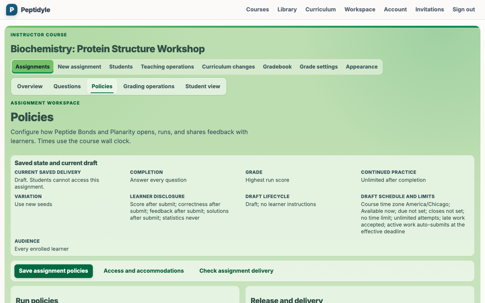
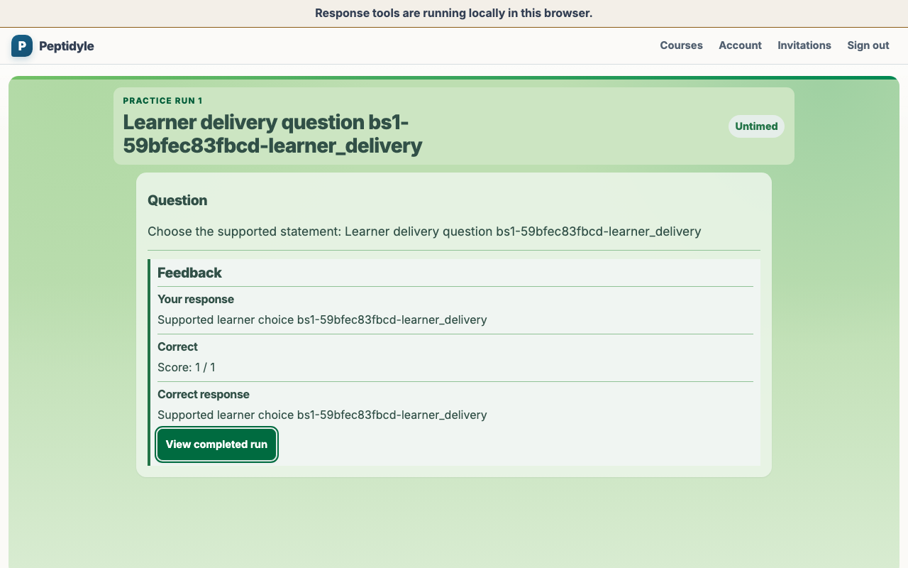
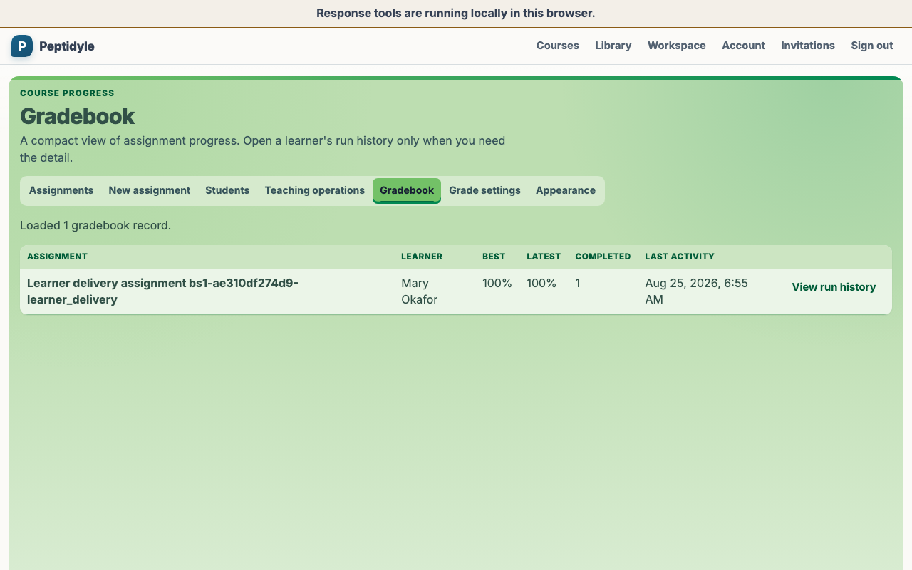

# Peptidyle Learning Engine

An open mastery-learning platform for biology instructors and students that delivers varied practice, keeps grading and answer keys on the server, and supports meaningful work beyond assignment completion.

**Project status: advanced implementation, not ready for production deployment.** The production-shaped
live demo and G1 acceptance evidence are green, and G2 calculated Gradebook plus audited Student-work
inspection is the current implementation handoff. Wider release closure and production deployment remain
open; the demo and its current 63-artifact privacy/provenance-checked capture are not a public deployment.
[docs/active_plans/implementation_status.md](docs/active_plans/implementation_status.md)
records the current handoff, and [docs/active_plans/implementation_plan.md](docs/active_plans/implementation_plan.md)
owns planned work.

## Practice past completion

The central teaching promise is a mastery loop that does not disappear when an assignment is marked
complete. An instructor can keep completion, scoring, variation, continued practice, and feedback
disclosure as separate course policies, while students see one focused question at a time and can
continue practicing with fresh values.

[docs/MASTERY_ASSIGNMENT_DESIGN.md](docs/MASTERY_ASSIGNMENT_DESIGN.md) explains the teaching
activity PLE presents to instructors and students, alongside the more expressive internal policies
that implement it.

<!-- screenshots:begin (managed by screenshot-docs) -->




<!-- screenshots:end -->

The published screenshots show a connected teaching loop: Instructor policy setup, Student feedback,
and Instructor Gradebook propagation. `tests/e2e/browser_screenshot_corpus.json` is the durable artifact
and viewport authority; the repository screenshot publisher and its provenance receipt are the
publication authority. The demo records behave as ordinary live PLE data inside a disposable,
production-shaped installation.
[docs/LIVE_DEMO_SPEC.md](docs/LIVE_DEMO_SPEC.md) defines that boundary, and
[docs/INSTRUCTOR_GUIDE.md](docs/INSTRUCTOR_GUIDE.md) and
[docs/STUDENT_GUIDE.md](docs/STUDENT_GUIDE.md) explain the visible workflows.

## Try the teaching loop

The canonical first result is a production-shaped local installation, not a browser mock. From a
checkout with the prerequisites in [docs/INSTALL.md](docs/INSTALL.md), run `./run_live_demo.sh`. The
launcher builds the production browser bundle and starts the real PostgreSQL, MinIO, API, worker,
gateway, and private WebWork services behind one disposable HTTPS origin. Use
`./run_live_demo.sh --headless` when you need the same stack without opening a browser.

Use the visible seeded-role entry to exercise ordinary PLE authorization and teaching work:

- As Elena (Instructor), select an assignment title to open its **Overview**. Use **Questions** to
  discover published questions by human-readable Question ID, reuse an existing assignment's
  ordered questions, select from reusable pools, and replace future-run questions. Use **Policies**
  for learner instructions, delivery, lifecycle, and disclosure rules. **Student view** shows the
  current answer-free learner landing while retaining the Instructor session. To test ordinary
  Instructor passkeys, use **Account** -> **Your passkeys**, sign out, and choose **Sign in with a
  passkey**.
- From the Instructor course, open reusable curricula to create revisioned private Blueprints,
  inspect public Alpha curricula, reuse their ordered questions, and adopt a source into ordinary
  course work through an answer-free proposal and immutable receipt.
- As Mary (Student), enter the course through ordinary Student entry, start the assignment, and
  submit a response. If **Response received** appears, use **Check grading status** until feedback
  or an instructor-attention message appears. Return to Elena's Instructor session and open
  **Gradebook**: the server-owned grade and authorized run history are visible there as ordinary
  course records.
- As Morgan (Sysadmin), open **Account** -> **Your passkeys**, add a passkey, sign out, and use
  **Sign in with a passkey**. This direct Sysadmin test retains the ordinary Sysadmin account and
  authorization; it is not a role claim supplied by the demo selector.

When finished, run `./run_live_demo.sh stop` to clean only the active demo owner. Relaunching creates
a fresh seeded installation, so changes made during exploration are disposable.

## Why this project

Most homework systems treat a submitted assignment as finished. Instructors using algorithmic
questions report the opposite behavior: students voluntarily rerun a completed assignment 30 or more
times, because every run generates fresh values around the same concept. A platform that ends at
completion cannot serve that, and a platform tied to one question format cannot serve a course that
already owns WeBWorK problems, QTI pools, and H5P activities.

The design answers both:

- Mastery runs as the default mode, where a student keeps working until every question is correct or
  an instructor-defined stopping condition is reached.
- Unlimited practice after completion, with completion, grading, variation, continued practice, and
  feedback disclosure as five independent policies an instructor combines freely.
- Question discovery and reuse through a published Library, human-readable Question IDs, ordered
  assignment reuse, and reusable pools, with the same selection boundary used by authoring and
  reusable curricula.
- Reusable curricula through revisioned private Blueprints and public Alpha curricula, preserving
  immutable publication pins and answer-free inspection while allowing ordinary course adoption.
- A focused assignment workspace: the title opens **Overview**, while **Questions**, **Policies**, and
  **Student view** each expose one teaching task without changing the Instructor identity.
- One backend-neutral question model behind every engine, so native algorithmic questions,
  WeBWorK, QTI, H5P, and a reviewed iMathAS provider use one adapter boundary even though their
  current runtime support differs.
- Per-question timing anchored to server timestamps, so the browser timer is display only and the
  server rules on whether an answer arrived before expiry.
- Capability validation before publication, so the platform can answer whether a question backend
  supports an assignment policy while the instructor is still editing.
- Deterministic server-owned grading for supported question families, followed by separate
  course-local item analysis that never delays a learner-visible grade.
- Exam export to DOCX and PDF, with separate student and answer-key artifacts.

## Two guarantees the structure enforces

**Grading is server-only, and the crate graph is what enforces it.** `crates/grading` holds every
answer key, checker, and correctness decision, and it sits outside the dependency closure of the
WebAssembly bridge that ships to the browser:

```toml
# crates/wasm/Cargo.toml
[dependencies]
question_model.workspace = true
domain.workspace = true
serde_json.workspace = true
wasm-bindgen.workspace = true
```

Adding `grading` to that list is the single change that would put an answer key in a browser, so it
is a compile-graph violation rather than a code-review judgment call. The bridge still does real
work: parameter generation, answer-format validation, timer display, and state transitions, none of
which carry information about correctness.

**Published content is shared and immutable; educational records are course-owned.** One published
problem version serves many instructors without being copied. Exact course membership, Student
ownership, workspace relation, observer grants, and worker leases are the database-enforced privacy
boundaries. Deleting a course's Student records destroys no reusable content because assignments
reference shared problem versions instead of owning copies.

## Architecture at a glance

```text
browser                         gateway       stateless server replicas
+---------------------------+               +----------------------------+
| Solid SPA (src/)          |               | axum API (crates/server)   |
|   domain.wasm:            | ------------> |   domain + grading         |
|   parameters, format      |               |   authoritative verdicts   |
|   validation, timer       |               +----------------------------+
|   no answers, no keys     |                   |          |           |
+---------------------------+                   v          v           v
                                          PostgreSQL   object store   private
                                          forced RLS   four domains   renderer
                                               |
                                               v
                                          durable jobs
                                          scoring first,
                                          analysis later
```

Each crate names an exhaustive dependency list, so the boundary holds by construction rather than by
convention:

| Crate                         | Owns                                                                          | Depends only on                                  |
| ----------------------------- | ----------------------------------------------------------------------------- | ------------------------------------------------ |
| `crates/question_model`       | Question types, capabilities, identity, taxonomy                              | External crates                                  |
| `crates/domain`               | Attempt state machine, runs, timing, seeded generation, capability validation | `question_model`                                 |
| `crates/grading`              | Answer keys, checkers, correctness decisions (server only)                    | `question_model`, `domain`                       |
| `crates/objects`              | Object store trait, S3 and MinIO backends, keys, checksums                    | `question_model`                                 |
| `crates/learning-data-access` | Learning data access: contracts, PostgreSQL, migrations, and direct ownership | `question_model`, `domain`, `objects`            |
| `crates/adapters/native`      | First-party generated questions and strict static PLE JSON                    | `question_model`, `domain`, `grading`            |
| `crates/adapters/webwork`     | Private renderer client, deterministic rendering, grading delegation          | `question_model`, `domain`, `grading`, `objects` |
| `crates/adapters/qti`         | Hardened package import and opt-in published runtime                          | `question_model`, `domain`, `grading`, `objects` |
| `crates/adapters/imathas`     | Contracted or self-hosted, server-brokered scored embed                       | `question_model`, `objects`                      |
| `crates/adapters/h5p`         | Package import into ungraded practice; scored execution is unavailable        | `question_model`                                 |
| `crates/export`               | Print model, DOCX and PDF writers                                             | `question_model`, `objects`                      |
| `crates/wasm`                 | The `wasm-bindgen` bridge, delegating every call to `domain`                  | `question_model`, `domain`                       |
| `crates/server`               | axum routes, auth, worker mode, composition root                              | Every crate above                                |

Two properties follow from that table. `crates/domain` reaches only `question_model`, so it has no
clock and no database, which is what lets the same code run on the server and in the browser. And
`crates/wasm` never reaches `crates/grading`, which is the answer-secrecy guarantee above.

The descriptive crate paths are `crates/learning-data-access` and `crates/project-tools`; their
Rust names are `learning_data_access` and `in_memory` where imported as code. Run repository-only
automation through `cargo tools`. See
[docs/CODE_ARCHITECTURE.md](docs/CODE_ARCHITECTURE.md) and
[docs/FILE_STRUCTURE.md](docs/FILE_STRUCTURE.md)
for the ownership map.

## Quick start

For the first complete developer result, install the system prerequisites in
[docs/INSTALL.md](docs/INSTALL.md), then clone the repository and start the fixed production-auth
browser session:

```bash
git clone https://github.com/vosslab/peptidyle-learning-engine.git
cd peptidyle-learning-engine
./run_live_demo.sh
```

On a fresh clone, `run_live_demo.sh` creates or refreshes its fixed `.venv` with Python 3.12,
installs the declared Python dependencies, and invokes `devel/setup_typescript.sh` before
delegating to the canonical local-stack owner. It builds the
production `dist/` bundle, creates a fresh disposable
`ple-live-demo-browser` HTTPS stack, waits for production-auth readiness, and opens
the canonical browser origin. For a headless alternative, run
`./run_live_demo.sh --headless`; it keeps the same stack and prints the origin
without opening a browser. Use `./run_live_demo.sh stop` for owner-scoped cleanup.
Follow the visible seeded production-auth flow.

Stop the session through its authenticated owner:

```bash
./run_live_demo.sh stop
```

`stop` authenticates to the active owner, cleans its containers, volumes, networks,
workspace, and private receipts, and refuses an unrelated or already-finished
session. Developer and browser tests serialize through the same owner lease. See
[docs/LOCAL_STACK_OPERATIONS.md](docs/LOCAL_STACK_OPERATIONS.md) for the controller contract and
[docs/USAGE.md](docs/USAGE.md) for detailed everyday workflows.

For the smallest complete offline verification result, install current Rust through `rustup`. The
repository's [rust-toolchain.toml](rust-toolchain.toml) selects stable Rust, rustfmt, Clippy, and the
`wasm32-unknown-unknown` target. Then run its behavior suite:

```bash
./check_rust.sh
```

Success is an exit status of zero after the domain, grading, storage, adapter, server, and
documentation tests; counts intentionally are not frozen in this page. This path proves the
mastery and server-side contracts without requiring containers or local credentials. The full
repository gate also needs current Node.js and npm, plus Python 3.12 with pytest:

```bash
./devel/setup_typescript.sh
./check_rust.sh
./check_codebase.sh
```

Run `./check_rust.sh` before `./check_codebase.sh` because the Rust gate generates projections
consumed by the codebase gate. The vendored codebase gate verifies TypeScript and browser code. The
repository-owned Rust gate checks both Cargo feature graphs, strict Clippy, tests and doctests, and
the browser WebAssembly target. Build the API, WebAssembly bridge, generated contracts, and Solid
client with `./build.sh`.

## One assignment through the system

The core path is implemented as a set of explicit ownership transitions:

```text
author draft
  -> publish one immutable problem version
  -> assign that exact version to a course
  -> issue a fresh server-seeded learner attempt
  -> persist an automatic result
  -> publish the newest scoring generation atomically
  -> rebuild the current course item analysis on a lower-priority job
```

The final analysis is course-owned and instructor-only. It reports aggregate difficulty,
discrimination, credit distribution, unanswered and pending-manual counts, and completion time. It
contains no learner identity, raw response, answer key, or grading implementation. A stale analysis
generation is discarded without delaying or rolling back the current grade.

When automatic grading needs attention, review the learner's attention state, open **Grading
operations**, review the metadata-only operation, and choose its currently enabled **Retry automated
grading for [question]** action when the operation is eligible. Follow the operation's current state
and available action, wait for learner completion, then open **Gradebook** and confirm the current
score. The recovery action reuses the accepted server-private response; the Instructor page receives
metadata and receipts, not learner responses or answer keys.

## What exists today

| Area                                 | State                                                                                                                                                                                                                                                                                                       |
| ------------------------------------ | ----------------------------------------------------------------------------------------------------------------------------------------------------------------------------------------------------------------------------------------------------------------------------------------------------------- |
| Rust domain and learning data access | Attempt, timing, deterministic scoring, item analysis, retention, catalog, and worker contracts; in-memory and PostgreSQL implementations share conformance tests                                                                                                                                           |
| Reusable curriculum                  | Revisioned private Blueprints, public Alpha curricula, immutable publication pins, answer-free inspection, and shared question selection                                                                                                                                                                    |
| API server                           | Auth, catalog, course, assignment, run, submission, deterministic grading, item analysis, asset, export, workspace, retention, reusable curriculum, and curriculum-adoption route groups                                                                                                                    |
| WebAssembly bridge                   | Browser-safe generation, response-format validation, timer, and state behavior; grading remains outside its dependency closure                                                                                                                                                                              |
| Browser client                       | Solid routes for courses, assignments, attempt loop, summary, Library discovery, question authoring, the Overview/Questions/Policies/Grading operations/Student view assignment workspace, gradebook, reusable curricula, and Instructor curriculum adoption                                                |
| Curriculum adoption                  | Current BlueprintCourse/CourseInstance contract and Memory behavior cover preview, explicit adoption, rollover, term shifting, provenance, controlled updates, and divergence recovery. PostgreSQL/RLS, server, browser, and live acceptance remain SD1 cutover work.                                       |
| PostgreSQL                           | Forward-only SQL migrations, forced RLS, least-privilege roles, retention fences, and disposable PostgreSQL verification                                                                                                                                                                                    |
| Question engines                     | PLE flat-question JSON v2 implements all eight required native families; the external WeBWorK PG `/render-api` supports live PLE render, grading, cache, outage, and browser checks for its bounded RadioButtons contract; QTI profiles convert atomically; contracted iMathAS broker; H5P is ungraded only |
| DOCX and PDF export                  | Deterministic student and answer-key artifact generation through the object-store boundary                                                                                                                                                                                                                  |
| Containers                           | Local PostgreSQL and MinIO named-volume state, stateless API/worker/gateway, and the private external stateless PG renderer; production runtime identities and deployment remain open                                                                                                                       |
| Worker runtime                       | Production attests seven families: six generic queue families plus sealed `GradeAcceptedSubmission`; reserved Render and generic Import work stays unclaimed until its complete implementation lands                                                                                                        |

The current checkpoint, evidence, and remaining dependency order live in
[docs/active_plans/reports/project_status_report_2026-08-10.md](docs/active_plans/reports/project_status_report_2026-08-10.md),
[docs/active_plans/implementation_status.md](docs/active_plans/implementation_status.md), and
[docs/active_plans/active/release_completion_plan.md](docs/active_plans/active/release_completion_plan.md).
The full architecture and milestone plan remain in
[docs/active_plans/implementation_plan.md](docs/active_plans/implementation_plan.md).

## Current limitations

- Flat-question JSON v2 strictly parses, splits, publishes, renders, validates, and server-grades
  multiple choice, multiple answer, fill-in-the-blank, multi-blank, numerical entry, matching,
  ordered list, and image hotspot; version 1 single choice remains compatible. The visual instructor
  editor still supports only version 1 single choice. Family-specific visual authoring, external
  QTI-JSONL adoption, hotspot pointer-overlay and media-upload workflows, and the Chapter 1 pilot
  content remain planned work.
- QTI profile import is intentionally bounded to the reviewed Canvas and Blackboard subsets;
  broader vendor compatibility, imported media, and optional exporters remain deferred.
- The live WeBWorK path intentionally supports only the licensed, user-authored single-radio PGML
  fixture in `content/pilot/webwork/`. Matching and broader problem compatibility need their own
  implementation and verification; this bounded renderer integration is not a general WeBWorK
  compatibility claim.
- Course appearance intentionally supports one theme and at most one 1200 by 328 entry banner per
  course. Per-page themes, multiple banners, freeform CSS, SVG/animated uploads, and learner edits are
  out of scope because the accepted version already supplies safe, accessible course identity without
  active-content or styling injection.
- File-upload responses deliberately fail closed until the server-issued,
  course/Student/attempt-bound capability described in the
  [secure Student file-upload plan](docs/active_plans/active/secure_student_file_upload_plan.md)
  is implemented and verified.
- The local container topology is not a production security or deployment configuration.

## Repository layout

```text
crates/     Rust workspace: question model, domain, grading, storage, adapters, export, wasm, server
src/        TypeScript and SolidJS browser client
pipeline/   Browser bundle build script
tests/      Python hygiene suite, plus Playwright browser tests
docs/       Style guides, changelog, and the active implementation plan
devel/      Maintenance and release helper scripts
```

## Documentation

Use these routes after the first local result:

- [docs/INSTALL.md](docs/INSTALL.md) - required tools, setup, and verification.
- [docs/USAGE.md](docs/USAGE.md) - local session, sign-in, health, and validation commands.
- [docs/INSTRUCTOR_GUIDE.md](docs/INSTRUCTOR_GUIDE.md) - visible course, roster, assignment, and
  gradebook workflows.
- [docs/STUDENT_GUIDE.md](docs/STUDENT_GUIDE.md) - keyboard-accessible assignment, feedback, and
  repeat-practice workflow.
- [docs/LIVE_DEMO_SPEC.md](docs/LIVE_DEMO_SPEC.md) - ordinary live-product behavior within the
  disposable seeded installation.
- [docs/TEST_EVIDENCE_MODEL.md](docs/TEST_EVIDENCE_MODEL.md) - permanent, connected, and one-time
  validation boundaries.
- [docs/CODE_ARCHITECTURE.md](docs/CODE_ARCHITECTURE.md) - system boundaries and component ownership.
- [docs/FILE_STRUCTURE.md](docs/FILE_STRUCTURE.md) - repository layout and major-directory owners.
- [docs/RELATED_PROJECTS.md](docs/RELATED_PROJECTS.md) - prior art, alternatives, standards, and
  companion projects.
- [docs/CHANGELOG.md](docs/CHANGELOG.md) - dated package history and evidence receipts.
- [docs/active_plans/implementation_status.md](docs/active_plans/implementation_status.md) - current
  package handoff and evidence boundary.

For contributor rules and design sources, begin with [AGENTS.md](AGENTS.md),
[docs/HUMAN_GUIDANCE.md](docs/HUMAN_GUIDANCE.md),
[docs/CONTRACTS.md](docs/CONTRACTS.md), and
[docs/DESIGN_DECISIONS.md](docs/DESIGN_DECISIONS.md). The dated
[docs/CHANGELOG.md](docs/CHANGELOG.md) retains package history.

## License

Code is licensed under the GNU Affero General Public License v3, in
[LICENSE.AGPL-3.0](LICENSE.AGPL-3.0). Because this is a hosted platform, AGPL matters in practice:
running a modified version as a network service carries an obligation to offer that modified source
to its users.

Non-code material such as documentation text and figures is licensed under Creative Commons
Attribution 4.0, in [LICENSE.CC-BY-4.0](LICENSE.CC-BY-4.0).

## Author

Neil R. Voss, Associate Professor of Biology at Roosevelt University, who also maintains the
[Biology Problems](https://biologyproblems.org) open educational resource project of computationally
generated problem sets. Background in [docs/AUTHORS.md](docs/AUTHORS.md); reachable on
[Bluesky](https://bsky.app/profile/neilvosslab.bsky.social).
