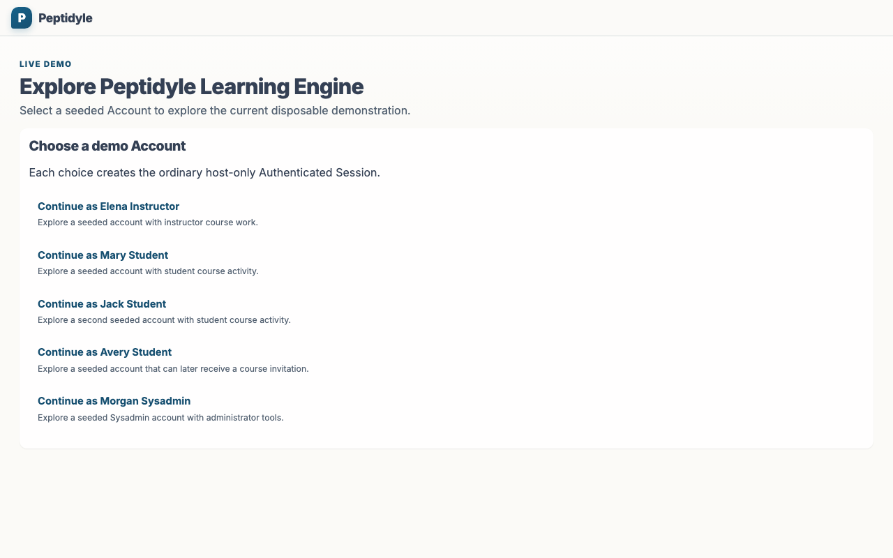
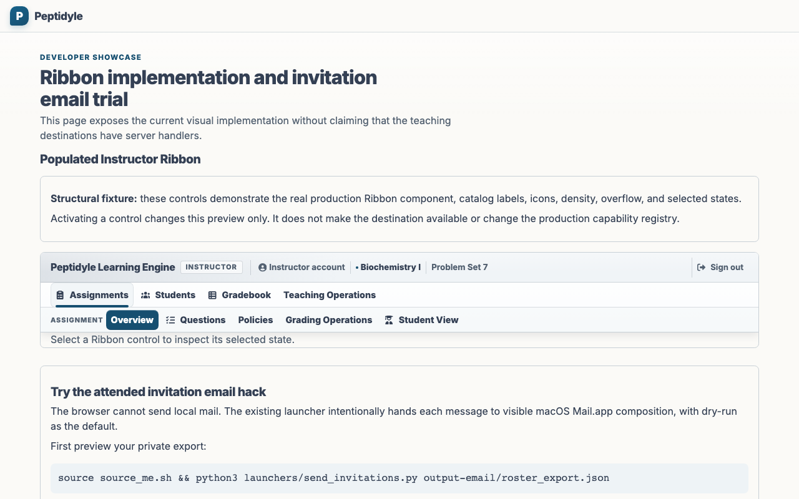
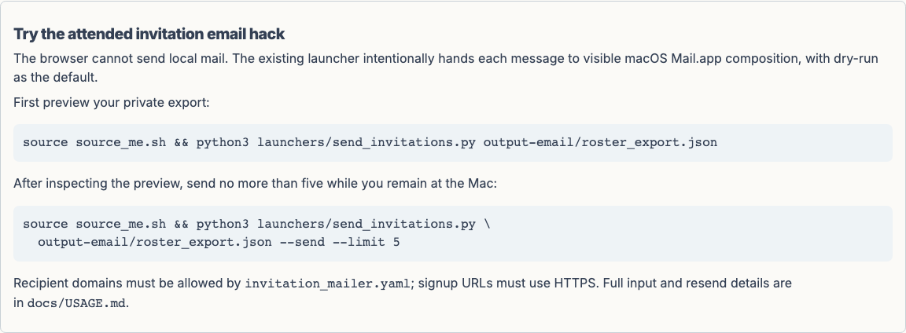

# Peptidyle Learning Engine

An open-source, pre-production platform for biology instructors to design varied practice while
keeping grading decisions and answer keys on the server.

## Status

PLE is under active development and is not ready for production deployment. The current local demo
proves a real HTTPS deployment and ordinary seeded Account session, then exposes an explicitly
labelled populated Ribbon and invitation-mailer developer showcase. It is not a complete teaching
workflow. Course, Question Library, authoring, assignment delivery, grading, Gradebook, and
administration routes remain future work. [LIVE_DEMO_SPEC.md](docs/LIVE_DEMO_SPEC.md) and
[TEST_EVIDENCE_MODEL.md](docs/TEST_EVIDENCE_MODEL.md) define that boundary.

## The teaching promise

PLE is built for the instructional moment after a student finishes an assignment: instructors can
separate completion, grading, variation, continued practice, and feedback policies instead of
treating an assignment as a one-shot event. The intended system combines reusable Question Sources,
exact immutable Question Revisions, Course-owned student records, and answer-free browser contracts.

The current code and contracts preserve two non-negotiable boundaries:

- Grading, Answer Keys, private Question Sources, and provider credentials remain server-owned.
- Shared published Questions remain distinct from Course-owned memberships, attempts, responses,
  grades, and issued evidence.

See [MASTERY_ASSIGNMENT_DESIGN.md](docs/MASTERY_ASSIGNMENT_DESIGN.md) for the teaching model and
[CODE_ARCHITECTURE.md](docs/CODE_ARCHITECTURE.md) for the technical ownership boundary.

## Current Live Demo screenshots

These images come from the production bundle served by the fixed disposable Live Demo owner.

<!-- screenshots:begin (managed by screenshot-docs) -->




<!-- screenshots:end -->

Run `./devel/capture_screenshots.sh` to rebuild all six current desktop, tablet, phone, selected
state, and invitation-email images. They demonstrate only the current Live Demo surfaces; the older
teaching-workflow images under `docs/screenshots/` remain historical design reference.

## Quick start

The first meaningful result is a disposable HTTPS PLE stack with the seeded sign-in entry. Install
the prerequisites in [INSTALL.md](docs/INSTALL.md), including Python, Rust, Node.js, Podman,
and a usable Compose provider. Then run:

```bash
./launchers/run_live_demo.sh
```

The command runs the existing TypeScript setup, builds the production browser bundle, starts the
fixed `ple-live-demo-browser` stack, and prints a ready HTTPS origin.
Open that URL in your browser to
choose a seeded persona; the server derives the ordinary authenticated session from disposable
seeded state and opens the developer showcase. There you can inspect and activate the production
Ribbon's structural preview and copy the existing attended invitation-mailer commands. Run
`./launchers/run_live_demo.sh open` (or its `--open` shorthand) to open an already-running demo; use
`./launchers/run_live_demo.sh start --open` to create a fresh demo and open it.

Stop the disposable stack when you finish:

```bash
./launchers/run_live_demo.sh stop
```

Relaunching replaces this demo's containers, volumes, networks, and seeded records. It does not
change unrelated Podman projects. Use [TROUBLESHOOTING.md](docs/TROUBLESHOOTING.md) when the stack
does not become ready.

## What is available now

The current server exposes:

- `GET /health` for readiness.
- `GET /api/auth/session` and `POST /api/auth/logout` for the ordinary session boundary.
- Deployment-gated seeded-account endpoints for the local demo selector.

The browser receives no Answer Keys or grading inputs through these paths. The complete current
surface and the intentionally absent teaching routes are documented in
[USAGE.md](docs/USAGE.md) and [API_CONTRACTS.md](docs/API_CONTRACTS.md).

## For contributors

Use the repository front doors to build and verify the current contract surfaces:

```bash
./build.sh
./check_rust.sh
./check_codebase.sh
source source_me.sh && python3 -m pytest tests/
```

The complete aggregate adds disposable service acceptance:

```bash
source source_me.sh && ./launchers/all_test.sh
```

Passing these commands does not establish a visible browser teaching journey. Read
[TEST_EVIDENCE_MODEL.md](docs/TEST_EVIDENCE_MODEL.md) before assigning that broader claim.

## Documentation

- [INSTALL.md](docs/INSTALL.md): prerequisites and first local stack.
- [USAGE.md](docs/USAGE.md): current commands and browser-entry boundary.
- [CODE_ARCHITECTURE.md](docs/CODE_ARCHITECTURE.md): component ownership and security boundaries.
- [FILE_STRUCTURE.md](docs/FILE_STRUCTURE.md): repository layout and placement guidance.
- [CONTRACTS.md](docs/CONTRACTS.md): durable module and service boundaries.
- [ROADMAP.md](docs/ROADMAP.md): pre-production release direction and gates.
- [FAQ.md](docs/FAQ.md): terminology and common design questions.
- [RELATED_PROJECTS.md](docs/RELATED_PROJECTS.md): related assessment systems and standards.

## License and authorship

Code is licensed under the [GNU Affero General Public License v3](LICENSE.AGPL-3.0). Documentation
and figures are licensed under [Creative Commons Attribution 4.0](LICENSE.CC-BY-4.0). See
[AUTHORS.md](docs/AUTHORS.md) for project authorship and acknowledgments.

The bundled Ribbon sprite redistributes only Font Awesome Free SVG icon artwork under
[Creative Commons Attribution 4.0](LICENSE.CC-BY-4.0). That attribution does not claim to
redistribute Font Awesome package tooling, code, or fonts.
