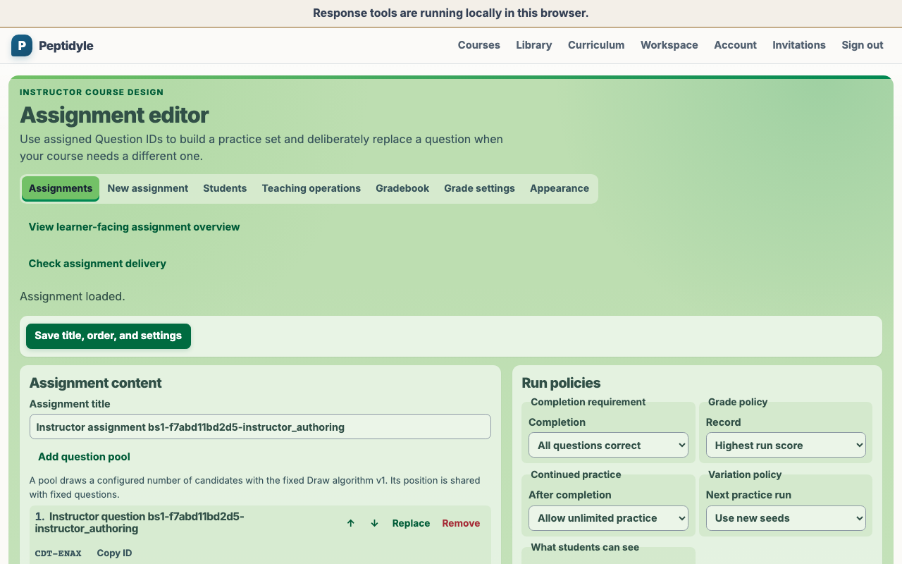
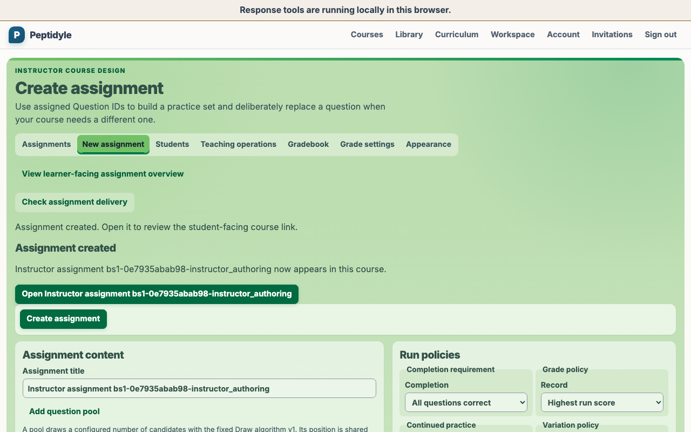

# Peptidyle Learning Engine

An open platform for mastery teaching across question formats. Students retry varied problems until they can solve them consistently, then keep practicing fresh versions after completion, while grading and answer keys stay securely on the server.

**Project status: advanced implementation, not ready for production deployment.** Core learning,
privacy, browser, and developer paths work together, including a bounded external WeBWorK PG
renderer. Read the [current implementation handoff](docs/active_plans/implementation_status.md)
for verified current scope and the [implementation plan](docs/active_plans/implementation_plan.md) for
planned work.

## Practice past completion

The central teaching promise is a mastery loop that does not disappear when an assignment is marked
complete. An instructor can keep completion, scoring, variation, continued practice, and feedback
disclosure as separate course policies, while students see one focused question at a time and can
continue practicing with fresh values.

[docs/MASTERY_ASSIGNMENT_DESIGN.md](docs/MASTERY_ASSIGNMENT_DESIGN.md) explains the teaching
activity PLE presents to instructors and students, alongside the more expressive internal policies
that implement it.

<!-- screenshots:begin (managed by screenshot-docs) -->






<!-- screenshots:end -->

These are real-stack captures from the accepted teaching workflow. See
the dedicated [instructor guide](docs/INSTRUCTOR_GUIDE.md) and
[student guide](docs/STUDENT_GUIDE.md) for the complete visible workflow. It demonstrates the local
pilot rather than a production deployment; every displayed person and course record is simulated.
The fixed labels `Dr. Fake Professor`, `Mary Fake Student`, and `Jack Fake Student` make that status
explicit in screenshots.

## Why this project

Most homework systems treat a submitted assignment as finished. Instructors using algorithmic
questions report the opposite behavior: students voluntarily rerun a completed assignment 30 or more
times, because every run generates fresh values around the same concept. A platform that ends at
completion cannot serve that, and a platform tied to one question format cannot serve a course that
already owns WeBWorK problems, QTI pools, and H5P activities.

The design answers both:

- Mastery runs as the default mode, where a student keeps working until every question is correct or
  an instructor-defined stopping condition is reached.
- Unlimited practice after completion, with completion, grading, variation, continued practice, and
  feedback disclosure as five independent policies an instructor combines freely.
- One backend-neutral question model behind every engine, so native algorithmic questions,
  WeBWorK, QTI, H5P, and a reviewed iMathAS provider use one adapter boundary even though their
  current runtime support differs.
- Per-question timing anchored to server timestamps, so the browser timer is display only and the
  server rules on whether an answer arrived before expiry.
- Capability validation before publication, so the platform can answer whether a question backend
  supports an assignment policy while the instructor is still editing.
- Mixed automatic and manual grading with generation-fenced score publication, followed by a
  separate course-local item analysis that never delays a learner-visible grade.
- Exam export to DOCX and PDF, with separate student and answer-key artifacts.

## Two guarantees the structure enforces

**Grading is server-only, and the crate graph is what enforces it.** `crates/grading` holds every
answer key, checker, and correctness decision, and it sits outside the dependency closure of the
WebAssembly bridge that ships to the browser:

```toml
# crates/wasm/Cargo.toml
[dependencies]
question_model.workspace = true
domain.workspace = true
serde_json.workspace = true
wasm-bindgen.workspace = true
```

Adding `grading` to that list is the single change that would put an answer key in a browser, so it
is a compile-graph violation rather than a code-review judgment call. The bridge still does real
work: parameter generation, answer-format validation, timer display, and state transitions, none of
which carry information about correctness.

**Published content is shared and immutable; educational records are tenant-owned.** One published
problem version serves many instructors without being copied, while every course, enrollment, run,
attempt, and grade carries a tenant ID protected by database-enforced row-level security. That one
boundary is also the privacy boundary: deleting a course's student records destroys no reusable
content, because assignments reference shared problem versions instead of owning copies.

## Architecture at a glance

```text
browser                         gateway       stateless server replicas
+---------------------------+               +----------------------------+
| Solid SPA (src/)          |               | axum API (crates/server)   |
|   domain.wasm:            | ------------> |   domain + grading         |
|   parameters, format      |               |   authoritative verdicts   |
|   validation, timer       |               +----------------------------+
|   no answers, no keys     |                   |          |           |
+---------------------------+                   v          v           v
                                          PostgreSQL   object store   private
                                          forced RLS   four domains   renderer
                                               |
                                               v
                                          durable jobs
                                          scoring first,
                                          analysis later
```

Each crate names an exhaustive dependency list, so the boundary holds by construction rather than by
convention:

| Crate                         | Owns                                                                          | Depends only on                                  |
| ----------------------------- | ----------------------------------------------------------------------------- | ------------------------------------------------ |
| `crates/question_model`       | Question types, capabilities, identity, taxonomy                              | External crates                                  |
| `crates/domain`               | Attempt state machine, runs, timing, seeded generation, capability validation | `question_model`                                 |
| `crates/grading`              | Answer keys, checkers, correctness decisions (server only)                    | `question_model`, `domain`                       |
| `crates/objects`              | Object store trait, S3 and MinIO backends, keys, checksums                    | `question_model`                                 |
| `crates/learning-data-access` | Learning data access: contracts, PostgreSQL, migrations, and tenant isolation | `question_model`, `domain`, `objects`            |
| `crates/adapters/native`      | First-party generated questions and strict static PLE JSON                    | `question_model`, `domain`, `grading`            |
| `crates/adapters/webwork`     | Private renderer client, deterministic rendering, grading delegation          | `question_model`, `domain`, `grading`, `objects` |
| `crates/adapters/qti`         | Hardened package import and opt-in published runtime                          | `question_model`, `domain`, `grading`, `objects` |
| `crates/adapters/imathas`     | Contracted or self-hosted, server-brokered scored embed                       | `question_model`, `objects`                      |
| `crates/adapters/h5p`         | Package import into ungraded practice; scored execution is unavailable        | `question_model`                                 |
| `crates/export`               | Print model, DOCX and PDF writers                                             | `question_model`, `objects`                      |
| `crates/wasm`                 | The `wasm-bindgen` bridge, delegating every call to `domain`                  | `question_model`, `domain`                       |
| `crates/server`               | axum routes, auth, worker mode, composition root                              | Every crate above                                |

Two properties follow from that table. `crates/domain` reaches only `question_model`, so it has no
clock and no database, which is what lets the same code run on the server and in the browser. And
`crates/wasm` never reaches `crates/grading`, which is the answer-secrecy guarantee above.

The descriptive crate paths are `crates/learning-data-access` and `crates/project-tools`; their
Rust names are `learning_data_access` and `in_memory` where imported as code. Run repository-only
automation through `cargo tools`. See
[docs/CODE_ARCHITECTURE.md](docs/CODE_ARCHITECTURE.md) and
[docs/FILE_STRUCTURE.md](docs/FILE_STRUCTURE.md)
for the ownership map.

## Quick start

For the first complete developer result, install the prerequisites in
[docs/INSTALL.md](docs/INSTALL.md), then clone the repository, install browser dependencies, and
start the fixed production-auth browser session:

```bash
git clone https://github.com/vosslab/peptidyle-learning-engine.git
cd peptidyle-learning-engine
npm run setup
./run_live_demo.sh
```

`run_live_demo.sh` delegates to the canonical local-stack owner. It builds the
production `dist/` bundle, creates a fresh disposable
`ple-live-demo-browser` HTTPS stack, waits for production-auth readiness, and opens
the canonical browser origin. For a headless alternative, run
`./run_live_demo.sh --no-open`; it keeps the same stack and prints the origin
without opening a browser. Use `./run_live_demo.sh stop` for owner-scoped cleanup.
Follow the visible seeded production-auth flow.

Stop the session through its authenticated owner:

```bash
./run_live_demo.sh stop
```

`stop` authenticates to the active owner, cleans its containers, volumes, networks,
workspace, and private receipts, and refuses an unrelated or already-finished
session. Developer and browser tests serialize through the same owner lease. See
[docs/LOCAL_STACK_OPERATIONS.md](docs/LOCAL_STACK_OPERATIONS.md) for the controller contract and
[docs/USAGE.md](docs/USAGE.md) for detailed everyday workflows.

For the smallest complete offline first success, install current Rust through `rustup`. The
repository's [rust-toolchain.toml](rust-toolchain.toml) selects stable Rust, rustfmt, Clippy, and the
`wasm32-unknown-unknown` target. Then run its behavior suite:

```bash
./check_rust.sh
```

Success is an exit status of zero after the domain, grading, storage, adapter, server, and
documentation tests; counts intentionally are not frozen in this page. This path proves the
mastery and server-side contracts without requiring containers or local credentials. The full
repository gate also needs current Node.js and npm, plus Python 3.12 with pytest:

```bash
npm run setup
./check_codebase.sh
./check_rust.sh
```

The vendored codebase gate verifies TypeScript and browser code. The repository-owned Rust gate
checks both Cargo feature graphs, strict Clippy, tests and doctests, and the browser WebAssembly
target. Build the API, WebAssembly bridge, generated contracts, and Solid client with `./build.sh`.

## One assignment through the system

The core path is implemented as a set of explicit ownership transitions:

```text
author draft
  -> publish one immutable problem version
  -> assign that exact version to a course
  -> issue a fresh server-seeded learner attempt
  -> persist an automatic result or a pending manual evaluation
  -> publish the newest scoring generation atomically
  -> rebuild the current course item analysis on a lower-priority job
```

The final analysis is course-owned and instructor-only. It reports aggregate difficulty,
discrimination, credit distribution, unanswered and pending-manual counts, and completion time. It
contains no learner identity, raw response, answer key, or grading implementation. A stale analysis
generation is discarded without delaying or rolling back the current grade.

## What exists today

| Area                                 | State                                                                                                                                                                                                                                                                                                                                         |
| ------------------------------------ | --------------------------------------------------------------------------------------------------------------------------------------------------------------------------------------------------------------------------------------------------------------------------------------------------------------------------------------------- |
| Rust domain and learning data access | Attempt, timing, scoring, manual-grading, item-analysis, retention, catalog, and worker contracts; in-memory and PostgreSQL implementations share conformance tests                                                                                                                                                                           |
| API server                           | Auth, catalog, course, assignment, run, submission, manual grade, item analysis, asset, export, workspace, and retention route groups                                                                                                                                                                                                         |
| WebAssembly bridge                   | Browser-safe generation, response-format validation, timer, and state behavior; grading remains outside its dependency closure                                                                                                                                                                                                                |
| Browser client                       | Solid routes for courses, assignments, attempt loop, summary, library, authoring, flat-question editing, assignment editing, and gradebook                                                                                                                                                                                                    |
| PostgreSQL                           | Forward-only SQL migrations, forced RLS, least-privilege roles, retention fences, and disposable PostgreSQL verification                                                                                                                                                                                                                      |
| Question engines                     | PLE flat-question JSON v2 implements all eight required native families; the external WeBWorK PG `/render-api` supports live PLE render, grading, cache, outage, and browser checks for its bounded RadioButtons contract; QTI profiles convert atomically; contracted iMathAS broker; H5P is ungraded only |
| DOCX and PDF export                  | Deterministic student and answer-key artifact generation through the object-store boundary                                                                                                                                                                                                                                                    |
| Containers                           | Local PostgreSQL and MinIO named-volume state, stateless API/worker/gateway, and the private external stateless PG renderer; production runtime identities and deployment remain open                                                                                                                                                         |
| Worker runtime                       | Production drains six complete families through a family-filtered registry; reserved Render and generic Import work stays unclaimed until its complete implementation lands                                                                                                                                                                   |

The current checkpoint, evidence, and remaining dependency order live in
[docs/active_plans/reports/project_status_report_2026-08-10.md](docs/active_plans/reports/project_status_report_2026-08-10.md),
[docs/active_plans/implementation_status.md](docs/active_plans/implementation_status.md), and
[docs/active_plans/active/release_completion_plan.md](docs/active_plans/active/release_completion_plan.md).
The full architecture and milestone plan remain in
[docs/active_plans/implementation_plan.md](docs/active_plans/implementation_plan.md).

## Current limitations

- Flat-question JSON v2 strictly parses, splits, publishes, renders, validates, and server-grades
  multiple choice, multiple answer, fill-in-the-blank, multi-blank, numerical entry, matching,
  ordered list, and image hotspot; version 1 single choice remains compatible. The visual instructor
  editor still supports only version 1 single choice. Family-specific visual authoring, external
  QTI-JSONL adoption, hotspot pointer-overlay and media-upload workflows, and the Chapter 1 pilot
  content remain planned work.
- QTI profile import is intentionally bounded to the reviewed Canvas and Blackboard subsets;
  broader vendor compatibility, imported media, and optional exporters remain deferred.
- The live WeBWorK path intentionally supports only the licensed, user-authored single-radio PGML
  fixture in `content/pilot/webwork/`. Matching and broader problem compatibility need their own
  implementation and verification; this bounded renderer integration is not a general WeBWorK
  compatibility claim.
- Course appearance intentionally supports one theme and at most one 1200 by 328 entry banner per
  course. Per-page themes, multiple banners, freeform CSS, SVG/animated uploads, and learner edits are
  out of scope because the accepted version already supplies safe, accessible course identity without
  active-content or styling injection.
- File-upload responses deliberately fail closed until the server-issued,
  tenant/learner/attempt-bound capability described in the
  [secure learner file-upload plan](docs/active_plans/active/secure_learner_file_upload_plan.md)
  is implemented and verified.
- The local container topology is not a production security or deployment configuration.

## Repository layout

```text
crates/     Rust workspace: question model, domain, grading, storage, adapters, export, wasm, server
src/        TypeScript and SolidJS browser client
pipeline/   Browser bundle build script
tests/      Python hygiene suite, plus Playwright browser tests
docs/       Style guides, changelog, and the active implementation plan
devel/      Maintenance and release helper scripts
```

## Documentation

Start with a local run and the system map:

- [docs/INSTALL.md](docs/INSTALL.md) - required tools, setup, verification, and the optional
  private WeBWorK profile.
- [docs/USAGE.md](docs/USAGE.md) - fixed developer session, sign-in, health, and validation commands.
- [docs/INSTRUCTOR_GUIDE.md](docs/INSTRUCTOR_GUIDE.md) and
  [docs/STUDENT_GUIDE.md](docs/STUDENT_GUIDE.md) - role-focused course setup, assignment practice,
  scoring, and repeat-workflow guides with real-stack screenshots.
- [docs/INSTRUCTOR_PAGE_VISUALS.md](docs/INSTRUCTOR_PAGE_VISUALS.md) - the current 1280 by 800
  simulated-data overview of every instructor work page.
- [docs/CODE_ARCHITECTURE.md](docs/CODE_ARCHITECTURE.md) - system shape, crate ownership, storage,
  API, browser, and security boundaries.
- [docs/FILE_STRUCTURE.md](docs/FILE_STRUCTURE.md) - repository map and the owner of each major
  directory.
- [docs/USER_ROLES.md](docs/USER_ROLES.md) - the closed Student, Instructor,
  and Sysadmin model, direct course authority, and FERPA radioactive-data
  boundary.
- [docs/LIVE_DEMO_SPEC.md](docs/LIVE_DEMO_SPEC.md) and the current
  [live-demo handoff](docs/active_plans/implementation_status.md) - the connected live-demo
  contract and current work; its selector and passkey behavior are deployment-controlled,
  owner-locked validation, not public production activation.

The durable documentation has three layers:

- Source authorities are [docs/HUMAN_GUIDANCE.md](docs/HUMAN_GUIDANCE.md), the active
  [docs/active_plans/implementation_plan.md](docs/active_plans/implementation_plan.md),
  [docs/CONTRACTS.md](docs/CONTRACTS.md), and the named code owner.
- [docs/DESIGN_DECISIONS.md](docs/DESIGN_DECISIONS.md) is the conceptual entrypoint: it explains
  why the platform has its key boundaries and directs readers to the detailed contract maps.
- Operating and reference documents cover the local stack, question formats, browser behavior,
  security, storage, and external backends. [docs/CODE_ARCHITECTURE.md](docs/CODE_ARCHITECTURE.md)
  and [docs/FILE_STRUCTURE.md](docs/FILE_STRUCTURE.md) provide the curated map rather than
  repeating every link here.

For status and contribution work:

- [docs/active_plans/implementation_plan.md](docs/active_plans/implementation_plan.md) - implementation
  roadmap, module catalog, contracts, and validation for this build.
- [docs/active_plans/implementation_status.md](docs/active_plans/implementation_status.md) - current
  package handoff and shared migration allocation registry.
- [docs/active_plans/reports/project_status_report_2026-08-10.md](docs/active_plans/reports/project_status_report_2026-08-10.md) - historical Aug. 10 executive status,
  verification evidence, milestone posture, blockers, and next work.
- [docs/active_plans/project_status_report_2026-08-09.md](docs/active_plans/project_status_report_2026-08-09.md)
  - historical Aug. 9 snapshot retained for comparison.
- [docs/active_plans/partial_commit_status.md](docs/active_plans/partial_commit_status.md) - historical
  handoff record; it is not the current status authority.
- [docs/CHANGELOG.md](docs/CHANGELOG.md) - dated record of changes, decisions, and failures.
- [AGENTS.md](AGENTS.md) - working method, validation loop, and constraints for contributors and
  coding agents.
- [docs/RUST_STYLE.md](docs/RUST_STYLE.md), [docs/TYPESCRIPT_STYLE.md](docs/TYPESCRIPT_STYLE.md),
  and [docs/MARKDOWN_STYLE.md](docs/MARKDOWN_STYLE.md) - language and documentation conventions.

## License

Code is licensed under the GNU Affero General Public License v3, in
[LICENSE.AGPL-3.0.md](LICENSE.AGPL-3.0.md), which the root `LICENSE` symlink points to. Because this
is a hosted platform, AGPL matters in practice: running a modified version as a network service
carries an obligation to offer that modified source to its users.

Non-code material such as documentation text and figures is licensed under Creative Commons
Attribution 4.0, in [LICENSE.CC-BY-4.0.md](LICENSE.CC-BY-4.0.md).

## Author

Neil R. Voss, Associate Professor of Biology at Roosevelt University, who also maintains the
[Biology Problems](https://biologyproblems.org) open educational resource project of computationally
generated problem sets. Background in [docs/AUTHORS.md](docs/AUTHORS.md); reachable on
[Bluesky](https://bsky.app/profile/neilvosslab.bsky.social).
