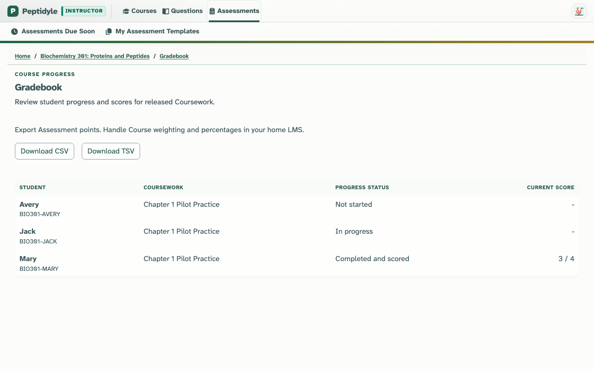

# Peptidyle Learning Engine

An open teaching platform where instructors assign auto-graded practice that students can repeat until they master it. Share and reuse Questions across courses, mix static and algorithmic WeBWorK problems, export grades, and keep student data protected.

Pre-production, no hosted instance yet. Run the local Live Demo below; the first classroom
pilot is Fall 2026.


<!-- screenshots:begin (managed by screenshot-docs) -->
<p align="center">
  
</p>
<!-- screenshots:end -->

<p align="center"><em>A real Genetics problem from the shared Question Library. It is algorithmic: every student's Attempt gets a freshly generated version.</em></p>

## Practice until it sticks

Assignments default to unlimited Attempts, grade themselves, and keep the highest score.

<p align="center">
  
  
</p>

<p align="center"><em>One Question at a time, on a laptop or a phone. Saved checkmarks, a countdown, and keys 1-4 to answer.</em></p>

- Students repeat an Assignment until they earn the score they want; the best Attempt counts.
- Responses save to the server as they go, so students pick up where they left off.
- Every Question shows keyboard shortcuts and hints.

## Real questions, shared and reused

One Question Library serves every course: algorithmic WeBWorK PG and PGML problems beside
native multiple choice, multiple answer, fill-in, numeric, matching, ordering, and hotspot
Questions. The free BiologyProblems.org Genetics example Blueprint is included.

<p align="center">
  
</p>

<p align="center"><em>Browse by Subject, Tag, Question Type, and Bloom level; star and watch what you want to reuse.</em></p>

## Build a course once, teach it every term

A Blueprint Course holds your Assessments without students or dates; each term you create a
fresh Course Instance from it and export points to your LMS.

<p align="center">
  
</p>

<p align="center"><em>Progress per student, CSV or TSV export; weighting stays in your home LMS.</em></p>

## Screenshot galleries

Browse screenshots by their existing folder:

- [Public laptop](docs/screenshot_galleries/public-laptop.md)
- [Public phone](docs/screenshot_galleries/public-phone.md)
- [Instructor](docs/screenshot_galleries/instructor.md)
- [Student laptop](docs/screenshot_galleries/student-laptop.md)
- [Student tablet](docs/screenshot_galleries/student-tablet.md)
- [Student phone](docs/screenshot_galleries/student-phone.md)
- [Student square](docs/screenshot_galleries/student-square.md)
- [Sysadmin](docs/screenshot_galleries/sysadmin.md)

The [aggregate screenshot atlas](docs/SCREENSHOT_ATLAS.md) groups all captures by role and workflow.

## Try the Live Demo

You need Bash, Git, Python, Rust, Node.js/npm, and Podman with a Compose provider; see
[docs/INSTALL.md](docs/INSTALL.md) and [docs/MACOS_PODMAN.md](docs/MACOS_PODMAN.md).

```bash
source source_me.sh && python3 -m pip install --requirement pip_requirements.txt
./launchers/run_live_demo.sh
```

The launcher builds the browser bundle, provisions a disposable local stack, and prints an HTTPS
URL. `./launchers/run_live_demo.sh open` reopens a running demo, `start --open` starts a fresh
one, and `stop` tears it down. Email sign-in is not configured for the demo: pick a fictional
Account from the sign-in page (Sysadmin entry needs TOTP; see
[docs/LIVE_DEMO_SPEC.md](docs/LIVE_DEMO_SPEC.md)).

1. Sign in as **Elena Rivera (Instructor)**. Open **BCHM 301**, then **Chapter 1 Pilot
   Practice**: its Questions, Properties, answer-free Student View, and Gradebook.
2. Sign out and pick **Jack Nguyen (Student)** to resume an open practice Attempt with saved
   responses.
3. Pick **Mary Okafor (Student)** for completed, scored work, or **Avery Thompson (Student)** to
   start the same Assignment fresh.

Startup trouble: [docs/TROUBLESHOOTING.md](docs/TROUBLESHOOTING.md).

## Status

- Pre-production. The Fall 2026 pilot covers Genetics, Biostatistics, Biotechnology, and
  Biochemistry courses ([docs/FALL_2026_PILOT.md](docs/FALL_2026_PILOT.md)); release gates are in
  [docs/ROADMAP.md](docs/ROADMAP.md).
- Student work stays private to its course and is deleted on a schedule; your Questions and
  Courses are kept.

## Learn more

- [docs/INSTRUCTOR_GUIDE.md](docs/INSTRUCTOR_GUIDE.md): the teaching workflow, start to gradebook.
- [docs/FAQ.md](docs/FAQ.md): Blueprints, repeated practice, grading, and Student records.
- [docs/LIVE_DEMO_SPEC.md](docs/LIVE_DEMO_SPEC.md): demo Accounts and teaching data.
- [docs/HUMAN_GUIDANCE.md](docs/HUMAN_GUIDANCE.md): the complete product rules.
- [docs/RELATED_PROJECTS.md](docs/RELATED_PROJECTS.md): ADAPT, WeBWorK, and other systems.

Developers: start at [docs/DEVELOPMENT.md](docs/DEVELOPMENT.md) and
[docs/CODE_ARCHITECTURE.md](docs/CODE_ARCHITECTURE.md).

## License and authorship

Code is licensed under the [GNU Affero General Public License v3](LICENSE.AGPL-3.0). Documentation
and figures are licensed under [Creative Commons Attribution 4.0](LICENSE.CC-BY-4.0). See
[docs/AUTHORS.md](docs/AUTHORS.md) for project authorship and acknowledgments.

The bundled Ribbon sprite redistributes only Font Awesome Free SVG icon artwork under
[Creative Commons Attribution 4.0](LICENSE.CC-BY-4.0). That attribution does not claim to
redistribute Font Awesome package tooling, code, or fonts.

The bundled Atkinson Hyperlegible Next browser fonts are distributed under the
[SIL Open Font License 1.1](src/assets/fonts/atkinson_hyperlegible_next/ofl_1_1.txt); their pinned
source and retained-file record are in
[the local provenance record](src/assets/fonts/atkinson_hyperlegible_next/provenance.txt).
