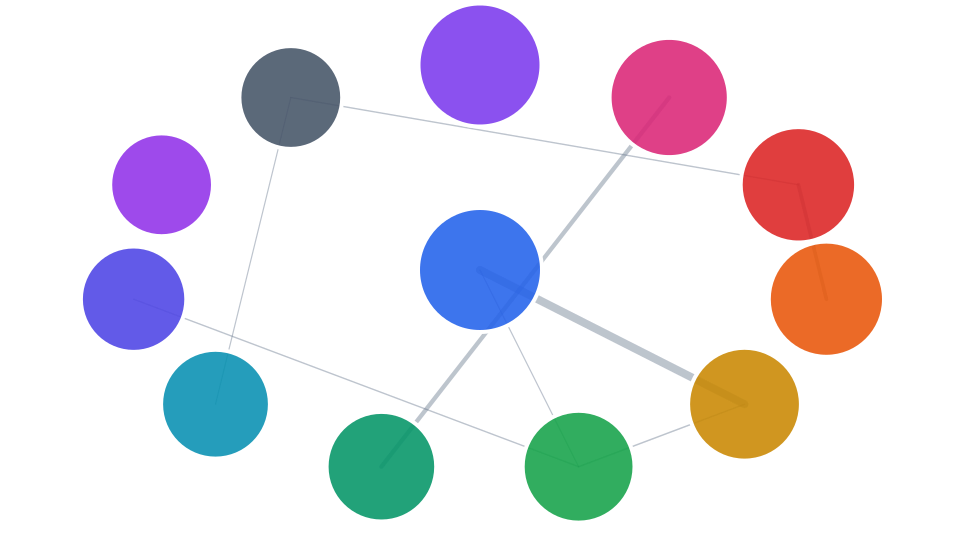

# Repository map

This Graphify snapshot maps 11809 symbols and 32668 relationships into 394 communities. The illustration keeps the largest 12 communities, scales each circle by membership, and weights each line by cross-community relationships.

## Repository groups

Source paths reveal the main implementation and support areas.

| Group | Symbols | Files | Communities |
| --- | ---: | ---: | ---: |
| `crates` | 4787 | 332 | 201 |
| `src` | 2406 | 248 | 66 |
| `local_stack_control` | 1108 | 42 | 30 |
| `schemas` | 586 | 43 | 43 |
| `deploy` | 189 | 15 | 10 |
| `Repository root` | 128 | 14 | 19 |
| `invitation_mailer` | 104 | 6 | 6 |
| `pipeline` | 20 | 2 | 2 |
| `launchers` | 9 | 3 | 3 |
| `containers` | 5 | 1 | 1 |

## Major communities

The largest communities show where related symbols concentrate. Representative files and
well-connected symbols provide useful starting points for source inspection.

| Community | Symbols | Representative files | Connected symbols |
| --- | ---: | --- | --- |
| Decoder Utilities | 170 | `src/api/decoders/question_library.ts`, `src/api/decoders/assignment_attempt.ts` | `decodeRecord()`, `requireOnlyFields()`, `field()` |
| IMathAS HTTP Transport | 166 | `crates/adapters/imathas/src/imathas_question_backend.rs`, `crates/adapters/imathas/src/http_transport.rs` | `ImathasTransportFailure`, `Result`, `imathas_question_backend.rs` |
| Disposable Demo Lifecycle | 151 | `local_stack_control/disposable_stack_adapter.py`, `local_stack_control/worker_lifecycle.py` | `DisposableComposeTarget`, `disposable_stack_adapter.py`, `lifecycle_migrations.py` |
| Course Banner Storage | 137 | `crates/learning-data-access/src/course_banner.rs`, `crates/learning-data-access/src/postgres/course_banner.rs` | `SessionTokenHash`, `CourseId`, `CourseBannerReference` |
| Assignment Release Domain | 136 | `crates/learning-data-access/src/postgres/assignment_release.rs`, `crates/learning-data-access/src/assignment_release.rs` | `CourseInstanceReference`, `AssignmentReference`, `Result` |
| Browser API Decoders | 128 | `src/api/http_client/response.ts`, `src/api/http_client/request.ts` | `ApiProtocolError`, `response.ts`, `request.ts` |
| Application Shell API Context | 124 | `src/pages/course_appearance_page.tsx`, `src/ribbon/route_scope_context.tsx` | `solid-js`, `routes.ts`, `useApplicationApi()` |
| Container Lifecycle Runner | 117 | `local_stack_control/lifecycle.py`, `local_stack_control/lifecycle_commands.py` | `CommandRunner`, `lifecycle.py`, `ComposeTarget` |
| Compiled PLE Question JSON | 114 | `crates/adapters/ple/src/question_json/schema_v3.rs`, `crates/adapters/ple/src/question_json.rs` | `schema_v3.rs`, `question_json.rs`, `invalid()` |
| Ribbon Capability Registry | 103 | `src/ribbon/ribbon_contract.ts`, `src/ribbon/capability_registry.ts` | `ribbon_contract.ts`, `capability_registry.ts`, `ribbon_catalog.ts` |
| Acceptance Runtime Harness | 95 | `crates/acceptance-runtime/src/lib.rs`, `crates/project-tools/src/database.rs` | `acceptance-runtime/src/lib.rs`, `Result`, `RuntimeError` |
| Pilot Content Publishing | 95 | `crates/project-tools/src/pilot_content.rs`, `crates/project-tools/src/pilot_content/publication.rs` | `pilot_content.rs`, `publication.rs`, `Result` |

## Graph observations

- `crates` is the largest source group: 4787 symbols across 332 files and 201 communities.
- Decoder Utilities is the largest community with 170 symbols (1.4% of the map).
- The strongest cross-community connection is Decoder Utilities to Course Grade Decoders, with 208 relationships.
- The graph contains 1307 connected community pairs, showing where responsibilities meet across area boundaries.

## Reading the map

The SVG is decorative and deliberately unlabeled. Community names and code-level detail live
in the tables, where they remain readable, searchable, and accessible. Graphify is navigation
evidence; confirm architectural conclusions in the current source and tests.

Regenerate the page and figure with
[devel/graphify_map_repo.py](../devel/graphify_map_repo.py) `--svg` after the map changes.
