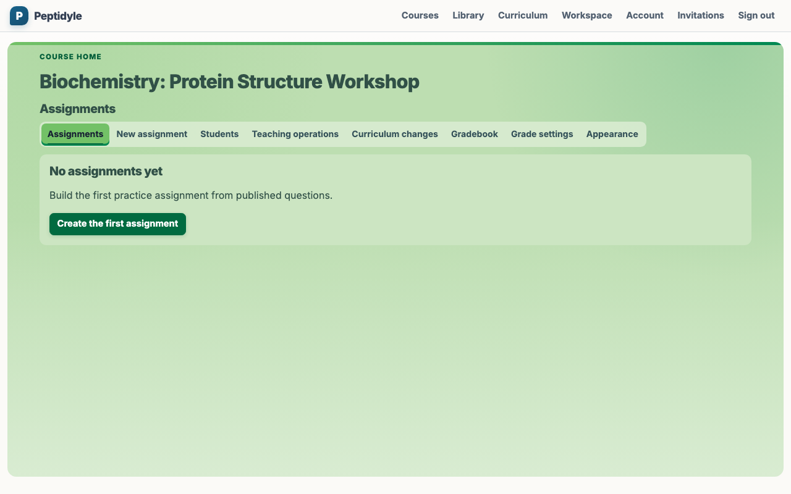
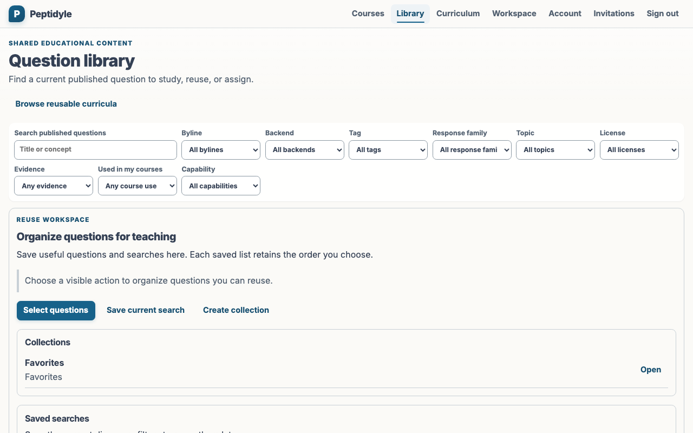

# Instructor guide

This guide follows the supported browser teaching loop: create a course, invite a learner through
the course roster, build a timed Mastery assignment from the published problem corpus, and confirm
learning in the gradebook. Start the local system first with [USAGE.md](USAGE.md).

All people and course records shown in these captures are fictional live-demo data. The seeded
personas are ordinary PLE Instructor and Student records in the disposable baseline; regeneration
discards them and recreates the same fictional baseline.

<!-- screenshots:begin (managed by screenshot-docs) -->

<!-- screenshots:end -->

## Before you begin

- Launch the local stack and open its HTTPS URL.
- Sign in through the visible PLE account page. Email is the canonical passwordless path; an
  ordinary passkey is an optional shortcut for an existing account.
- When the deployment enables the seeded persona selector, choose the fictional live-demo Instructor
  persona. It enters the same PLE account/session state and is unavailable when that deployment gate
  is not configured.

## Create a course

1. Sign in through the visible PLE account page with email, an ordinary passkey, or the enabled
   seeded instructor selector.
2. Enter a descriptive title in **Course title**.
3. Enter the inclusive **Start date** and **End date** for the teaching term.
4. Enter the exact case-sensitive **Time zone (IANA)**, such as `America/Chicago`.
5. Activate **Create course**.
6. Open the new course card.

The created course is a real PostgreSQL-backed course. It is not a browser fixture or an API-only
arrangement. The form never guesses a browser time zone. If a term value is invalid, it preserves
all four inputs, announces and focuses the field to correct, and supports an immediate retry.

## Invite a student

1. Open **Students** from the course navigation.
2. Enter the learner's **Institutional email** and course-scoped **Institutional student ID**.
3. Activate **Create invitation**.
4. In **Share this invitation**, copy the one-time link and share it through the trusted LMS or
   another trusted course channel. Configured SMTP may deliver the same link, but the copy-link
   path remains available.
5. Confirm the roster reports **Invitation pending** until the learner authenticates their PLE
   account and claims the invitation; after claiming, confirm the member reports **Active**.

## Build an assignment

1. Return to the course and open **New assignment**.
2. Enter the assignment title.
3. Prefer **Reuse questions from an existing assignment**. Choose the source assignment, then add
   its entire question set or use the checklist for a subset.
4. For an occasional direct lookup, copy the visible `AAA-BBBB` Question ID from the published
   problem catalog and paste it into **Add by question ID**. Never substitute a UUID.
5. Confirm the selected list contains the intended questions in teaching order. Engine and response
   labels identify the mix without imposing a fixed question count.
6. Confirm **All questions correct**, **Highest run score**, and **Allow unlimited practice**.
7. In **What students can see**, choose a timing for each independent field: **Score**,
   **Per-item correctness**, **Feedback text**, **Correct answer or solution**, and **Class
   statistics**. Each offers During attempt, After submit, After due, After close, and Never.
   After due and After close remain withheld when the matching boundary is not set. For this guide,
   use After submit for the first four fields and Never for class statistics.
8. Activate **Create assignment** and open the resulting course assignment. A new assignment is a
   Draft and is not yet available to students.
9. In **Teaching operations**, enter the plain-text student instructions, choose **Published**, and
   set availability, due, and close times in the displayed course time zone. Set **15** minutes per
   run, the intended attempt limit, late-submission behavior, and deadline behavior, then activate
   its separate save control.

Above those controls, verify the current server status. It states the stored
intent and the current clock result separately, for example **Published, open
now** or **Published, closed since 2026-09-01 23:59 America/Chicago**. This
status comes from the server's authoritative time; changing the computer clock
does not change it.

The teaching-operations save is independent of ordinary content editing but shares the assignment
revision. A conflict offers the current server values without discarding the local content or
teaching draft. Invalid or ambiguous local times, a timestamp outside the course term, invalid
ordering, or an illegal lifecycle transition preserve the draft, announce the exact field, and move
focus there. Closing removes learner start access; archiving is terminal and cannot be reopened.

Only corpus publication is arranged outside the browser. Course creation, roster activation,
assignment reuse, Question ID lookup, timing, and assignment construction use visible instructor
controls. If an ID is malformed, unavailable, unauthorized, or already selected, the editor keeps
the pasted text and selected questions unchanged so it can be corrected and tried again.

## Replace an assigned question

Open the assignment and choose **Replace question** for the item that should change. Enter or select
the replacement `AAA-BBBB` Question ID, then review the existing and replacement titles and IDs before
confirming the revision-checked change. The assignment uses the replacement for future runs. Issued
runs retain the exact question that each learner received.

## Configure course grades

The current WP-PROF-S6 slice supports two course-grade modes:

- **Total points** adds included assignment scores over included points possible.
- **Weighted categories** assigns ordered categories and weights, with optional drop-lowest rules
  inside each category.

Completion-based grading is deferred to a later package and is not available in the current selector.
Open **Grade settings** from the course navigation to read the current scheme. Assignment titles in
this view come from the server and are read-only; the settings payload changes inclusion, category,
and position, not a title. Save replaces the whole scheme and requires the current strong revision. If
another instructor saved first, reload the settings and retry the preserved changes after the revision
conflict.

The gradebook totals view is a compact server projection. It uses one scheme snapshot and maintained
assignment summaries, and reports a score or an explicit unavailable state such as recalculating,
failed, empty after drop, or zero possible points. The browser does not recompute totals. The course
**Export grades CSV** action is synchronous and bounded to 500 active-student rows. Email and display
name are used only in the ephemeral instructor download; the durable export audit stores no learner
PII, only course, actor, revision, mode, rounding, row count, and timestamp metadata.

This is an accepted capability. Connected evidence runs under the fixed
`ple-live-demo-browser` owner: one canonical production-browser invocation is
followed serially by the distinct WebWork renderer and two-API/one-PostgreSQL
replica service oracles.

## Adopt reusable curriculum

Open **Curriculum adoption** from an Instructor course. This is the live teaching workflow for
turning reusable meaning into ordinary course state. Choose a Blueprint assignment, an Alpha course,
course rollover, term shift, or import inspection. Select the source and target term when the
operation requires them, then choose **Prepare proposal**. To make an independently editable Alpha,
open its public curriculum detail and choose **Create independent copy**.

Review the server-owned, answer-free proposal before applying it. The proposal identifies its source
revision, destination, schedule resolution, and any exact Question ID that needs replacement. If a
source pin is no longer available or a local time falls in a DST gap or ambiguity, the page preserves
the draft choices and names the correction; choose a replacement or corrected time and prepare a new
proposal.

- **Blueprint or Alpha instantiation:** create an ordinary draft assignment or a new ordinary
  teaching course with its explicit target term, title, and source revision.
- **Fork Alpha:** from the public Alpha detail, create an independently editable Alpha with
  immutable source-lineage evidence.
- **Rollover:** create the next teaching course while leaving rosters, learner records, attempts,
  grades, retention, and issued work behind. The destination starts empty of learner activity.
- **Term shift:** move all unissued assignment schedules together. Relative calendar-day and local
  wall-clock values resolve in the target course IANA zone. Any issued run makes in-place shifting
  ineligible; use rollover instead.
- **Import maintenance:** inspect the current import, fast-forward only an eligible untouched
  assignment, or create a new source-derived draft when the destination diverged. The divergent
  assignment remains unchanged.

Activate **Apply proposal** only after reviewing the destination and correction state. The server
accepts the exact eligible preview, commits atomically, and returns an immutable receipt. Use
**Check receipt evidence** to reconcile B2-owned derived rows; incomplete immutable evidence refuses
reconciliation and requires operator recovery. The workflow exposes the destination and next action
after success.

## Review learning

After the student completes and repeats the assignment, open **Gradebook** and expand **View run
history** for the assignment row. The captured pilot shows Best and Latest at 100 percent, Completed
at 2, and two completed run-history entries.

The companion [STUDENT_GUIDE.md](STUDENT_GUIDE.md) follows the learner path. The platform keyboard
contract is documented in
[NO_MOUSE_ACCESSIBILITY_CONTRACT.md](NO_MOUSE_ACCESSIBILITY_CONTRACT.md).
