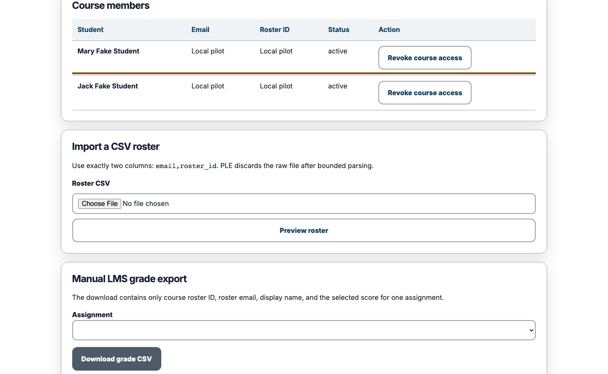
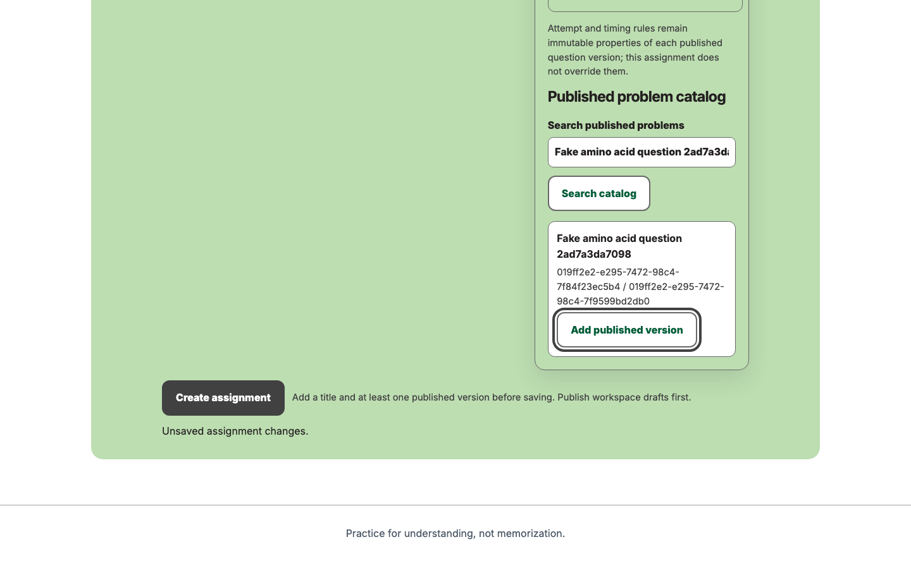
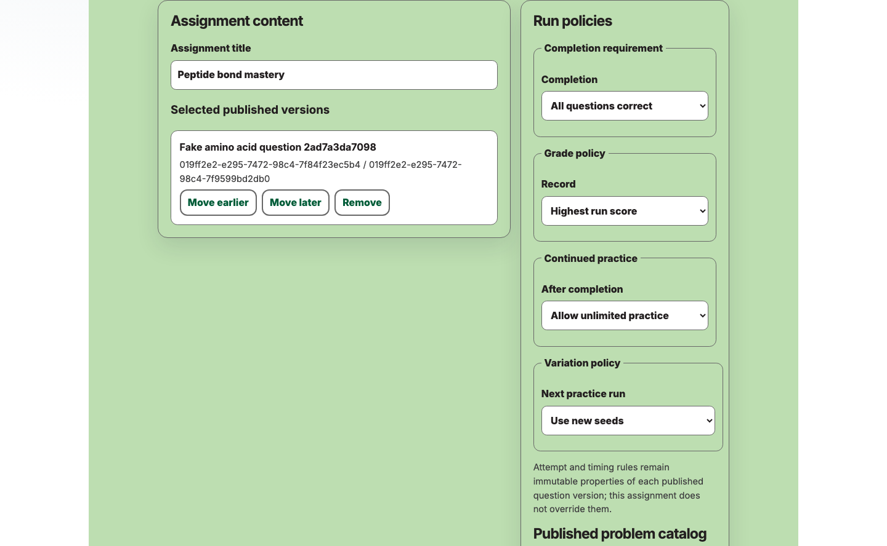

# Instructor guide

This guide follows the supported local no-email teaching loop: create a course, add the configured
local student, build a Mastery assignment from the published problem corpus, and confirm learning in
the gradebook. Start the local system first with [USAGE.md](USAGE.md).

All people and course records shown in these captures are simulated. The fixed labels
`Dr. Fake Professor`, `Mary Fake Student`, and `Jack Fake Student` are intentionally unmistakable
placeholders.

<!-- screenshots:begin (managed by screenshot-docs) -->

<!-- screenshots:end -->

## Before you begin

- Launch the normal local stack and open its loopback URL.
- Use the instructor value from the ignored `containers/local-login.txt` file.
- Keep the configured local learner alias available for the roster step.
- Use local-development identity only for this pilot. It does not require or test email delivery.

## Create a course

1. Sign in through the visible local-development form.
2. Enter a descriptive title in **Course title**.
3. Activate **Create course**.
4. Open the new course card.

The created course is a real PostgreSQL-backed course. It is not a browser fixture or an API-only
arrangement.

## Add the local student

1. Open **Students** from the course navigation.
2. Enter the configured local learner alias.
3. Activate **Add active student**.
4. Confirm the focused roster row reports **Local pilot** and **active**.

This narrow roster seam exists for local teaching pilots. Production enrollment and email identity
remain separate work.

## Build an assignment

1. Return to the course and open **New assignment**.
2. Enter the assignment title.
3. Search the published problem corpus.
4. Add the intended immutable published version.
5. Confirm **All correct**, **Highest**, and **Unlimited** policies.
6. Activate **Create assignment** and open the resulting course assignment.

Only corpus publication is arranged outside the browser. Course creation, roster activation, and
assignment construction use visible instructor controls.

## Review learning

After the student completes and repeats the assignment, open **Gradebook** and expand **View run
history** for the assignment row. The captured pilot shows Best and Latest at 100 percent, Completed
at 2, and two completed run-history entries.

The companion [STUDENT_GUIDE.md](STUDENT_GUIDE.md) follows the learner path. The platform keyboard
contract is documented in
[NO_MOUSE_ACCESSIBILITY_CONTRACT.md](NO_MOUSE_ACCESSIBILITY_CONTRACT.md).
