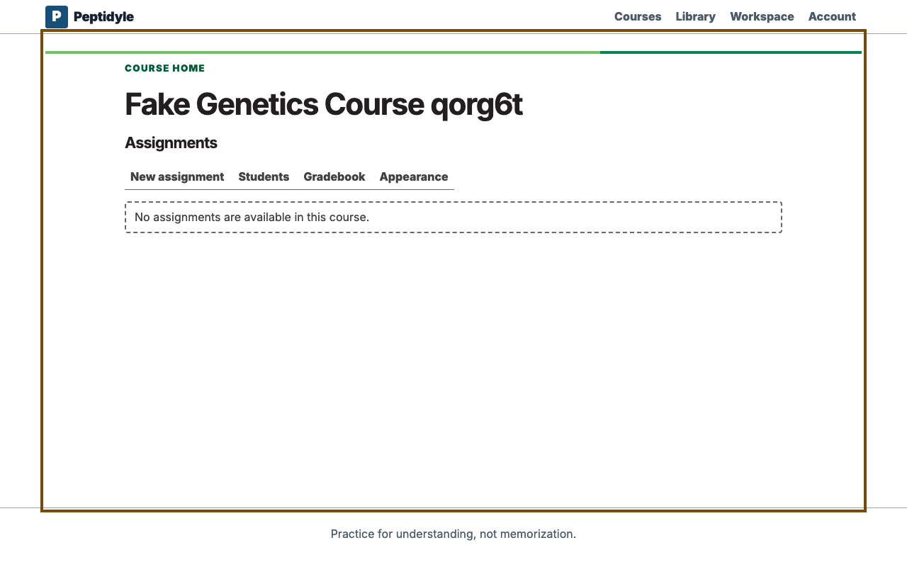
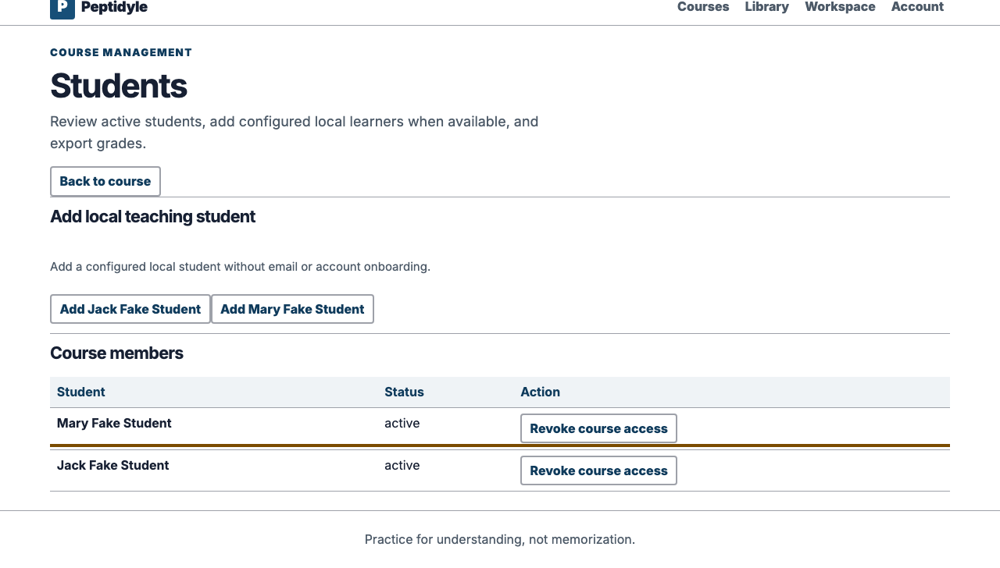
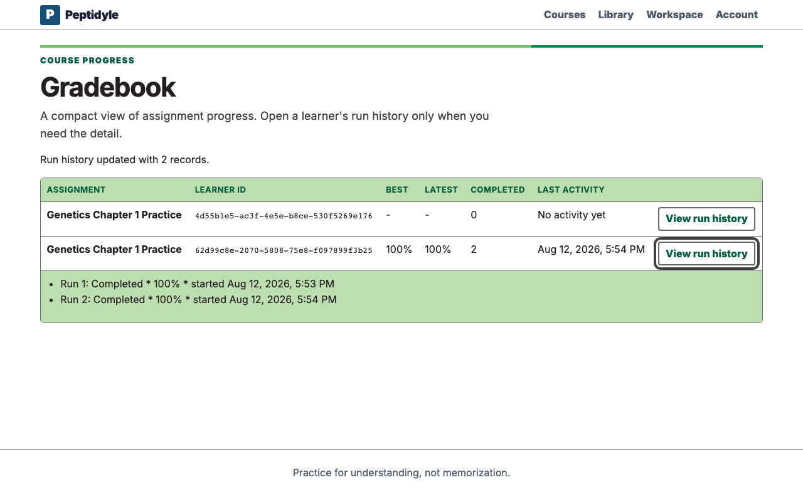

# Instructor guide

This guide follows the supported local no-email teaching loop: create a course, add a configured
fictional student through a visible roster control, build a timed Mastery assignment from the
published problem corpus, and confirm learning in the gradebook. Start the local system first with
[USAGE.md](USAGE.md).

All people and course records shown in these captures are simulated. The fixed labels
`Dr. Fake Professor`, `Mary Fake Student`, and `Jack Fake Student` are intentionally unmistakable
placeholders.

<!-- screenshots:begin (managed by screenshot-docs) -->

<!-- screenshots:end -->

## Before you begin

- Launch the normal local stack and open its loopback URL.
- Use the instructor value from the ignored `containers/local-login.txt` file.
- Use local-development identity only for this pilot. It does not require, configure, or test email
  delivery. Fastmail is a future provider decision, not a configured part of this teaching loop.

## Create a course

1. Sign in through the visible local-development form.
2. Enter a descriptive title in **Course title**.
3. Enter the inclusive **Start date** and **End date** for the teaching term.
4. Enter the exact case-sensitive **Time zone (IANA)**, such as `America/Chicago`.
5. Activate **Create course**.
6. Open the new course card.

The created course is a real PostgreSQL-backed course. It is not a browser fixture or an API-only
arrangement. The form never guesses a browser time zone. If a term value is invalid, it preserves
all four inputs, announces and focuses the field to correct, and supports an immediate retry.

## Add the local student

1. Open **Students** from the course navigation.
2. Activate **Add Mary Fake Student**. The page also offers **Add Jack Fake Student** when a second
   simulated learner is useful.
3. Confirm that the focused roster row reports **active**.

These buttons resolve only the configured local fictional learners and add canonical course
membership. They are intentionally not an alias-entry, invitation, or email-activation workflow.
Production enrollment and email identity remain separate work.

## Build an assignment

1. Return to the course and open **New assignment**.
2. Enter the assignment title.
3. Prefer **Reuse questions from an existing assignment**. Choose the source assignment, then add
   its entire question set or use the checklist for a subset.
4. For an occasional direct lookup, copy the visible `AAA-BBBB` Question ID from the published
   problem catalog and paste it into **Add by question ID**. Never substitute a UUID.
5. Confirm the selected list contains exactly the intended four selected questions: WeBWorK MC,
   WeBWorK MATCH, PLE flat MC, and PLE flat MATCH.
6. Confirm **All questions correct**, **Highest run score**, and **Allow unlimited practice**.
7. In **What students can see**, choose a timing for each independent field: **Score**,
   **Per-item correctness**, **Feedback text**, **Correct answer or solution**, and **Class
   statistics**. Each offers During attempt, After submit, After due, After close, and Never.
   After due and After close remain withheld when the matching boundary is not set. For the pilot,
   use After submit for the first four fields and Never for class statistics.
8. Activate **Create assignment** and open the resulting course assignment. A new assignment is a
   Draft and is not yet available to students.
9. In **Teaching operations**, enter the plain-text student instructions, choose **Published**, and
   set availability, due, and close times in the displayed course time zone. Set **15** minutes per
   run, the intended attempt limit, late-submission behavior, and deadline behavior, then activate
   its separate save control.

Above those controls, verify the current server status. It states the stored
intent and the current clock result separately, for example **Published, open
now** or **Published, closed since 2026-09-01 23:59 America/Chicago**. This
status comes from the server's authoritative time; changing the computer clock
does not change it.

The teaching-operations save is independent of ordinary content editing but shares the assignment
revision. A conflict offers the current server values without discarding the local content or
teaching draft. Invalid or ambiguous local times, a timestamp outside the course term, invalid
ordering, or an illegal lifecycle transition preserve the draft, announce the exact field, and move
focus there. Closing removes learner start access; archiving is terminal and cannot be reopened.

Only corpus publication is arranged outside the browser. Course creation, roster activation,
assignment reuse, Question ID lookup, timing, and assignment construction use visible instructor
controls. If an ID is malformed, unavailable, unauthorized, or already selected, the editor keeps
the pasted text and selected questions unchanged so it can be corrected and tried again.

## Replace an assigned question

Open the assignment and choose **Replace question** for the item that should change. Enter or select
the replacement `AAA-BBBB` Question ID, then review the existing and replacement titles and IDs before
confirming the revision-checked change. The assignment uses the replacement for future runs. Issued
runs retain the exact question that each learner received.

## Configure course grades

The current WP-PROF-S6 slice supports two course-grade modes:

- **Total points** adds included assignment scores over included points possible.
- **Weighted categories** assigns ordered categories and weights, with optional drop-lowest rules
  inside each category.

Completion-based grading is deferred to a later package and is not available in the current selector.
Open **Grade settings** from the course navigation to read the current scheme. Assignment titles in
this view come from the server and are read-only; the settings payload changes inclusion, category,
and position, not a title. Save replaces the whole scheme and requires the current strong revision. If
another instructor saved first, reload the settings and retry the preserved changes after the revision
conflict.

The gradebook totals view is a compact server projection. It uses one scheme snapshot and maintained
assignment summaries, and reports a score or an explicit unavailable state such as recalculating,
failed, empty after drop, or zero possible points. The browser does not recompute totals. The course
**Export grades CSV** action is synchronous and bounded to 500 active-student rows. Email and display
name are used only in the ephemeral instructor download; the durable export audit stores no learner
PII, only course, actor, revision, mode, rounding, row count, and timestamp metadata.

This is an accepted capability. The full ordinary `containers` demo, live PostgreSQL and browser
evidence, and all seven aggregate acceptance lanes are green.

## Review learning

After the student completes and repeats the assignment, open **Gradebook** and expand **View run
history** for the assignment row. The captured pilot shows Best and Latest at 100 percent, Completed
at 2, and two completed run-history entries.

The companion [STUDENT_GUIDE.md](STUDENT_GUIDE.md) follows the learner path. The platform keyboard
contract is documented in
[NO_MOUSE_ACCESSIBILITY_CONTRACT.md](NO_MOUSE_ACCESSIBILITY_CONTRACT.md).
