# Instructor page visuals

This gallery is the visual map of PLE's instructor interface. It is captured from a working demo
environment with one coherent set of sample courses, questions, roster records, and grades. The
complete page map retains a 1280 by 800 CSS-pixel desktop baseline; the course-grade editor
additionally covers 800 by 1280, 393 by 852, and 800 by 800 responsive views.

All people and records are fictional. `Dr. Fake Professor`, `Mary Fake Student`, and
`Jack Fake Student` are deterministic documentation identities, not real Roosevelt participants.
Deterministic fixture addresses in the reserved `example.invalid` domain are permitted test data;
real email addresses and real identifying records are prohibited in public evidence.
The capture checks visible and announced page text plus browser paths for UUID exposure before it
writes an image.

## Page map

| Page | Example route | What the view establishes |
| --- | --- | --- |
| Courses | `/` | Instructor home, course creation, and recognizable course list |
| Course assignments | `/courses/C-1` | Course identity, local navigation, and assignment scanning |
| Assignment overview | `/courses/C-1/assignments/A-1` | Question count, grade policy, feedback, and practice entry |
| New assignment | `/instructor/courses/C-1/assignments/new` | Empty assignment authoring state and catalog entry points |
| Assignment editor | `/instructor/courses/C-1/assignments/A-1/edit` | Four-question organization and run policies in one workspace |
| Students | `/instructor/courses/C-1/students` | Invitation, enrollment policy, pending invitation, and roster context |
| Gradebook | `/instructor/courses/C-1/gradebook` | Compact learner-assignment progress without expanded raw records |
| Grade settings | `/instructor/courses/C-1/grade-settings` | Weighted categories, assignment membership, letter bands, totals, and audited export |
| Course appearance | `/instructor/courses/C-1/appearance` | Applied course palettes, banner settings, and live theme context |
| Question library | `/library` | Full-width search, filters, Question IDs, and published results |
| Question detail | `/library/7K3-M9QP` | Human-facing identity, source context, and learner-facing prompt |
| Workspace | `/workspace` | Private draft list and the currently selected draft workspace |
| Question editor | `/workspace/W-1` | QTI import entry and native flat-question authoring |
| Account | `/account/security` | Optional contrast preference, passkeys, and sign-in email settings |

The authentication completion pages, invitation redemption, and student run pages are outside this
instructor-workspace gallery. The approved end-to-end teaching loop remains in
[INSTRUCTOR_GUIDE.md](INSTRUCTOR_GUIDE.md) and [STUDENT_GUIDE.md](STUDENT_GUIDE.md).

The committed files are owned by `tests/playwright/ui_corpus_manifest.ts`, the sole screenshot
ownership authority. A screenshot is acceptance evidence only after a fresh capture and inspection;
the retained gallery does not claim that a current implementation has passed its acceptance gate.
Keep private instructor evidence separate from public or learner evidence under `docs/screenshots/`.

## Visual gallery

The course-scoped pages use the Grass palette in standard presentation. This makes the gallery useful
for evaluating normal theme character as well as density, hierarchy, navigation, and page-level
composition. The Account view shows where increased contrast can be selected without changing the
course theme or teaching behavior.

<!-- screenshots:begin (managed by screenshot-docs) -->
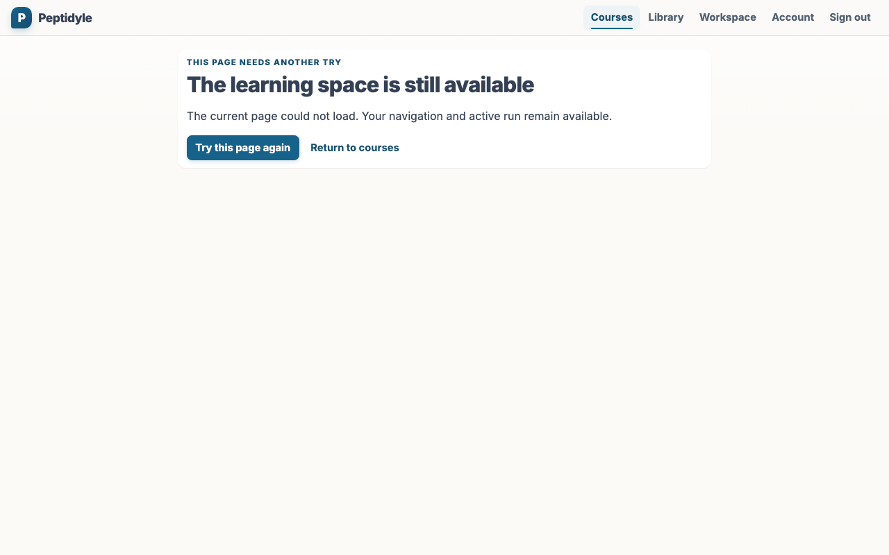
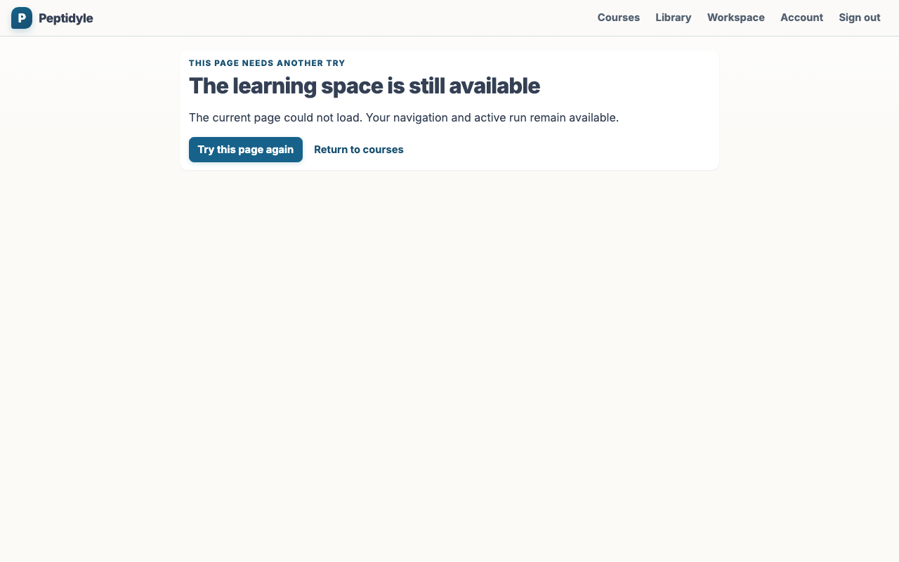
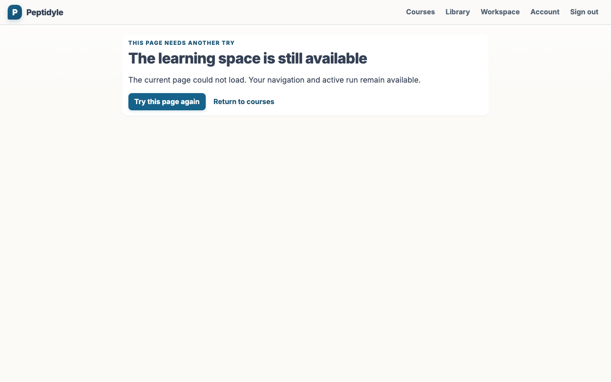
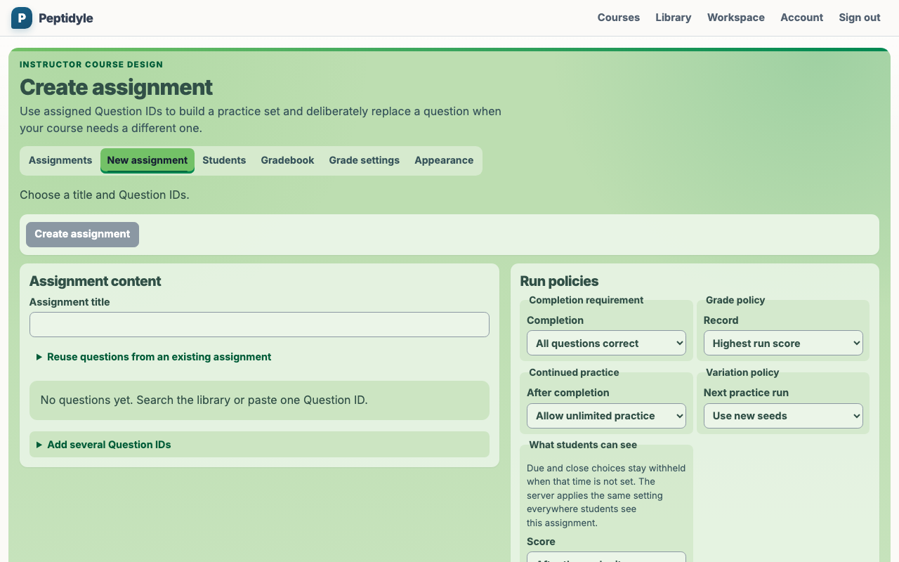

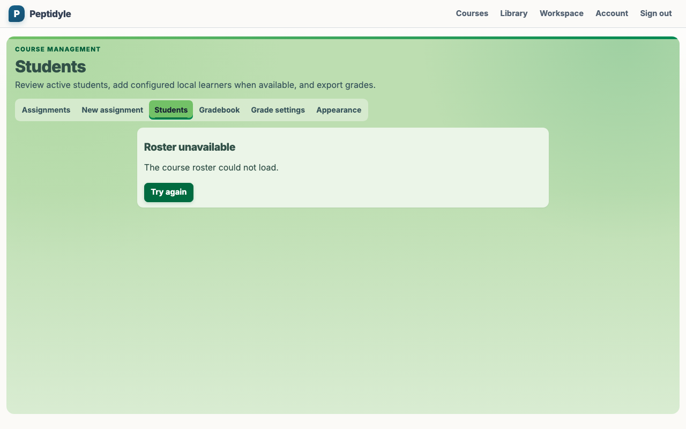
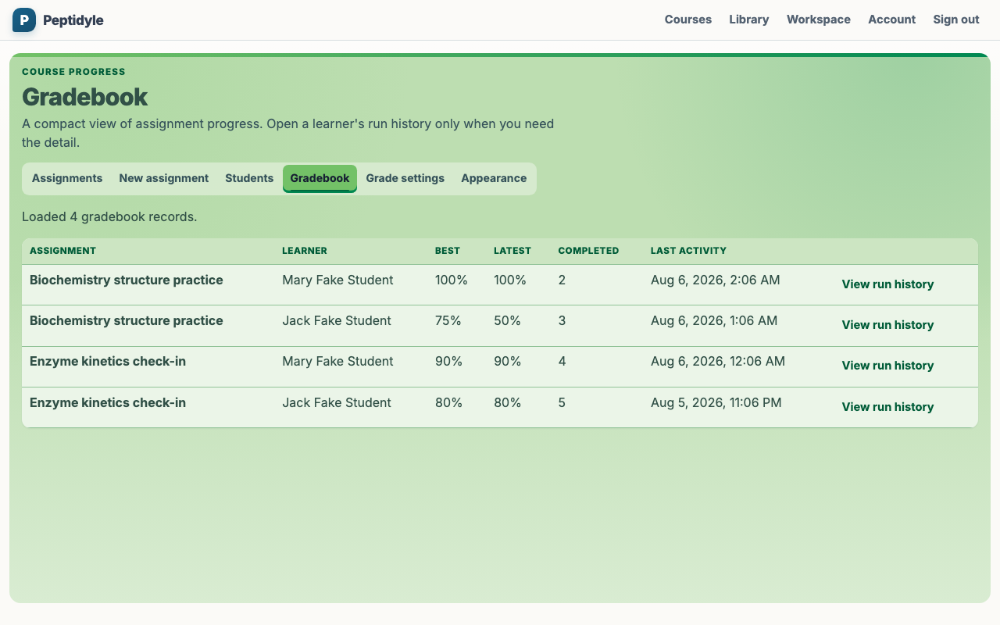
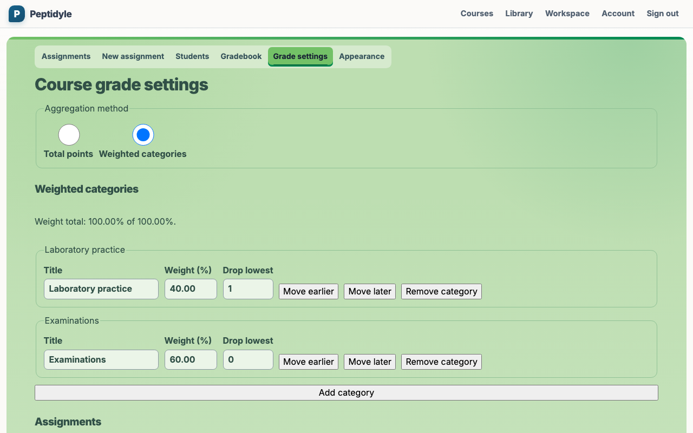
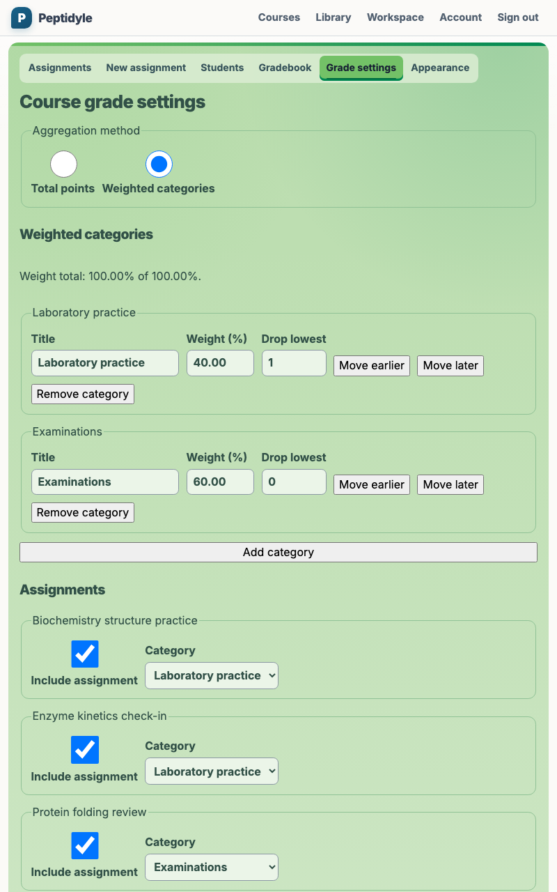
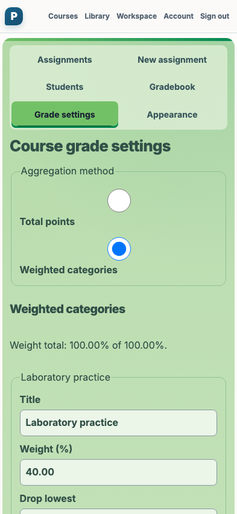
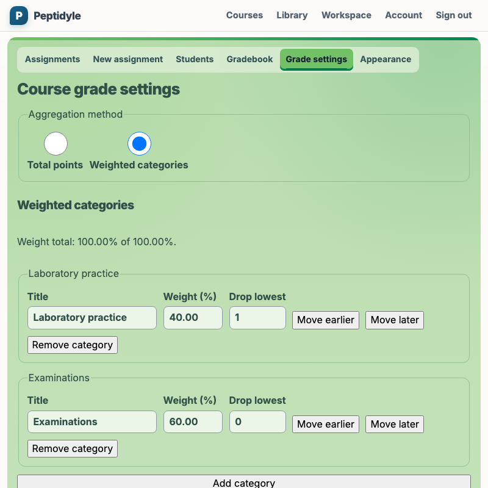
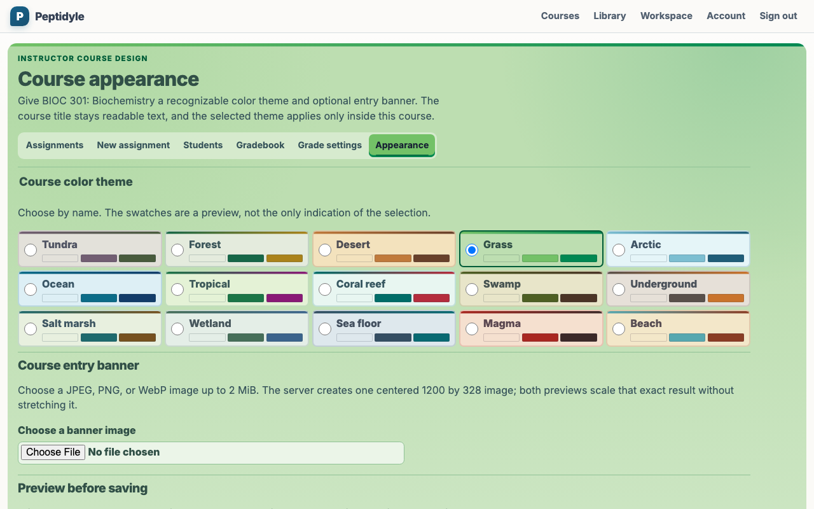
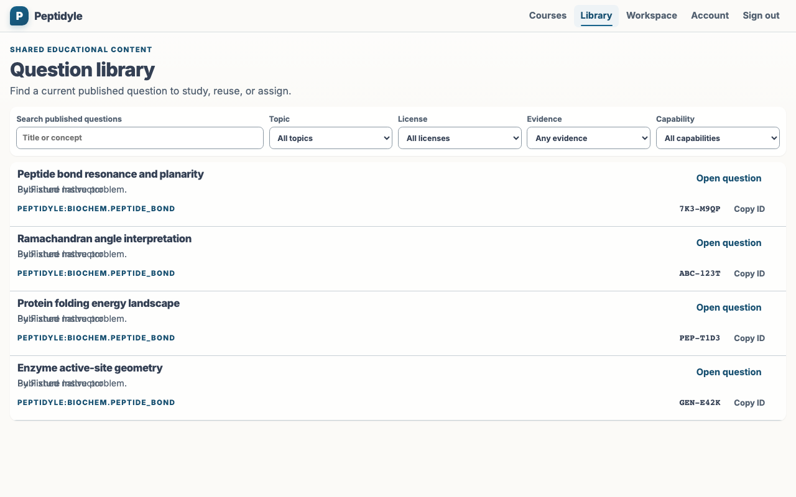
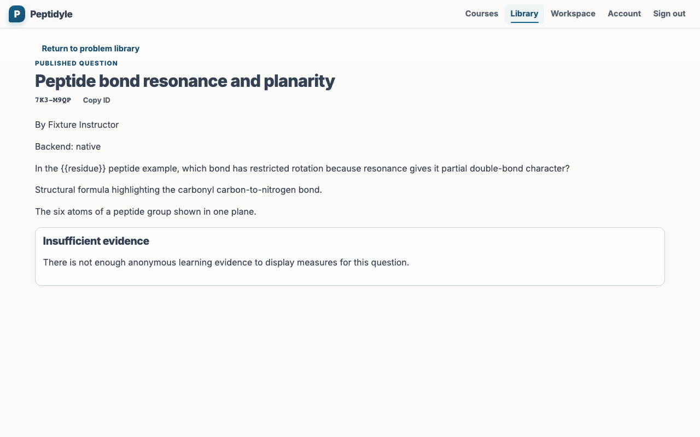
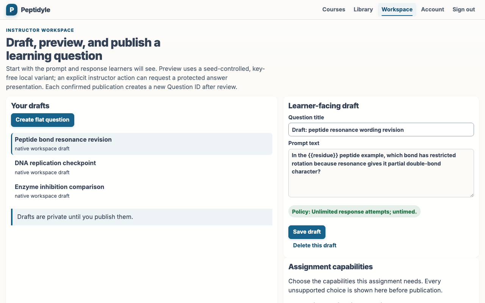
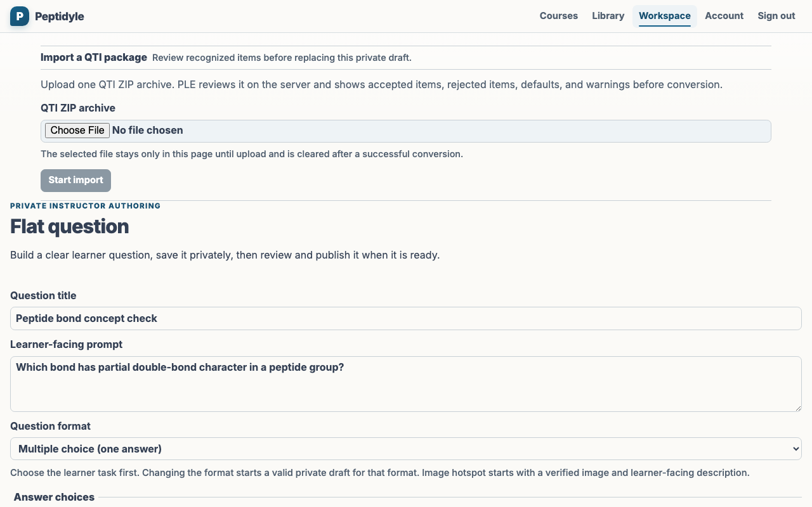
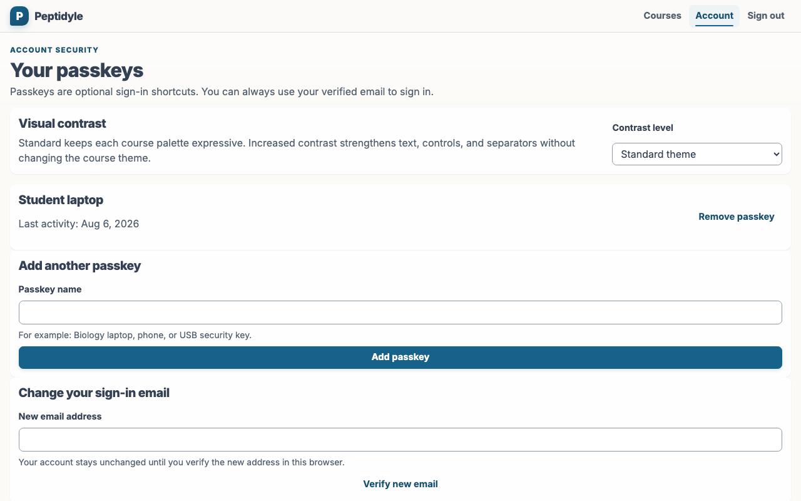
<!-- screenshots:end -->

## Refreshing the corpus

Run the repository-owned capture launcher from the repository root:

```bash
node tests/playwright/capture_instructor_page_visuals.mjs
```

The launcher builds and serves the current browser application, creates a private temporary capture
directory, runs the demo instructor with its deterministic sample data, verifies the exact screenshot
set and each manifest-owned dimension, and atomically refreshes `docs/screenshots/instructor/`. The
capture test is opt-in, so the ordinary browser suite checks its code without rewriting documentation
assets.

For the Validation test suite, use the same capture and validation path without refreshing the
retained screenshots:

```bash
node tests/playwright/capture_instructor_page_visuals.mjs --verify-only
```

`--verify-only` creates a mode-0700 directory under `/private/tmp`, validates the capture there,
and removes it after the check. It never writes `docs/screenshots/`.

Review the regenerated images together after shared layout, theme, typography, or navigation changes.
Behavior-focused browser tests remain the authority for interaction, authorization, answer secrecy,
and teaching semantics; these images are visual evidence for composition and current appearance.
