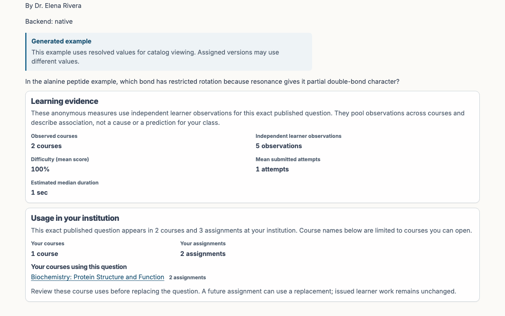

# Instructor page visuals

This gallery is a historical visual reference for PLE's intended Instructor interface. Its retained
captures depict one coherent historical demo fixture with Blueprint Courses, Course Instances,
questions, roster records, and grades; they do not describe the current built-app Browser Surface.
The historical Instructor and Sysadmin page map uses the fixed 1280 by 800 CSS-pixel desktop 16:10
viewport profile. Student profiles remain variable and use the maintained viewport profiles declared
below.

In the historical product reference, Blueprint Courses show reusable course-level content and
structure. Published Blueprint Courses are visible to all vetted Instructors; drafts are private to
their owner and authorized collaborators. Course Instances are created from exactly one Blueprint
parent and are private to their current equal Teaching Team Members and enrolled Students. Course
Instance pages own deadlines, releases, accommodations, grades, and delivery settings. No Blueprint
page shows Student records or live delivery state.

All people and records are fictional. Elena Rivera, Mary Okafor, Morgan, and the other seeded
personas are deterministic documentation identities, not real Roosevelt participants. Deterministic
fixture addresses in the reserved `example.invalid` domain are permitted test data; real email
addresses and real identifying records are prohibited in public evidence. The historical capture
workflow checked visible and announced page text plus browser paths for UUID exposure before it wrote
an image.

## Page map

| Historical page reference | Historical example route                                     | What the historical view establishes                                                                                               |
| ------------------------- | ------------------------------------------------------------ | ---------------------------------------------------------------------------------------------------------------------------------- |
| Courses                   | `/`                                                          | Instructor home, choose or create a Blueprint, and create a Course Instance                                                        |
| Course Instances          | `/courses/C-1`                                               | Course Instance identity, local navigation, and assignment scanning                                                                |
| Blueprint Courses         | `/blueprint-courses`                                         | Reusable Blueprint list, publication state, and owned drafts                                                                       |
| Blueprint detail          | `/blueprint-courses/:blueprintCourseRef`                     | Ordered modules and assignments, revision, publication, and fork actions                                                           |
| Assignment overview       | `/instructor/courses/C-1/assignments/A-1`                    | Assignment home opened from the linked title                                                                                       |
| Student assignment page   | `/courses/C-1/assignments/A-1`                               | Question count, grade policy, feedback, and practice entry                                                                         |
| New assignment            | `/instructor/courses/C-1/assignments/new`                    | Empty assignment authoring state and Question Library entry points                                                                 |
| Assignment Questions      | `/instructor/courses/C-1/assignments/A-1/questions`          | Title, ordered questions, pools, discovery, reuse, and server samples                                                              |
| Assignment Policies       | `/instructor/courses/C-1/assignments/A-1/policies`           | Instance instructions, release, delivery, lifecycle, access, and checks                                                            |
| Assignment Student view   | `/instructor/courses/C-1/assignments/A-1/student-view`       | Stable-identity, answer-free Student landing with Instructor identity active                                                       |
| Grading operations        | `/instructor/courses/C-1/assignments/A-1/grading-operations` | Assignment-local automated-grading attention and recovery actions                                                                  |
| Students                  | `/instructor/courses/C-1/students`                           | Invitation, enrollment policy, pending invitation, and roster context                                                              |
| Gradebook                 | `/instructor/courses/C-1/gradebook`                          | Compact Student-assignment progress without expanded raw records                                                                   |
| Grade settings            | `/instructor/courses/C-1/grade-settings`                     | Weighted categories, assignment membership, totals, and audited export                                                             |
| Course appearance         | `/instructor/courses/C-1/appearance`                         | Applied Course Instance palettes, banner settings, and live theme context                                                          |
| Question Library          | `/library`                                                   | Published Question views, Starred, Watched, Question Search, filters, Question IDs, and the planned My Question Drafts destination |
| Question Details          | `/library/7K3-M9QP`                                          | Human-facing identity, source context, Question Statistics, and Student-facing prompt                                              |
| My Question Drafts        | `/workspace`                                                 | Historical private authoring reference; the current Ribbon retains this as an unbacked future destination                          |
| My Question Draft editor  | `/workspace/W-1`                                             | Historical QTI import and PLE Question JSON authoring reference; unavailable in the current Browser Surface                        |
| Live Demo sign-in         | `/sign-in`                                                   | Deployment-gated seeded Account selector for the disposable demo                                                                   |

The authentication completion pages, invitation redemption, and Assignment Attempt pages are outside
this historical Instructor-workspace gallery. Their current role-owned routes are described in
[INSTRUCTOR_GUIDE.md](INSTRUCTOR_GUIDE.md), [STUDENT_GUIDE.md](STUDENT_GUIDE.md), and
[LIVE_DEMO_SPEC.md](LIVE_DEMO_SPEC.md). This gallery remains historical visual reference rather than
current workflow evidence.

In the historical reference, Student view is an answer-free inspection surface that creates no
Assignment Attempt, Question Attempt, submission, receipt, grade, or enrollment. Historical ordinary
Student delivery then creates graded work that flows to the Instructor Gradebook. Current Student
delivery and Gradebook evidence are separate functional PLE workflows; these historic captures do
not demonstrate them.

`./devel/capture_screenshots.sh` rebuilds only manifest-listed current captures. This retained
historical screenshot reference does not claim current acceptance. Keep Instructor evidence under
`docs/screenshots/instructor/` and separate it from public or Student evidence; a fresh capture and
review remain required before a current UI change can claim visual acceptance.

## Visual gallery

The historical Course Instance pages use the Grass palette in standard presentation. This makes the
gallery useful as a design reference for normal theme character, density, hierarchy, navigation, and
page-level composition. The current Live Demo runs the functional Instructor teaching surfaces
described in [LIVE_DEMO_SPEC.md](LIVE_DEMO_SPEC.md); it remains distinct from future email-code and
passkey authentication adapters.

<!-- screenshots:begin (managed by screenshot-docs) -->

<!-- Historical capture path retained as immutable evidence; the product term is Blueprint Course. -->

<!-- screenshots:end -->

## Refreshing historical screenshot references

The current capture command is `./devel/capture_screenshots.sh`; it rebuilds only the current
manifest and does not republish this historical gallery. This gallery is historical reference, not
current acceptance.

Any Instructor UI, viewport, typography, theme, or navigation change requires a
fresh current capture and human visual review before it can claim visual acceptance. Behavior tests
remain distinct evidence for interaction, authorization, answer secrecy, and teaching semantics.
