# Instructor page visuals

This gallery is the visual map of PLE's Instructor interface. It is captured from a working demo
environment with one coherent set of Blueprint Courses, Course Instances, questions, roster records,
and grades. The complete Instructor and Sysadmin page map uses the fixed `laptop` evidence profile
at exactly 1280 by 800 CSS pixels in a desktop 16:10 viewport. Student profiles remain variable and
use the maintained profiles declared by the current screenshot corpus.

Blueprint Courses show reusable course-level content and structure. Published Blueprint Courses are
visible to all vetted Instructors; drafts are private to their owner and authorized collaborators.
Course Instances are created from exactly one Blueprint parent and are private to their current equal
co-Instructors and enrolled Students. Course Instance pages own deadlines, releases,
accommodations, grades, and delivery settings. No Blueprint page shows Student records or live
delivery state.

All people and records are fictional. Elena Rivera, Mary Okafor, Morgan, and the other seeded
personas are deterministic documentation identities, not real Roosevelt participants. Deterministic
fixture addresses in the reserved `example.invalid` domain are permitted test data; real email
addresses and real identifying records are prohibited in public evidence. The capture checks visible
and announced page text plus browser paths for UUID exposure before it writes an image.

## Page map

| Page                    | Example route                                                | What the view establishes                                                               |
| ----------------------- | ------------------------------------------------------------ | --------------------------------------------------------------------------------------- |
| Courses                 | `/`                                                          | Instructor home, choose or create a Blueprint, and create a Course Instance             |
| Course Instances        | `/courses/C-1`                                               | Course Instance identity, local navigation, and assignment scanning                     |
| Blueprint Courses       | `/curriculum`                                                | Reusable Blueprint list, publication state, and owned drafts                            |
| Blueprint detail        | `/curriculum/:curriculumRef`                                 | Ordered modules and assignments, revision, publication, and fork actions                |
| Assignment overview     | `/instructor/courses/C-1/assignments/A-1`                    | Assignment home opened from the linked title                                            |
| Learner assignment page | `/courses/C-1/assignments/A-1`                               | Question count, grade policy, feedback, and practice entry                              |
| New assignment          | `/instructor/courses/C-1/assignments/new`                    | Empty assignment authoring state and catalog entry points                               |
| Assignment Questions    | `/instructor/courses/C-1/assignments/A-1/questions`          | Title, ordered questions, pools, discovery, reuse, and server samples                   |
| Assignment Policies     | `/instructor/courses/C-1/assignments/A-1/policies`           | Instance instructions, release, delivery, lifecycle, access, and checks                 |
| Assignment Student view | `/instructor/courses/C-1/assignments/A-1/student-view`       | Stable-identity, answer-free learner landing with Instructor identity active            |
| Grading operations      | `/instructor/courses/C-1/assignments/A-1/grading-operations` | Assignment-local automated-grading attention and recovery actions                       |
| Students                | `/instructor/courses/C-1/students`                           | Invitation, enrollment policy, pending invitation, and roster context                   |
| Gradebook               | `/instructor/courses/C-1/gradebook`                          | Compact learner-assignment progress without expanded raw records                        |
| Grade settings          | `/instructor/courses/C-1/grade-settings`                     | Weighted categories, assignment membership, totals, and audited export                  |
| Course appearance       | `/instructor/courses/C-1/appearance`                         | Applied Course Instance palettes, banner settings, and live theme context               |
| Question library        | `/library`                                                   | Full-width search, filters, Question IDs, and published results                         |
| Question detail         | `/library/7K3-M9QP`                                          | Human-facing identity, source context, and learner-facing prompt                        |
| Workspace               | `/workspace`                                                 | Private question drafts and the currently selected draft workspace                      |
| Question editor         | `/workspace/W-1`                                             | QTI import entry and native flat-question authoring                                     |
| Live Demo sign-in       | `/sign-in`                                                   | Deployment-gated seeded Account selector for the disposable demo                        |
| Curriculum adoption     | `/instructor/courses/:courseRef/curriculum`                  | Blueprint source selection, update proposal, rollover, term shift, and receipt evidence |

The authentication completion pages, invitation redemption, and Student run pages are outside this
Instructor-workspace gallery. The approved end-to-end teaching loop remains in
[INSTRUCTOR_GUIDE.md](INSTRUCTOR_GUIDE.md) and [STUDENT_GUIDE.md](STUDENT_GUIDE.md).

Student view is an inspection of the current live assignment in the Instructor session. It is
answer-free and creates no run, attempt, submission, receipt, grade, or enrollment. Ordinary Student
entry creates real graded work through the visible learner path, and the Instructor sees the result
in the Course Instance Gradebook. The Student view keeps the Instructor session and clearly points
to ordinary Student entry for graded validation.

`tests/e2e/browser_screenshot_corpus.json` owns the committed artifact corpus.
`tests/playwright/ui_corpus_manifest.ts` and
`tests/e2e/e2e_browser_screenshot_contract.py` strictly consume that source.
A screenshot is acceptance evidence only after a fresh capture and inspection; the retained gallery
does not claim that a current implementation has passed its acceptance gate. Keep private Instructor
evidence separate from public or learner evidence under `docs/screenshots/`.

## Visual gallery

Course Instance pages use the Grass palette in standard presentation. This makes the gallery useful
for evaluating normal theme character as well as density, hierarchy, navigation, and page-level
composition. The mounted Live Demo entry is intentionally distinct from the planned email-code and
passkey authentication adapters.

<!-- screenshots:begin (managed by screenshot-docs) -->

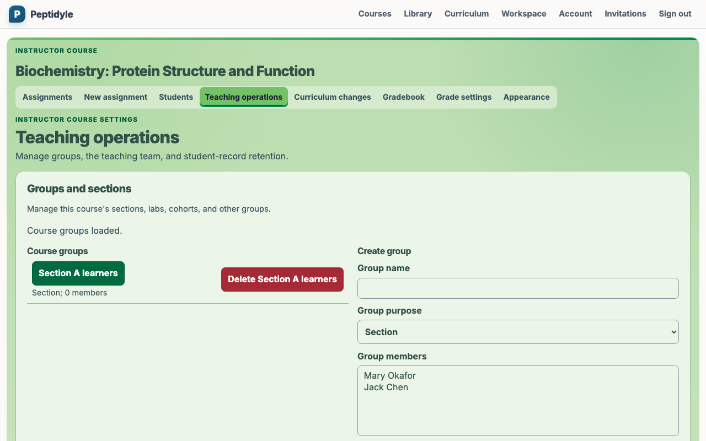
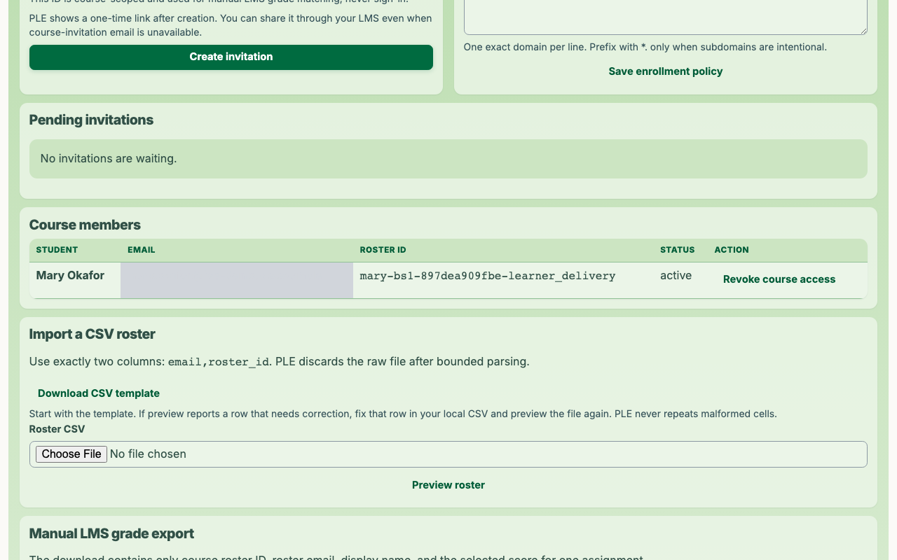

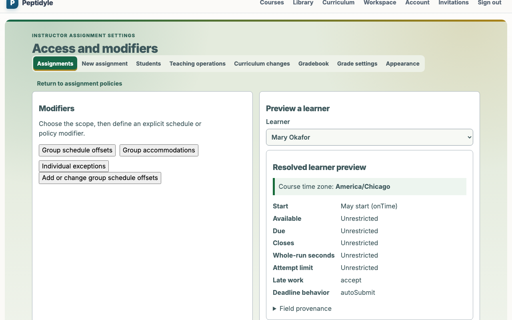
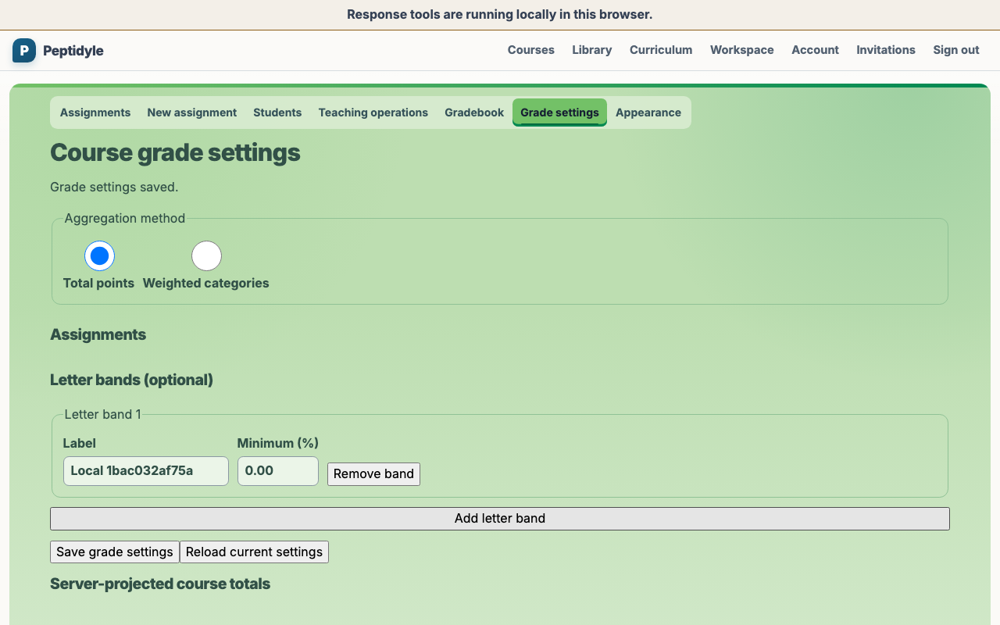
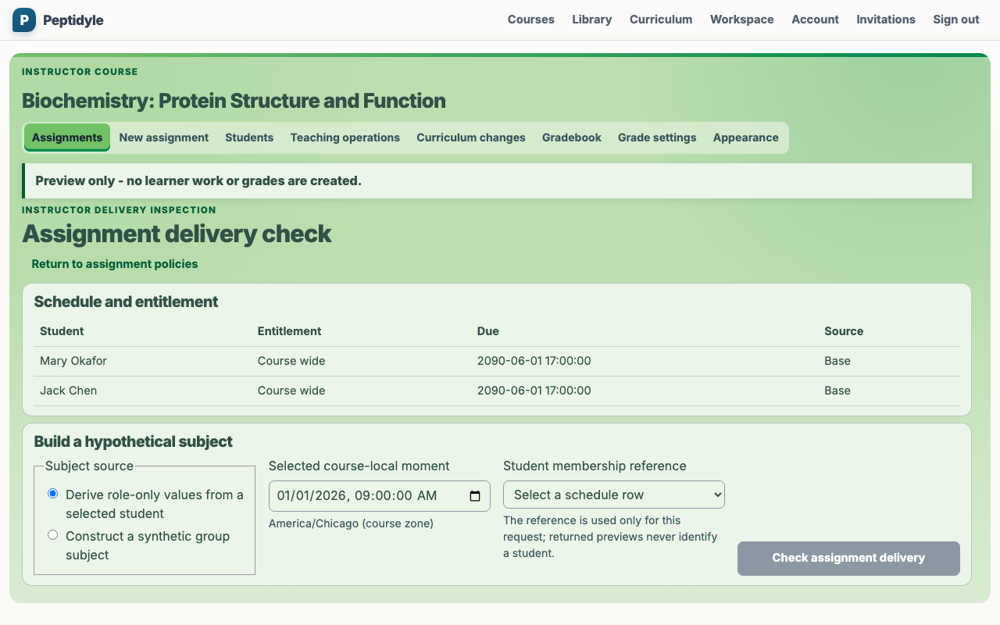
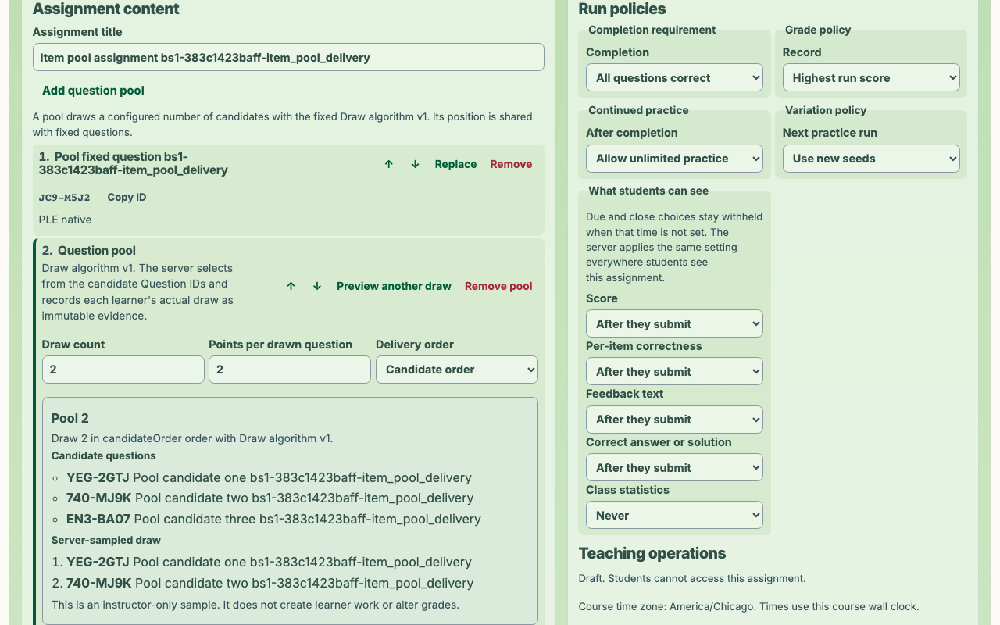

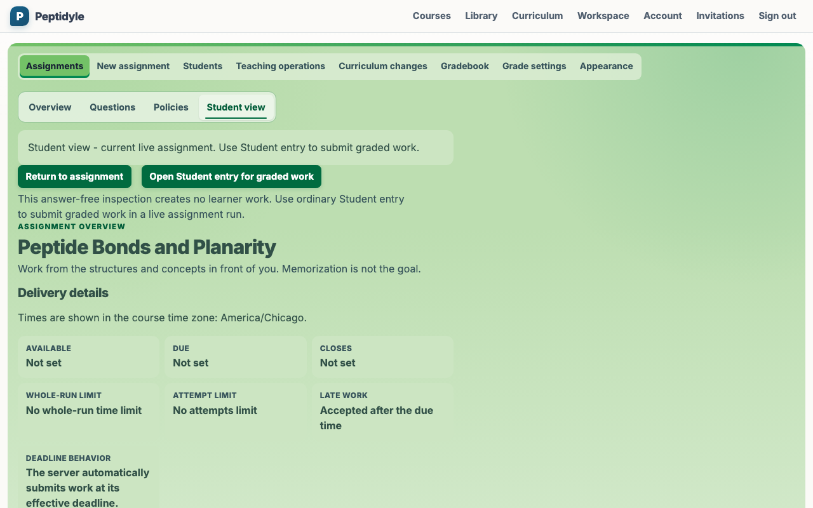
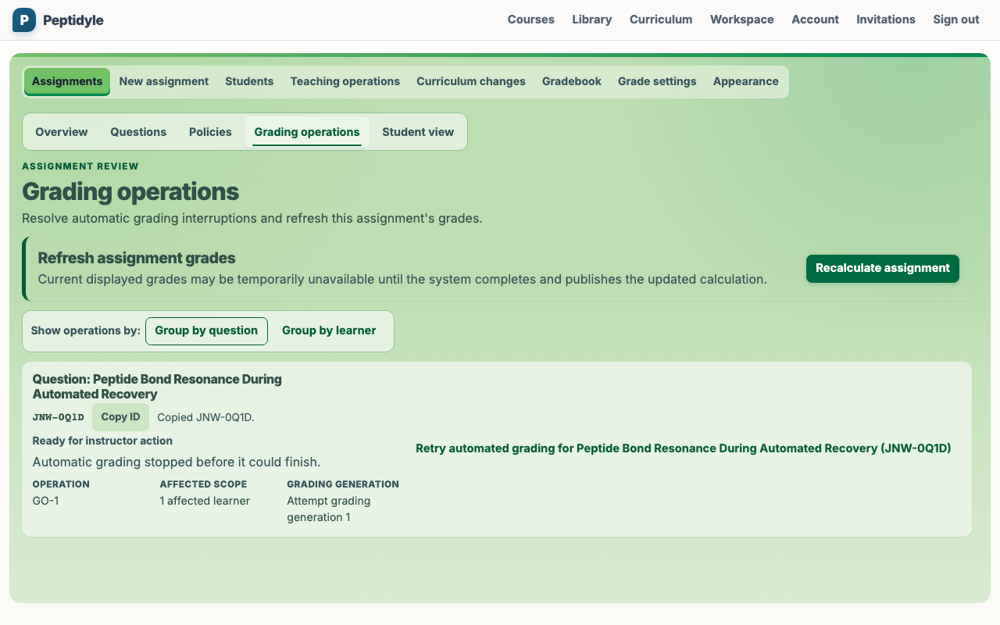
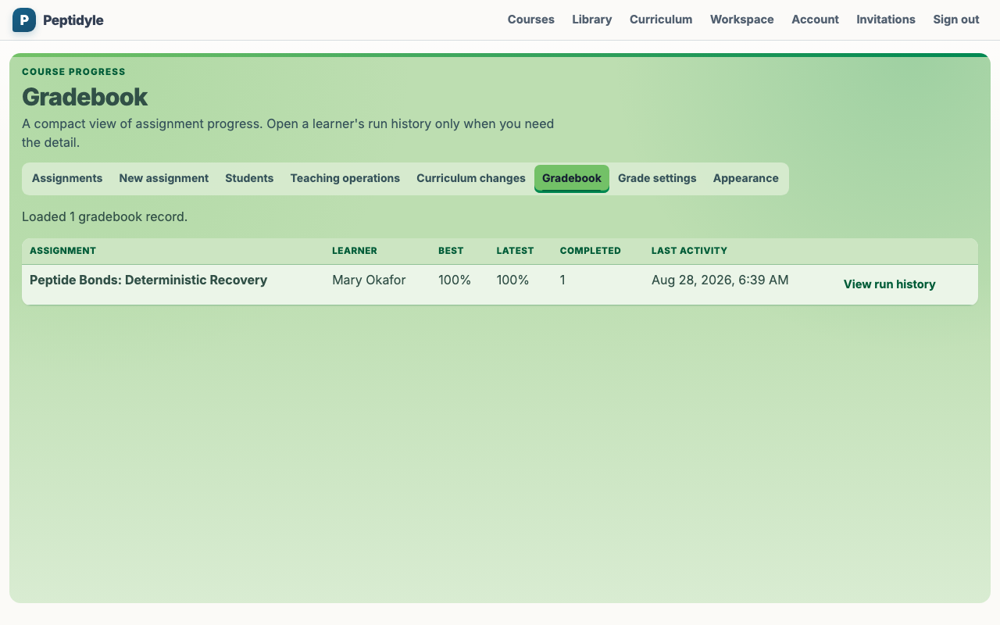
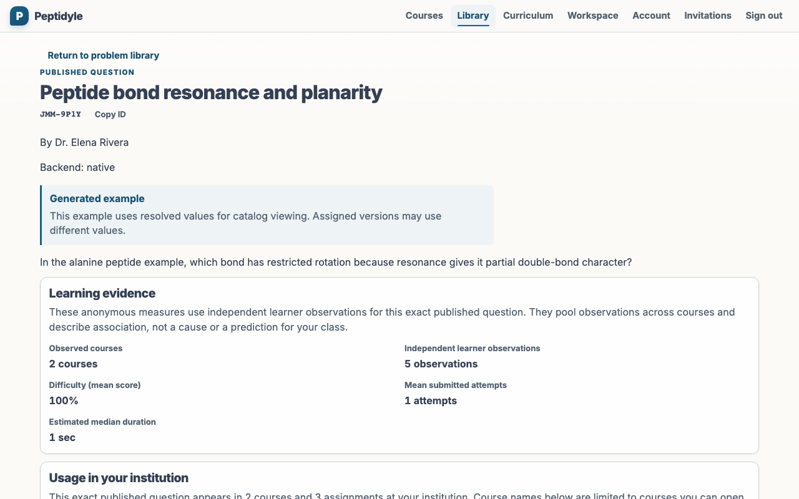
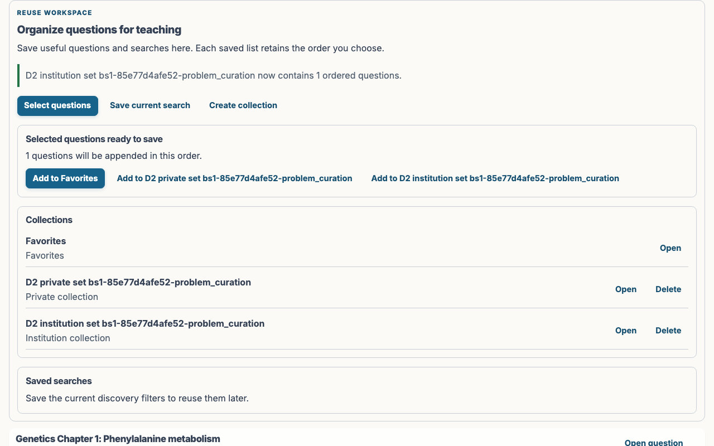
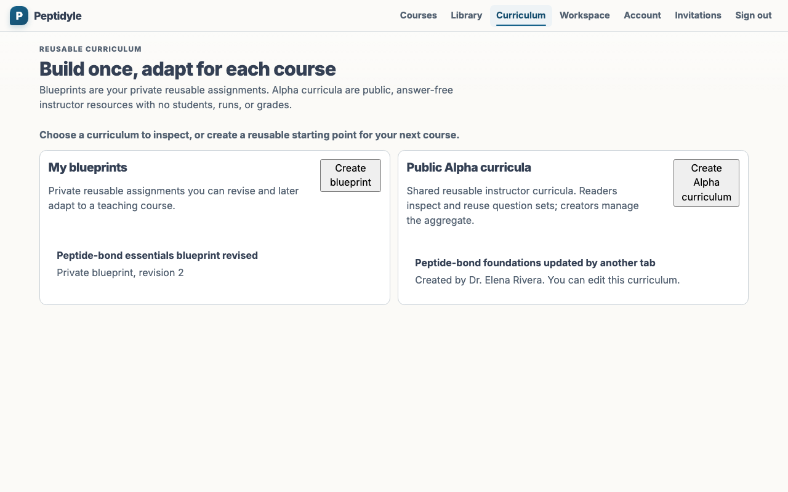
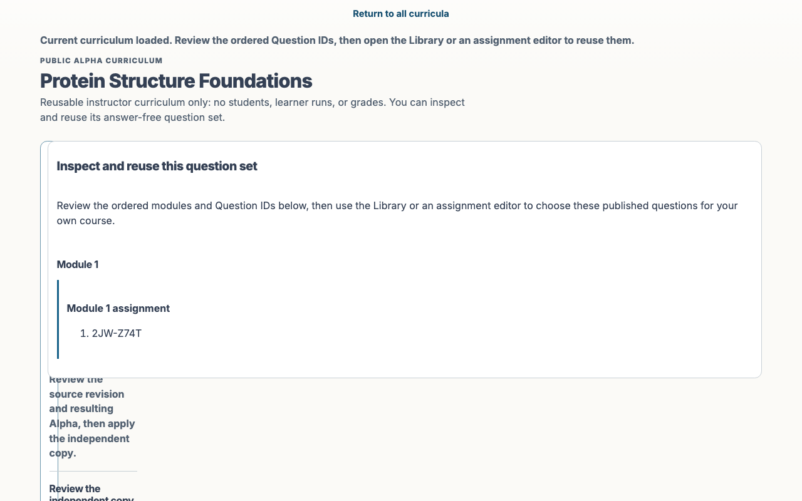
<!-- screenshots:end -->

## Refreshing the corpus

Run the repository-owned publication gate from the repository root whenever an Instructor UI,
corpus, or viewport change requires fresh visual evidence:

```bash
./capture_screenshots.sh
```

The gate uses the fixed real-stack browser owner, stages the dynamic manifest-owned corpus, verifies
origin and provenance, and atomically publishes the resulting `docs/screenshots/` artifacts.
`./all_test.sh` exercises the same stack's behavior and contract gates without rewriting
documentation assets.

Review regenerated images together after shared layout, theme, typography, or navigation changes.
Behavior-focused browser tests remain the authority for interaction, authorization, answer secrecy,
and teaching semantics; these images are visual evidence for composition and current appearance.
The accepted visual evidence covers Blueprint creator and reader distinction, explicit publication,
fork and update-proposal review, unreleased propagated assignments, rollover, DST correction,
keyboard focus, recovery, privacy, and contrast at the canonical 1280 by 800 Instructor profile.
Focused assignment evidence adds Policies and answer-free Student-view surfaces. Student responsive
profiles remain separate and are not inferred from the Instructor desktop capture.
