# Screenshot atlas

<!-- Generated from docs/screenshots/current_capture_manifest.json. Do not edit by hand. -->

This atlas surveys the current reproducible Live Demo surfaces. Machine verification proves
the declared semantic states and privacy boundaries; visual launch readiness still requires
human review.

## Public

### Account

#### Authentication

| | | |
| --- | --- | --- |
|  Seeded Live Demo sign-in sign in - laptop Featured |  Seeded Live Demo sign-in on a phone sign in - phone |  |

#### Session Recovery

| | | |
| --- | --- | --- |
|  Expired-session renewal expired - laptop |  |  |

## Instructor

### Courses

#### Seeded Teaching Course

| | | |
| --- | --- | --- |
|  Instructor Course Instances course list - laptop Featured |  Course Assignment workspace assignment workspace - laptop |  |

#### Past Teaching Courses

| | | |
| --- | --- | --- |
|  Inactive Courses list zero past Course Instances - laptop |  |  |

#### Roster

| | | |
| --- | --- | --- |
|  Active Course roster active students - laptop |  Roster with a pending invitation pending invitation - laptop |  |

### Grading

#### Seeded Teaching Course

| | | |
| --- | --- | --- |
|  Answer-free Gradebook mixed progress - laptop Featured |  |  |

### Assignments

#### Upcoming Deadlines

| | | |
| --- | --- | --- |
|  Assignments Due Soon without current deadlines no current deadlines - laptop |  |  |

#### Assignment Release

| | | |
| --- | --- | --- |
|  Assignment creation creation - laptop | [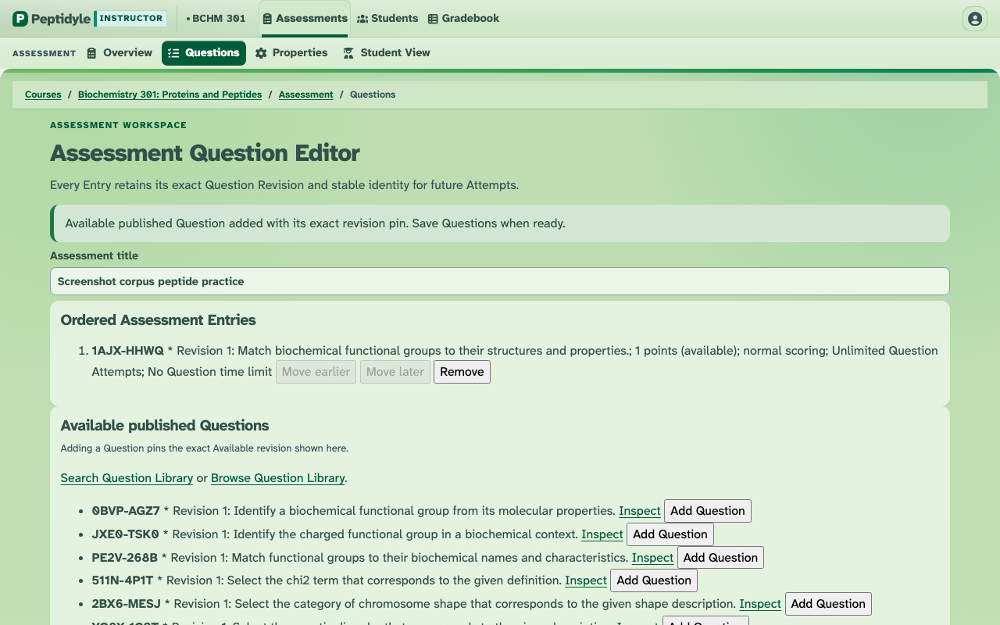](screenshots/instructor/assignment_release_draft.png) Draft Assignment Questions draft - laptop | [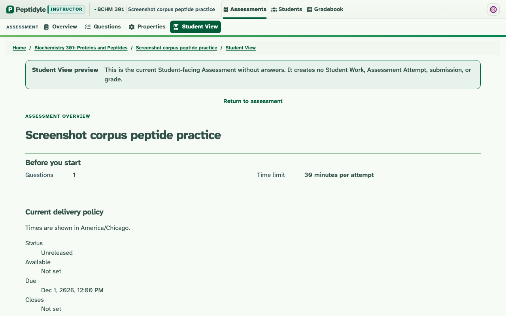](screenshots/instructor/assignment_release_preview.png) Answer-free Assignment Preview answer-free preview - laptop |
| [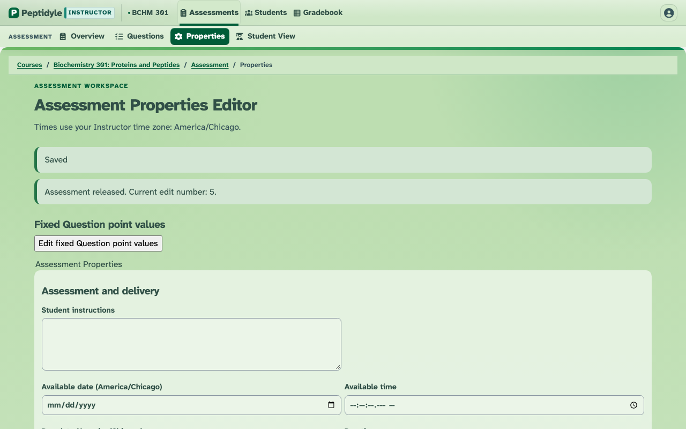](screenshots/instructor/assignment_release_released.png) Released Assignment Policies released - laptop Featured |  |  |

#### Assessment Template Creation

| | | |
| --- | --- | --- |
|  Editable Assessment Template editable template - laptop |  |  |

### Account

#### Profile Preferences

| | | |
| --- | --- | --- |
|  Instructor Profile default profile - laptop |  |  |

### Question Library

#### Question Discovery

| | | |
| --- | --- | --- |
| [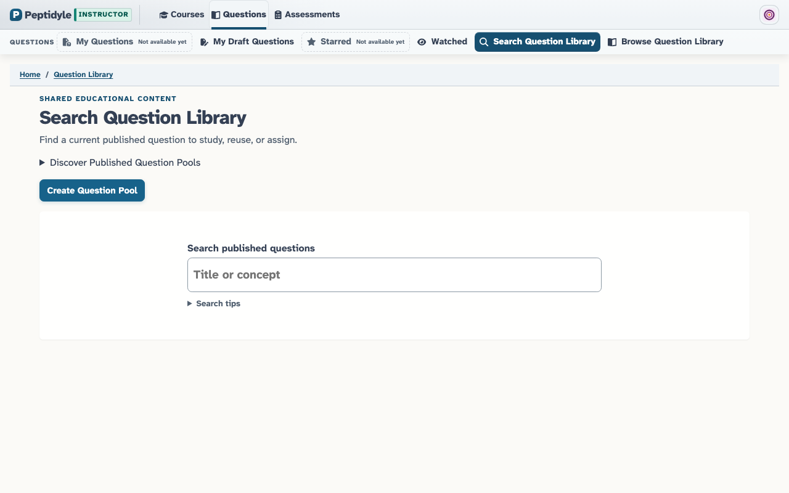](screenshots/instructor/question_library.png) Question Library default - laptop Featured | [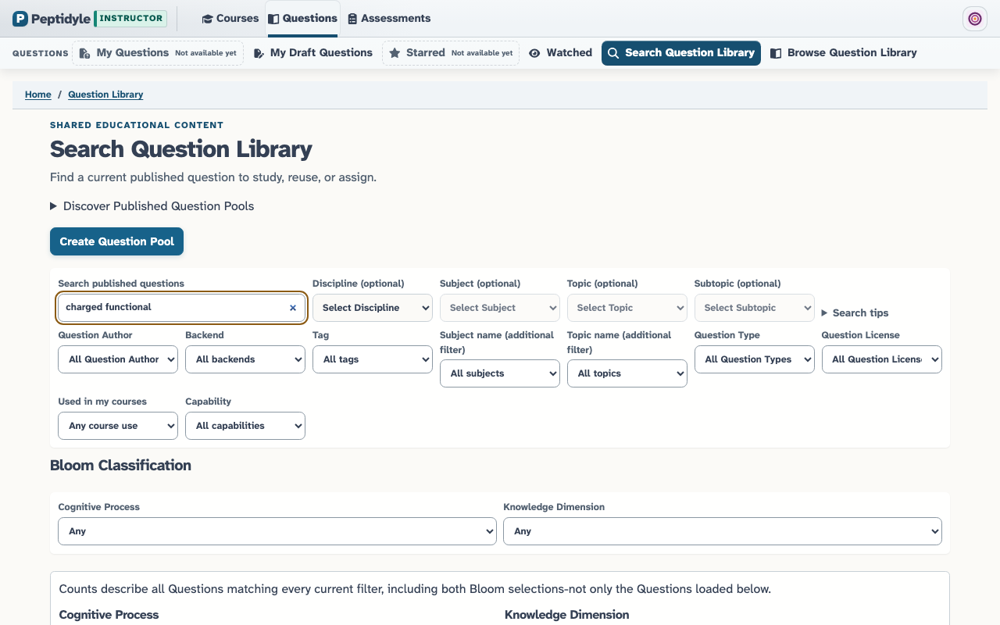](screenshots/instructor/question_library_filtered.png) Filtered Question Library filtered - laptop | [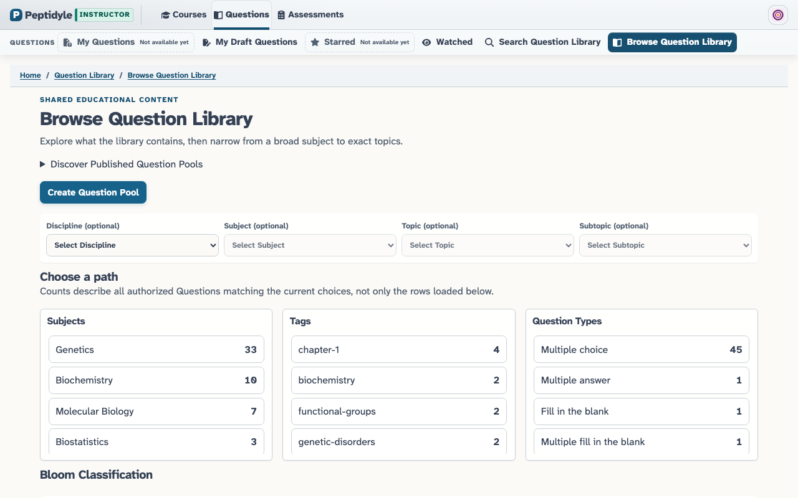](screenshots/instructor/question_library_browse.png) Browse Question Library browse overview - laptop |
|  Published Question detail published detail - laptop |  |  |

#### Question Pool Creation

| | | |
| --- | --- | --- |
| [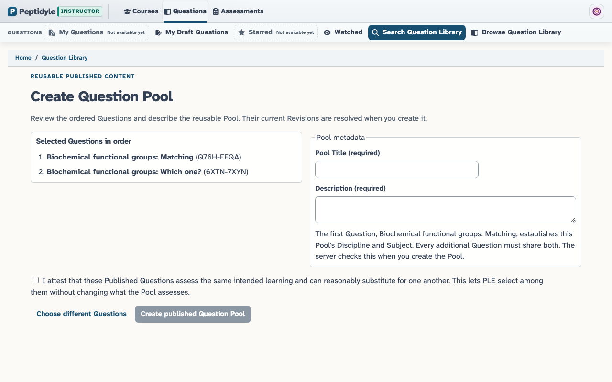](screenshots/instructor/question_pool_creation_review.png) Question Pool creation review selected Question review - laptop |  |  |

#### Generated Question Preview

| | | |
| --- | --- | --- |
|  Answer-free WeBWorK generated example rendered WeBWorK example - laptop |  HLA offspring genotype generated example HLA haplotype inheritance example - laptop |  Monohybrid genotype matching generated example monohybrid genotype matching example - laptop |
|  X-linked offspring count table generated example X-linked offspring count table example - laptop |  True/False Statements About DNA Structure generated example True/False Statements About DNA Structure generated example - laptop |  Matching Meiosis Prophase I Stages to Descriptions generated example Matching Meiosis Prophase I Stages to Descriptions generated example - laptop |
|  True/False Statements About Chi-Square Tests generated example True/False Statements About Chi-Square Tests generated example - laptop |  Matching Chromosome Shapes to Descriptions generated example Matching Chromosome Shapes to Descriptions generated example - laptop |  |

### Question Authoring

#### Publication

| | | |
| --- | --- | --- |
| [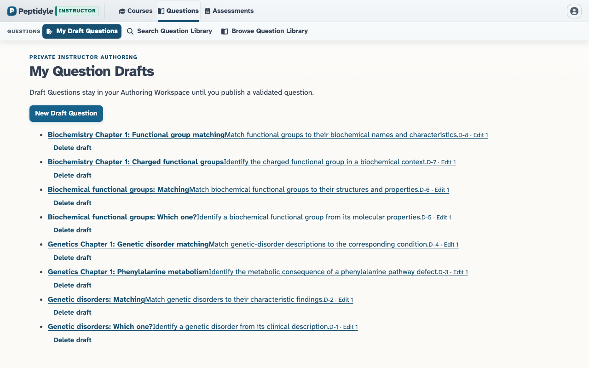](screenshots/instructor/question_drafts.png) Private Question drafts draft list - laptop |  Saved private Question editor saved draft - laptop |  Question publication review review - laptop |

### Blueprint Courses

#### Reusable Course Design

| | | |
| --- | --- | --- |
|  Blueprint Courses list - laptop | [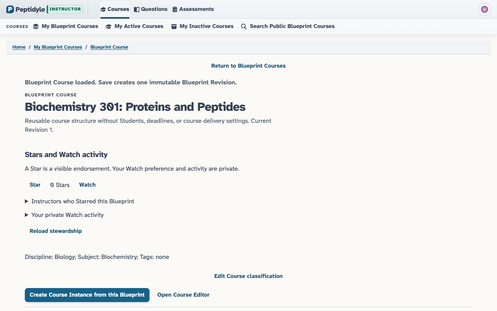](screenshots/instructor/blueprint_course_detail.png) Blueprint Course detail detail - laptop |  Blueprint Question picker question picker - laptop |

#### Public Blueprint Discovery

| | | |
| --- | --- | --- |
| [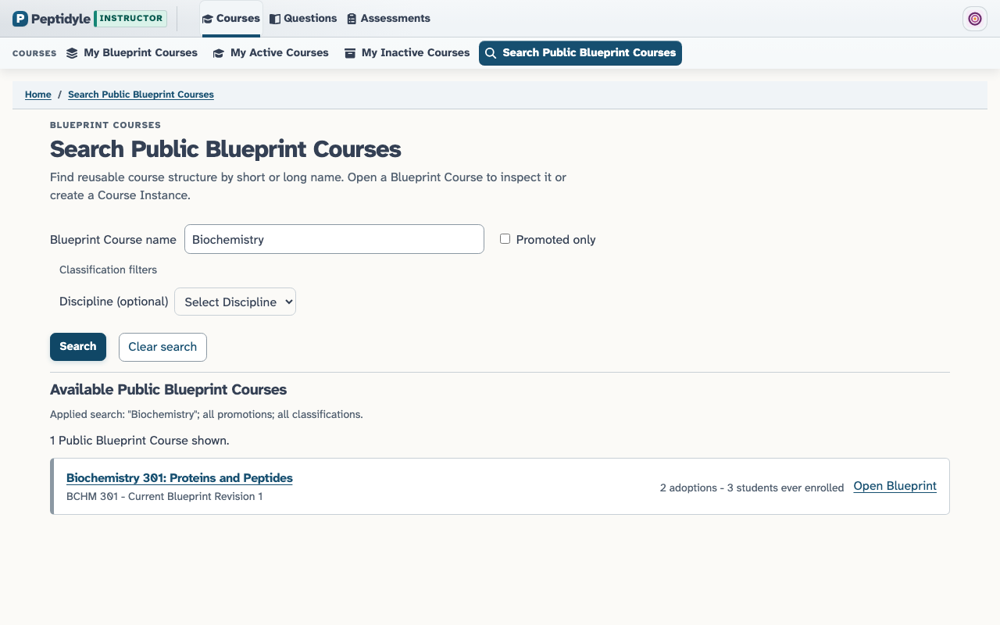](screenshots/instructor/public_blueprint_search.png) Search Public Blueprint Courses filtered results - laptop |  |  |

## Student

### Courses

#### Course Navigation

| | | |
| --- | --- | --- |
|  Student courses course list - laptop Featured |  Student courses on a phone course list - phone |  |

#### Course Invitation

| | | |
| --- | --- | --- |
|  Pending Course Invitations pending index - laptop |  Course Invitation review review - laptop |  |

#### Seeded Assignment Progress

| | | |
| --- | --- | --- |
|  Not-started Course landing not started - laptop |  In-progress Course landing in progress - laptop |  Completed Course landing completed - laptop Featured |
|  Not-started Course landing on a phone not started - phone |  |  |

### Assignments

#### Assignment Entry

| | | |
| --- | --- | --- |
|  Unanswered Assignment overview unanswered - laptop Featured |  Unanswered Assignment overview on a tablet unanswered - tablet |  |

#### Assignment History

| | | |
| --- | --- | --- |
|  Assignment overview with previous attempts previous attempts - laptop |  Selected Assignment history selected previous attempt - laptop |  |

#### Assignment Attempt

| | | |
| --- | --- | --- |
|  Saved Student Assignment response saved response - laptop Featured |  Reloaded Student Assignment response on a tablet reloaded saved response - tablet |  Submitted Student Assignment on a phone submitted - phone |

### Authorization

#### Role Denial

| | | |
| --- | --- | --- |
|  Student authorization denial denied - laptop |  Student authorization denial on a phone denied - phone |  |

### Assessments

#### Native And WeBWorK Response Practice

| | | |
| --- | --- | --- |
| [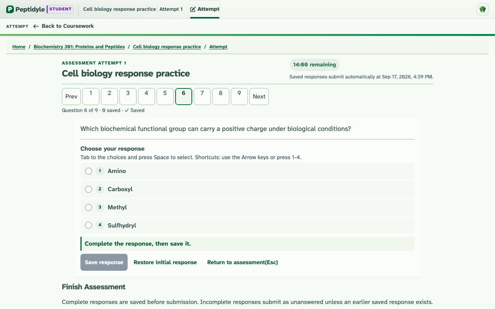](screenshots/student/question_mc_laptop.png) Student MC response controls on a laptop unanswered MC question - laptop | [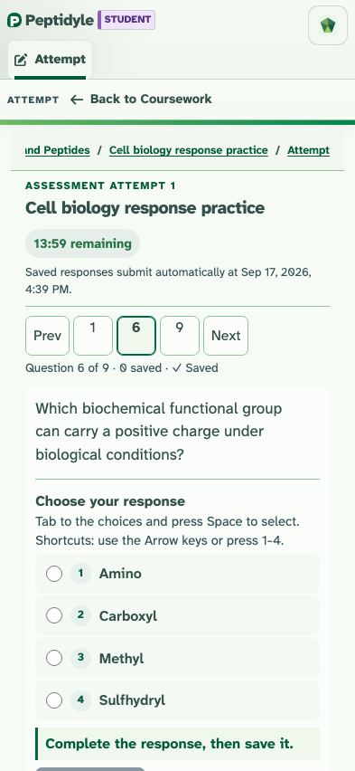](screenshots/student/question_mc_phone.png) Student MC response controls on a phone unanswered MC question - phone | [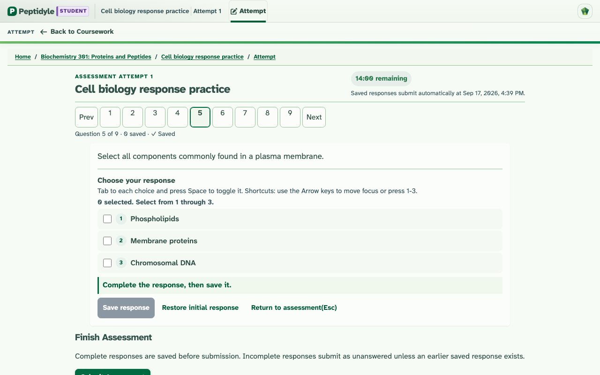](screenshots/student/question_ma_laptop.png) Student MA response controls on a laptop unanswered MA question - laptop |
| [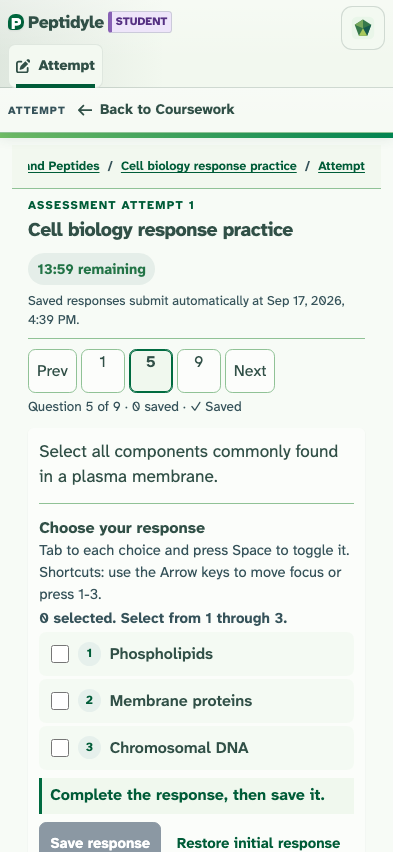](screenshots/student/question_ma_phone.png) Student MA response controls on a phone unanswered MA question - phone | [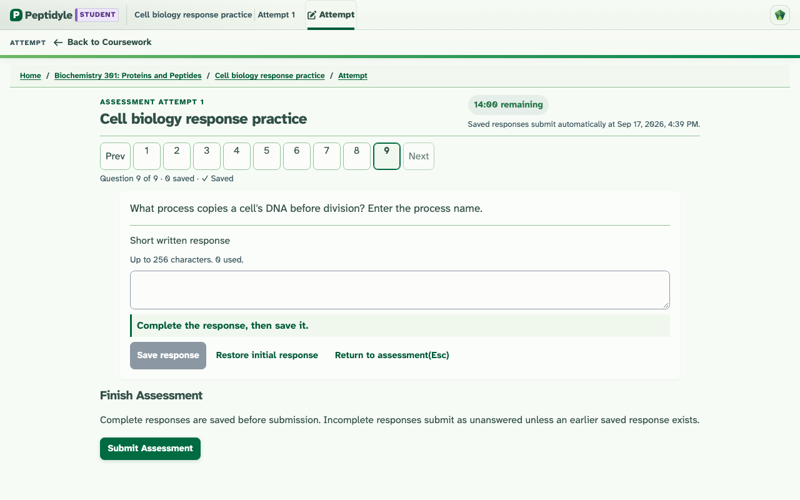](screenshots/student/question_fib_laptop.png) Student FIB response controls on a laptop unanswered FIB question - laptop | [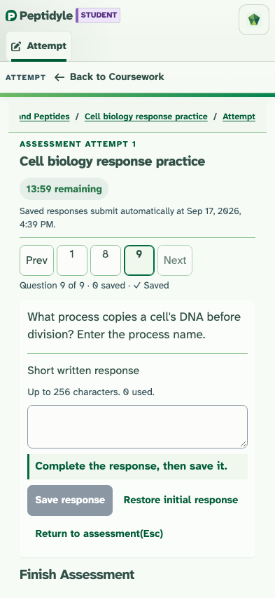](screenshots/student/question_fib_phone.png) Student FIB response controls on a phone unanswered FIB question - phone |
| [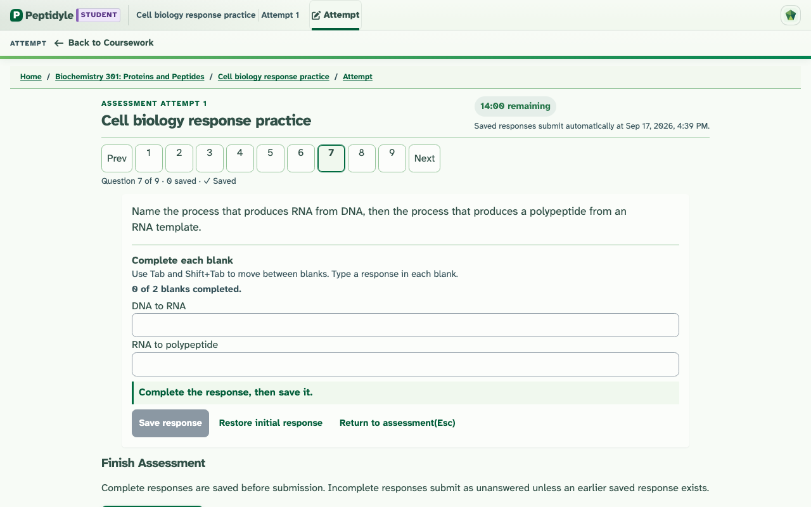](screenshots/student/question_multi_fib_laptop.png) Student MULTI-FIB response controls on a laptop unanswered MULTI-FIB question - laptop | [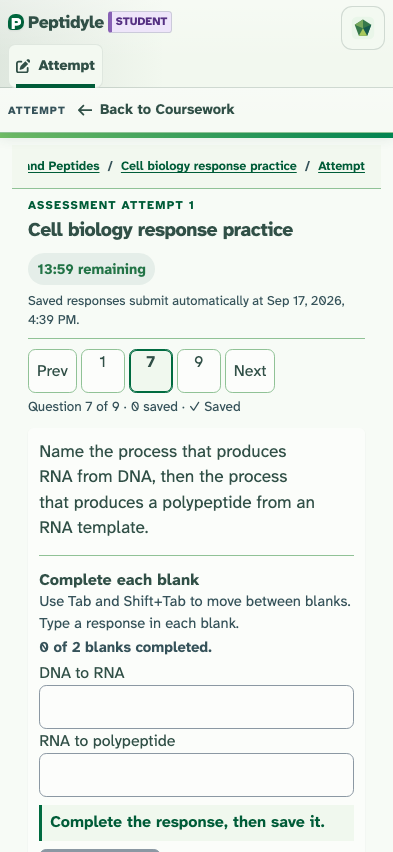](screenshots/student/question_multi_fib_phone.png) Student MULTI-FIB response controls on a phone unanswered MULTI-FIB question - phone | [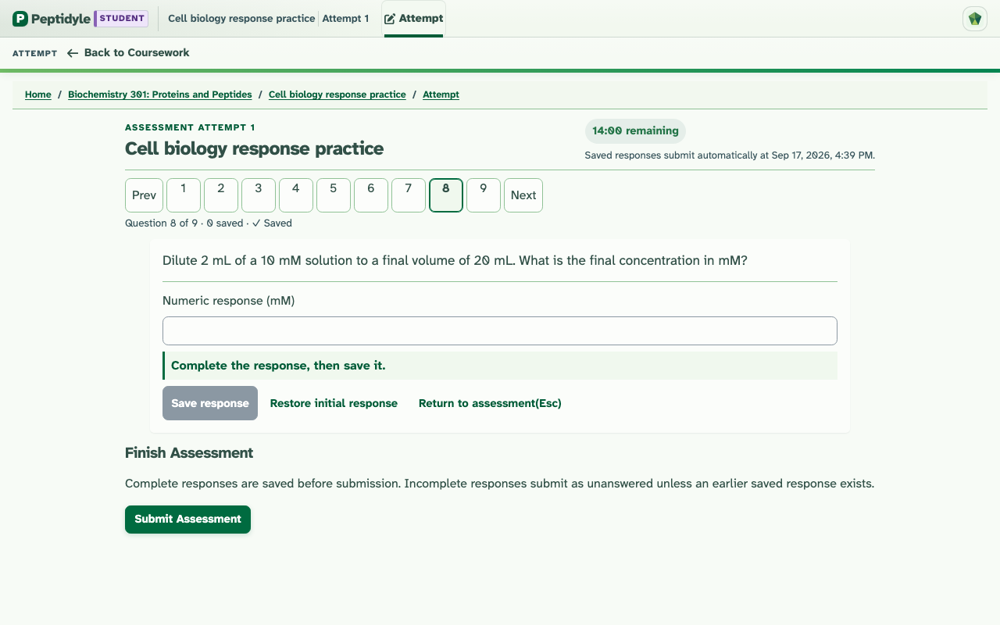](screenshots/student/question_num_laptop.png) Student NUM response controls on a laptop unanswered NUM question - laptop |
| [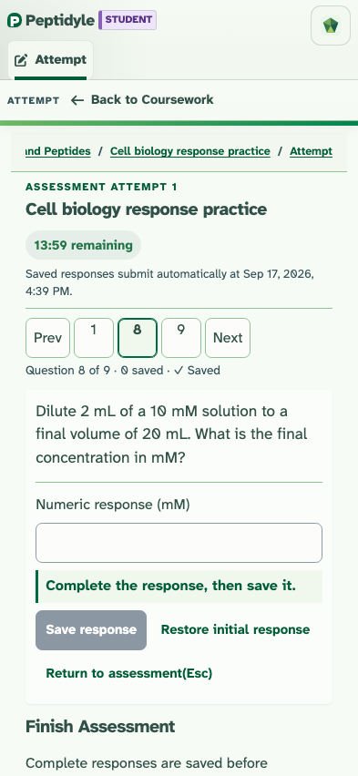](screenshots/student/question_num_phone.png) Student NUM response controls on a phone unanswered NUM question - phone | [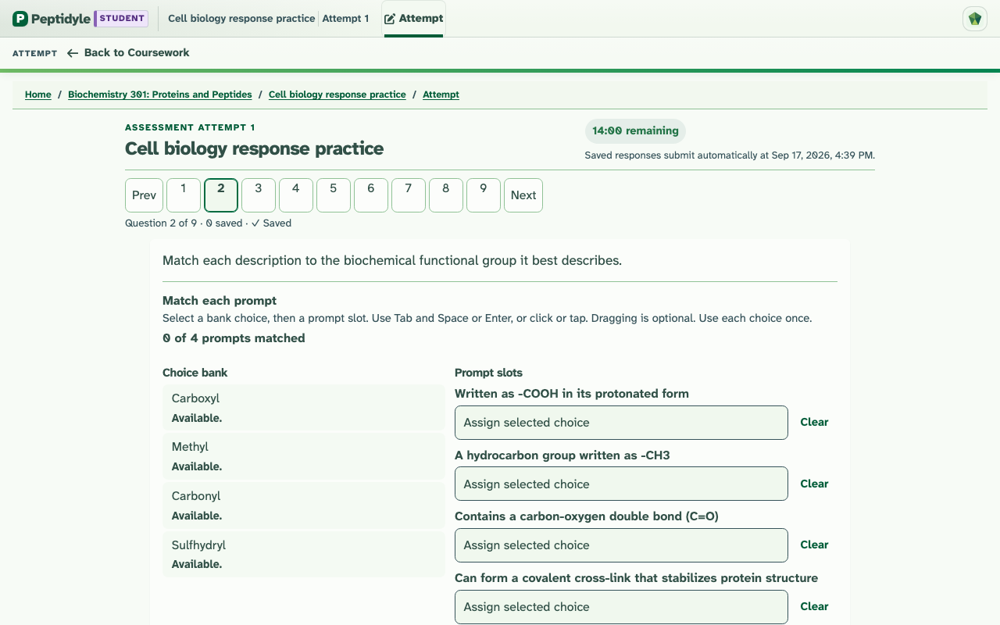](screenshots/student/question_match_laptop.png) Student MATCH response controls on a laptop unanswered MATCH question - laptop | [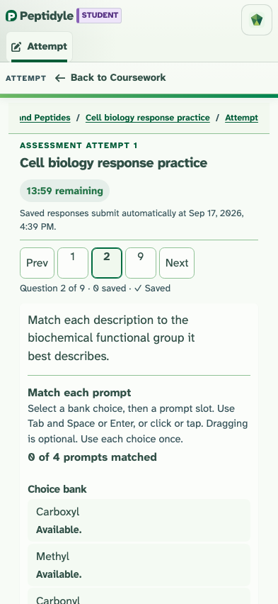](screenshots/student/question_match_phone.png) Student MATCH response controls on a phone unanswered MATCH question - phone |
| [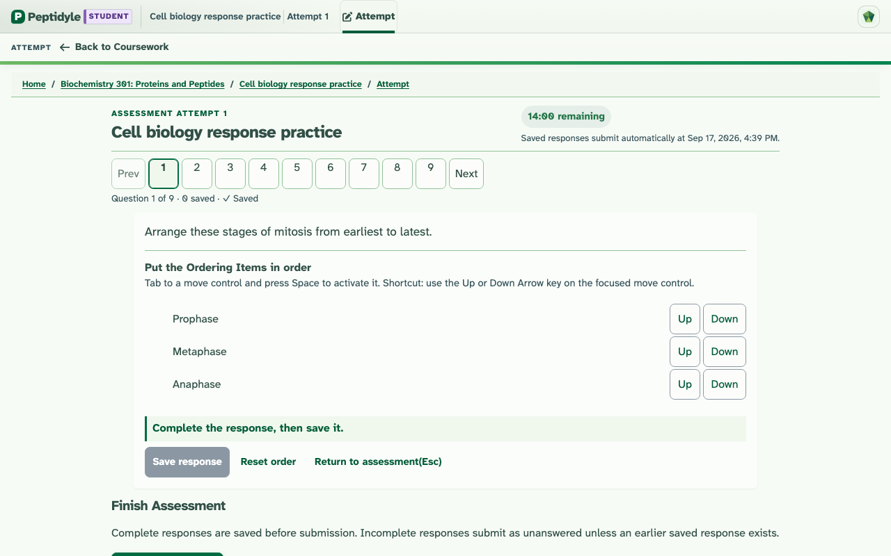](screenshots/student/question_order_laptop.png) Student ORDER response controls on a laptop unanswered ORDER question - laptop | [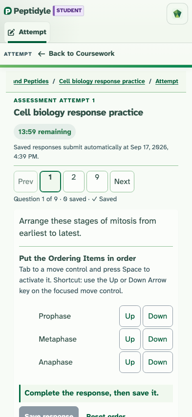](screenshots/student/question_order_phone.png) Student ORDER response controls on a phone unanswered ORDER question - phone |  Student HOTSPOT uploaded-image response controls on a laptop unanswered HOTSPOT question - laptop |
| [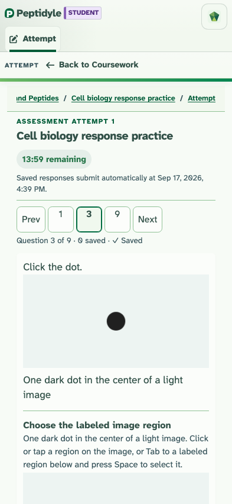](screenshots/student/question_hotspot_phone.png) Student HOTSPOT uploaded-image response controls on a phone unanswered HOTSPOT question - phone | [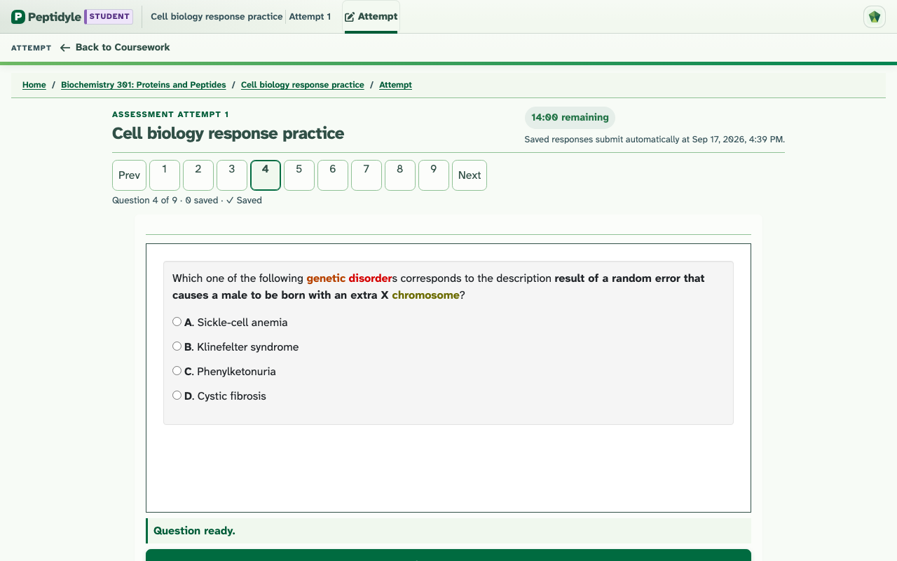](screenshots/student/question_webwork_laptop.png) Student WeBWorK response controls on a laptop unanswered WeBWorK question - laptop | [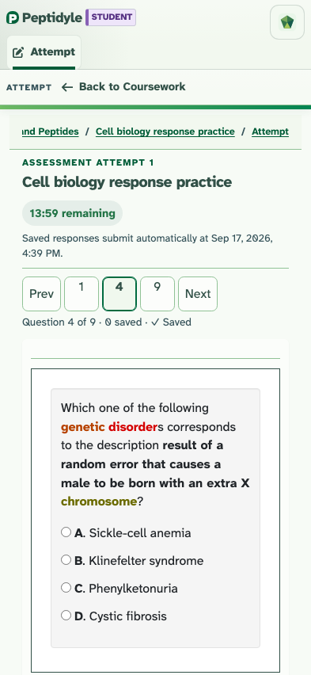](screenshots/student/question_webwork_phone.png) Student WeBWorK response controls on a phone unanswered WeBWorK question - phone |

## Sysadmin

### System Administration

#### System Administration

| | | |
| --- | --- | --- |
|  System administration home system administration home - laptop Featured |  |  |

### Accounts

#### Instructor Account Lifecycle

| | | |
| --- | --- | --- |
|  Instructor Accounts initial - laptop |  Instructor Account creation validation creation validation - laptop |  Created Instructor Account created - laptop |
|  Deactivated Instructor Account deactivated - laptop |  |  |

## Route coverage

| Surface | Status | Evidence or reason |
| --- | --- | --- |
| courses | deferred | The root route is only signed-in Product Role resolution; current canonical captures use their role-owned home routes. |
| instructorHome | captured | instructor_course_list_laptop |
| instructorInactiveCourses | captured | instructor_inactive_courses_list_laptop |
| studentHome | captured | student_course_list_laptop, student_course_list_phone |
| sysadminHome | captured | sysadmin_course_list_laptop |
| profile | captured | instructor_profile_default_laptop |
| accountSettings | deferred | Account Settings requires a fresh Live Demo capture before visual evidence is claimed. |
| courseAssessments | captured | instructor_course_assignment_workspace_laptop |
| assessmentOverview | captured | student_assignment_overview_unanswered_laptop, student_assignment_overview_history_laptop |
| assessmentAttempt | captured | student_assignment_attempt_saved_laptop, student_assignment_attempt_resumed_tablet |
| assessmentAttemptSummary | captured | student_assignment_attempt_submitted_phone, student_assignment_attempt_summary_laptop |
| library | captured | instructor_question_library_laptop, instructor_question_pool_creation_review_laptop |
| libraryBrowse | captured | instructor_question_library_browse_laptop |
| libraryWatchNotifications | deferred | The private Watch notification inbox requires the next canonical Live Demo screenshot refresh before rendered evidence is claimed. |
| questionDetail | captured | instructor_published_question_detail_laptop, instructor_webwork_generated_example_laptop, instructor_webwork_hla_genotype_laptop, instructor_webwork_monohybrid_matching_laptop, instructor_webwork_x_linked_counts_laptop, instructor_webwork_dna_structure_laptop, instructor_webwork_meiosis_prophase_laptop, instructor_webwork_chi_square_laptop, instructor_webwork_chromosome_shapes_laptop |
| questionDrafts | captured | instructor_question_drafts_laptop |
| questionDraftEditor | captured | instructor_draft_editor_saved_laptop, instructor_publication_review_laptop |
| blueprintCourses | captured | instructor_blueprint_courses_laptop, instructor_blueprint_question_picker_laptop |
| publicBlueprintSearch | captured | instructor_public_blueprint_search_laptop |
| blueprintCourseDetail | captured | instructor_blueprint_course_detail_laptop |
| myChangeProposals | deferred | Blueprint Change Proposals require a compiled-main two-Instructor Live Demo workflow before rendered evidence is claimed. |
| changeProposalDetail | deferred | Blueprint Change Proposals require a compiled-main two-Instructor Live Demo workflow before rendered evidence is claimed. |
| assessmentCreate | captured | instructor_assignment_creation_laptop |
| assessmentWorkspaceOverview | deferred | The legacy multi-tab Assignment workspace is retired. |
| assessmentWorkspaceQuestions | captured | instructor_assignment_release_draft_laptop |
| assessmentWorkspacePolicies | captured | instructor_assignment_release_released_laptop |
| assessmentWorkspaceStudentView | captured | instructor_assignment_release_preview_laptop |
| assessmentsDueSoon | captured | instructor_assignments_due_soon_empty_laptop |
| assessmentTemplates | deferred | Assessment Templates needs a fresh Live Demo capture before rendered evidence is claimed. |
| gradebook | captured | instructor_gradebook_laptop |
| courseAppearance | deferred | Course Appearance is an admitted Instructor Ribbon destination; the current atlas has no dedicated Appearance capture. The completed M11 browser scenario separately proves reload, enrolled-Student propagation, and second-Course isolation. |
| signIn | captured | public_sign_in_laptop, public_sign_in_phone |
| courseRoster | captured | instructor_course_roster_active_laptop, instructor_course_roster_pending_invitation_laptop |
| instructorAccounts | captured | sysadmin_instructor_accounts_initial_laptop, sysadmin_instructor_account_created_laptop, sysadmin_instructor_account_deactivated_laptop, sysadmin_instructor_account_validation_laptop |
| contentDisciplines | deferred | The Sysadmin Discipline lifecycle workspace requires the next canonical Live Demo screenshot refresh before rendered evidence is claimed. |
| pendingCourseInvitations | deferred | Pending teaching invitations are not provisioned by the current Live Demo and are not restored for screenshots. |
| studentCourseInvitations | captured | student_invitation_index_laptop |
| studentCourseInvitation | captured | student_invitation_detail_laptop |
| studentCourseLanding | captured | student_course_not_started_laptop, student_course_in_progress_laptop, student_course_completed_laptop |

## Ribbon destination coverage

| Surface | Status | Evidence or reason |
| --- | --- | --- |
| tab:courses | captured | instructor_course_list_laptop, student_course_list_laptop, sysadmin_course_list_laptop |
| tab:questions | captured | instructor_question_library_laptop, instructor_question_pool_creation_review_laptop, instructor_webwork_generated_example_laptop, instructor_webwork_hla_genotype_laptop, instructor_webwork_monohybrid_matching_laptop, instructor_webwork_x_linked_counts_laptop, instructor_webwork_dna_structure_laptop, instructor_webwork_meiosis_prophase_laptop, instructor_webwork_chi_square_laptop, instructor_webwork_chromosome_shapes_laptop |
| tab:productAssessments | captured | instructor_assignments_due_soon_empty_laptop |
| tab:assessments | captured | instructor_course_assignment_workspace_laptop |
| tab:studentAssessments | captured | student_course_not_started_laptop |
| tab:students | captured | instructor_course_roster_active_laptop |
| tab:gradebook | captured | instructor_gradebook_laptop |
| tab:teachingOperations | deferred | Teaching Operations is not admitted by the current Live Demo capability registry. |
| tab:blueprintUpdates | deferred | Blueprint Updates is a future Ribbon destination without a Product Route. |
| tab:courseSetup | deferred | Course Setup is a future Ribbon destination without a complete current workflow. |
| tab:attempt | deferred | The separate legacy Assignment Attempt Ribbon is not exposed by the default Live Demo. |
| tab:instructorAccounts | captured | sysadmin_instructor_accounts_initial_laptop |
| tab:disciplines | deferred | The Sysadmin Disciplines tab requires the next canonical Live Demo screenshot refresh before rendered evidence is claimed. |
| task:myBlueprintCourses | captured | instructor_blueprint_courses_laptop |
| task:myActiveCourses | captured | instructor_course_list_laptop |
| task:myInactiveCourses | captured | instructor_inactive_courses_list_laptop |
| task:searchPublicBlueprintCourses | captured | instructor_public_blueprint_search_laptop |
| task:myQuestions | deferred | My Questions is a future Ribbon destination without a Product Route. |
| task:myDraftQuestions | captured | instructor_question_drafts_laptop |
| task:starred | deferred | Starred Questions is a future Ribbon destination without a Product Route. |
| task:watched | deferred | Watched is an Instructor route to the private Watch inbox; its rendered checkpoint awaits the next canonical Live Demo replay. |
| task:searchQuestionLibrary | captured | instructor_question_library_filtered_laptop |
| task:browseQuestionLibrary | captured | instructor_question_library_laptop |
| task:assessmentsDueSoon | captured | instructor_assignments_due_soon_empty_laptop |
| task:assessmentTemplates | deferred | Assessment Templates needs a fresh Live Demo capture before rendered evidence is claimed. |
| task:assessmentOverview | deferred | The legacy multi-tab Assignment workspace is retired. |
| task:assessmentQuestions | deferred | The legacy multi-tab Assignment workspace is retired. |
| task:assessmentPolicies | deferred | The legacy multi-tab Assignment workspace is retired. |
| task:assessmentStudentView | deferred | The answer-free release preview is the current Student-view surface. |
| task:gradeSettings | deferred | Grade Settings is not admitted by the current Live Demo capability registry. |
| task:appearance | deferred | Course Appearance is an admitted Instructor Ribbon task; the current atlas has no dedicated Appearance capture. The completed M11 browser scenario separately proves reload, enrolled-Student propagation, and second-Course isolation. |
| task:backToAssessments | covered_by | tab:assessments: The destination is the same captured Course Assignment workspace. |
