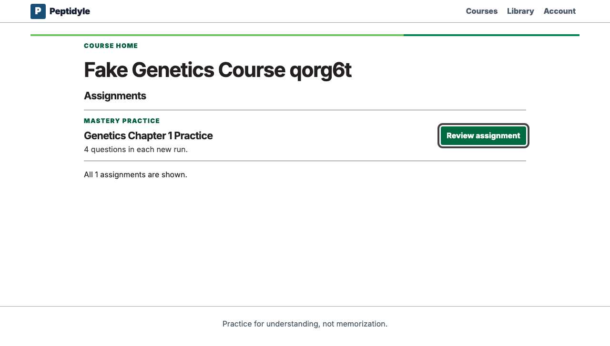
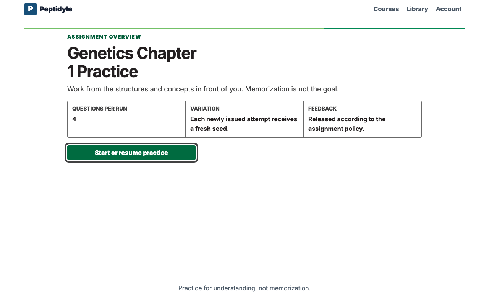
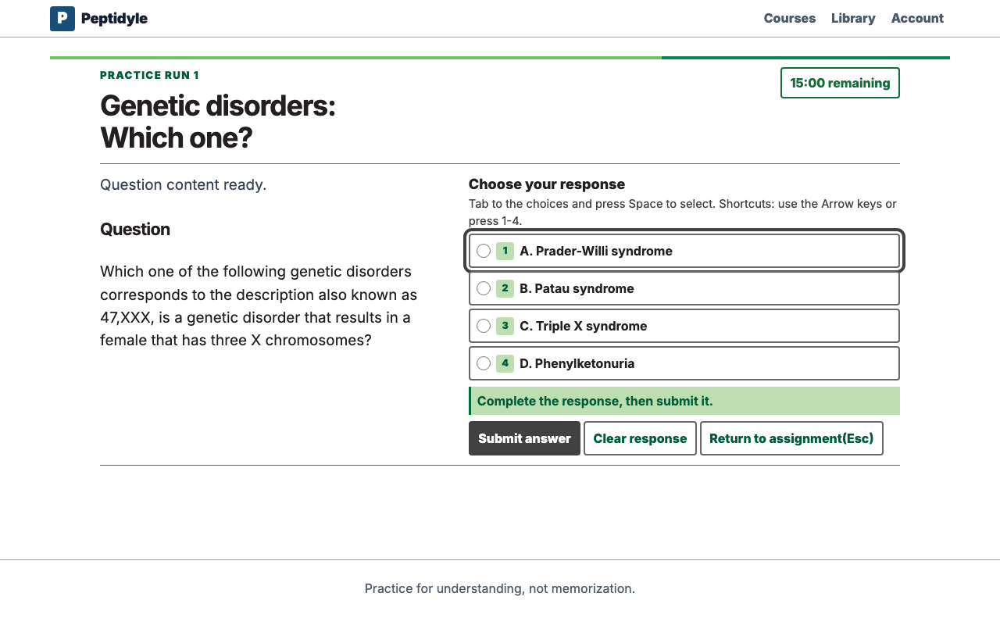
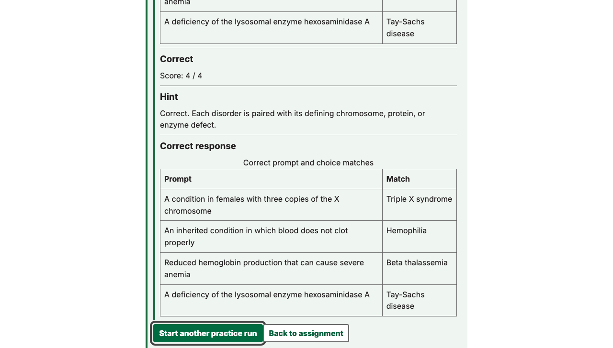
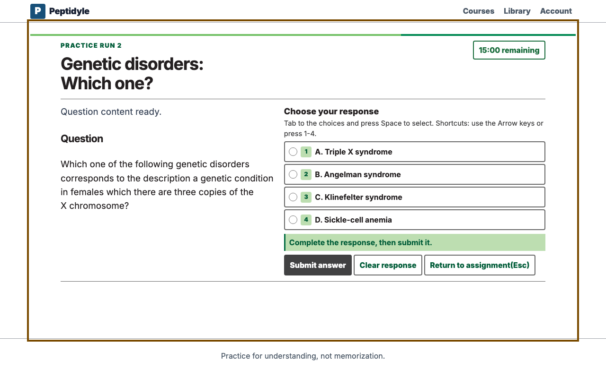

# Student guide

This guide follows one local Mastery assignment from its overview through completion and fresh
practice. The browser path uses visible controls and the platform keyboard model; it does not call a
private API or inspect an answer key. Start the local system first with [USAGE.md](USAGE.md).

All people and course records shown in these captures are simulated. The fixed labels
`Dr. Fake Professor`, `Mary Fake Student`, and `Jack Fake Student` are intentionally unmistakable
placeholders.

<!-- screenshots:begin (managed by screenshot-docs) -->

<!-- screenshots:end -->

## Before you begin

- Use the student value from the ignored `containers/local-login.txt` file.
- Ask the instructor to confirm that the local learner is active in the course roster.
- Open the course and assignment through their visible cards.

This local pilot deliberately avoids email registration, invitation delivery, and activation.
Production student accounts and canonical onboarding are separate from the teaching-loop evidence
shown here. Fastmail is intended for a future external-email integration, but it is not configured
or required for this pilot.

## Use the keyboard path

- Press **Tab** and **Shift+Tab** to move focus through visible controls.
- Press **Space** to select a response or activate the focused practice control.
- Press **Enter** to follow the focused course and assignment links.
- Follow the visible focus ring rather than relying on a pointer shortcut.

The complete accessibility contract is in
[NO_MOUSE_ACCESSIBILITY_CONTRACT.md](NO_MOUSE_ACCESSIBILITY_CONTRACT.md).

## Complete the first run

1. Open the assignment and activate **Start or resume practice**.
2. Read the visible timer, then select a response and activate **Submit answer**.
3. Read the visible feedback.
4. Activate **Continue**.
5. Correct the retry and continue to the completed summary.

The student receives visible feedback, but answer keys and grading implementation remain on the
server. The browser displays the countdown; the server decides whether a response arrived on time.

## Practice again

The completed summary keeps **Start another practice run** available. Activating it opens the captured
**Mastery practice run 2** screen with a reset 15-minute timer and no response selected, proving that the
student entered a new run rather than reopening the completed one. The completed assignment remains
recorded. Leaving an unsubmitted response and resuming the active run clears that response, so the
learner returns to an intentional fresh choice.

After two completed runs, the instructor can verify the score summary and history described in
[INSTRUCTOR_GUIDE.md](INSTRUCTOR_GUIDE.md). Continued practice remains available after completion;
completion and the opportunity to learn are not the same event.
