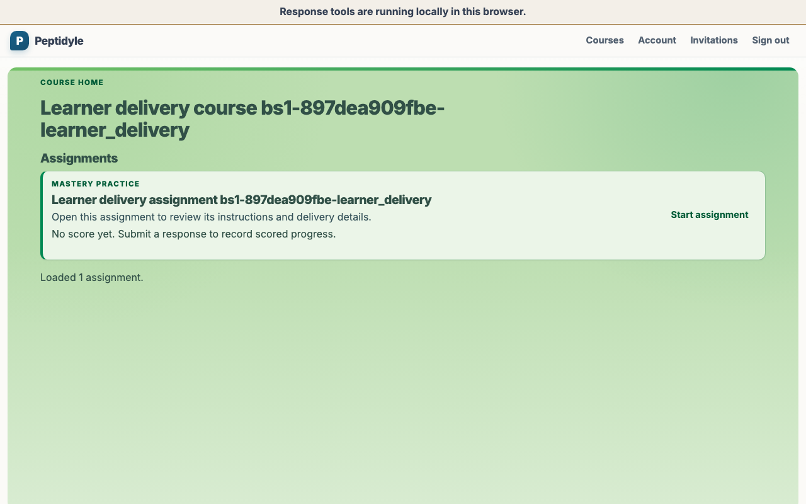
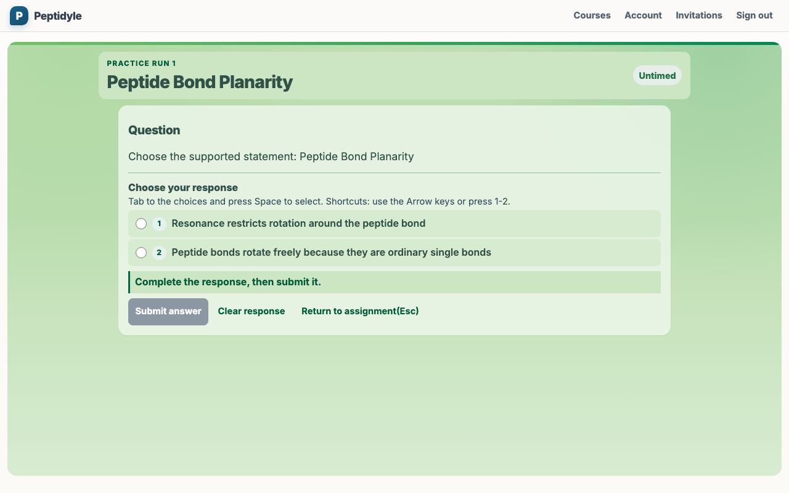
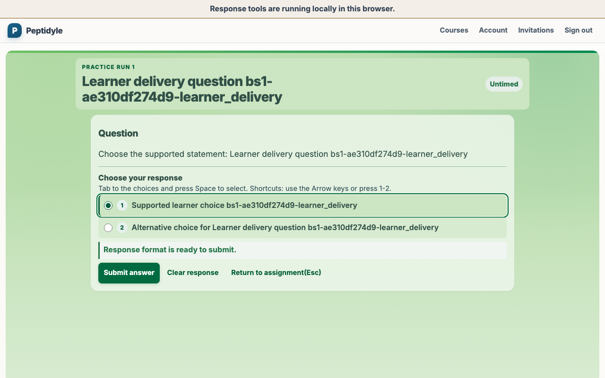
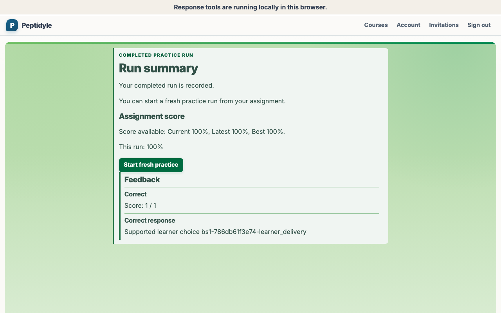
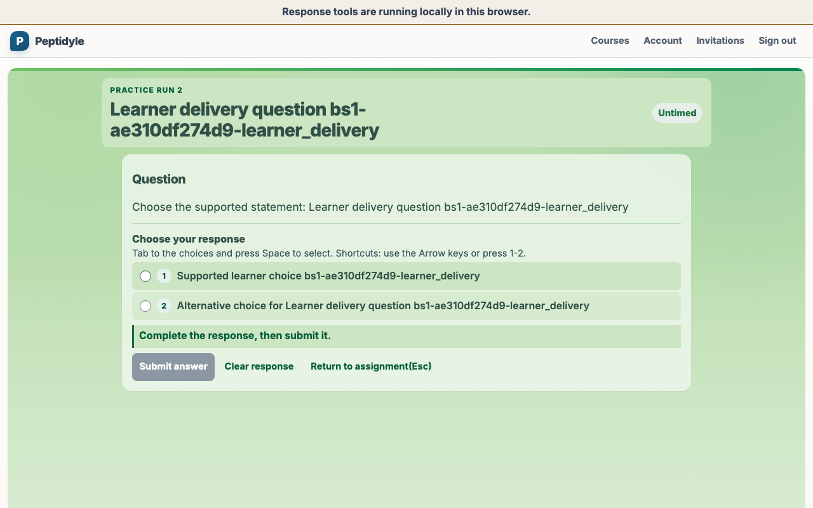

# Student guide

This guide follows one account-authenticated Mastery assignment from its overview through
completion and fresh practice. The browser path uses visible controls and the platform keyboard
model; it does not call a private API or inspect an answer key. Start the local system first with
[USAGE.md](USAGE.md).

All people and course records shown in these captures are fictional live-demo data. The seeded
personas are ordinary PLE Instructor and Student records in the disposable baseline; regeneration
discards them and recreates the same fictional baseline.

<!-- screenshots:begin (managed by screenshot-docs) -->

<!-- screenshots:end -->

## Before you begin

- Open the local stack's HTTPS URL and use the visible PLE account page.
- The current live-demo build uses its visible seeded-persona selector to enter a fictional Student
  Account through the ordinary Authenticated Session. Email-code and passkey sign-in remain the
  required product paths and are being reconstructed on that same session foundation.
- If you are not using the seeded selector, ask the instructor to create an invitation and share its
  one-time copy link through the trusted course channel. Claim it after authenticating your PLE
  account, then open the course and assignment through their visible cards.

## Use the keyboard path

- Press **Tab** and **Shift+Tab** to move focus through visible controls.
- Press **Space** to select a response or activate the focused practice control.
- Press **Enter** to follow the focused course and assignment links.
- Follow the visible focus ring rather than relying on a pointer shortcut.

The complete accessibility contract is in
[NO_MOUSE_ACCESSIBILITY_CONTRACT.md](NO_MOUSE_ACCESSIBILITY_CONTRACT.md).

## Complete the first run

1. Open the assignment and read **Instructions** and **Delivery details**. Schedule times are already
   resolved by the server and shown in the course time zone; the browser does not infer policy or a
   deadline from its own clock.
2. Activate **Start or resume practice**.
3. Read the visible timer, then select a response and activate **Submit answer**.
4. If **Response received** appears, activate **Check grading status** until feedback or an
   instructor-attention message appears.
5. When **Feedback** appears, read it and activate **Continue**.
6. When an instructor-attention message appears, stop and contact your instructor; the assignment
   keeps your accepted response while the instructor resolves the grading issue.
7. After feedback, correct the retry and continue to the completed summary.

The student receives visible feedback, but answer keys and grading implementation remain on the
server. The browser displays the countdown; the server decides whether a response arrived on time.
When scoring is recalculating or has failed, the page reports that neutral state and omits numeric
scores; it never presents a missing score as zero. Draft, closed, or otherwise unavailable work does
not expose instructor policy or provenance through the Student route.

## Practice again

The completed summary keeps **Start fresh practice** available. Activating it opens the captured
**Practice run 2** screen with no response selected, proving that the student entered a new run rather
than reopening the completed one. This demo assignment is untimed; timed assignments display a fresh
server-authoritative deadline. The completed assignment remains recorded. Leaving an unsubmitted
response and resuming the active run clears that response, so the Student returns to an intentional
fresh choice.

After a completed run, the instructor can verify the score summary and history described in
[INSTRUCTOR_GUIDE.md](INSTRUCTOR_GUIDE.md). Continued practice remains available after completion;
completion and the opportunity to learn are not the same event.
