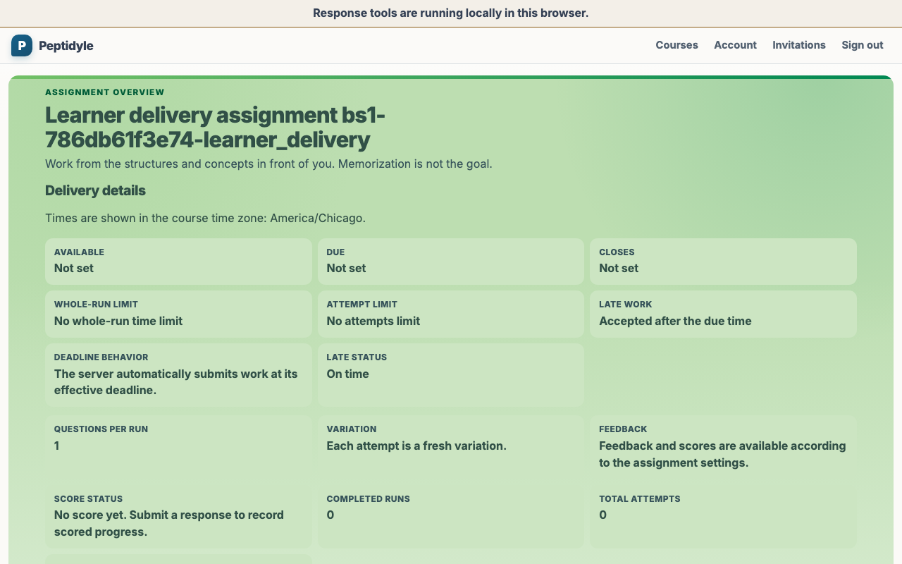
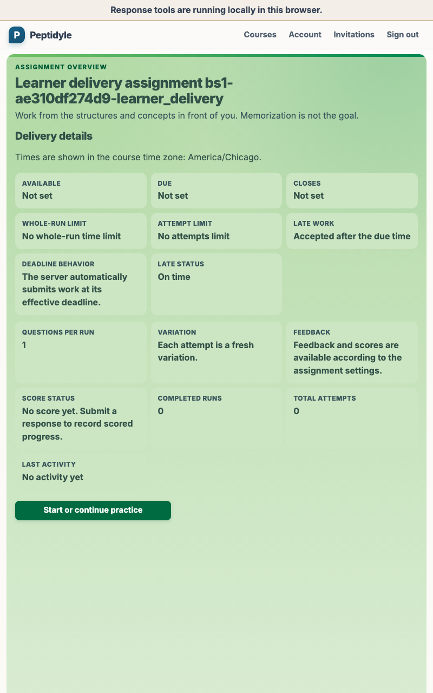
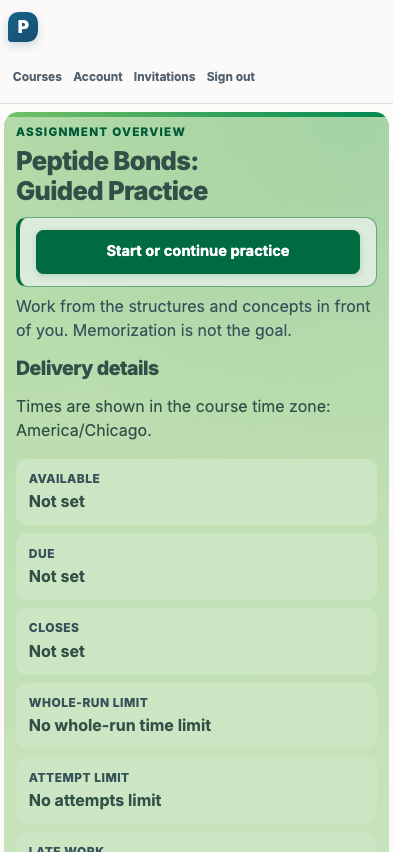
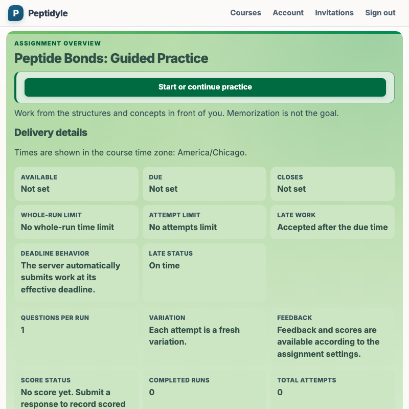
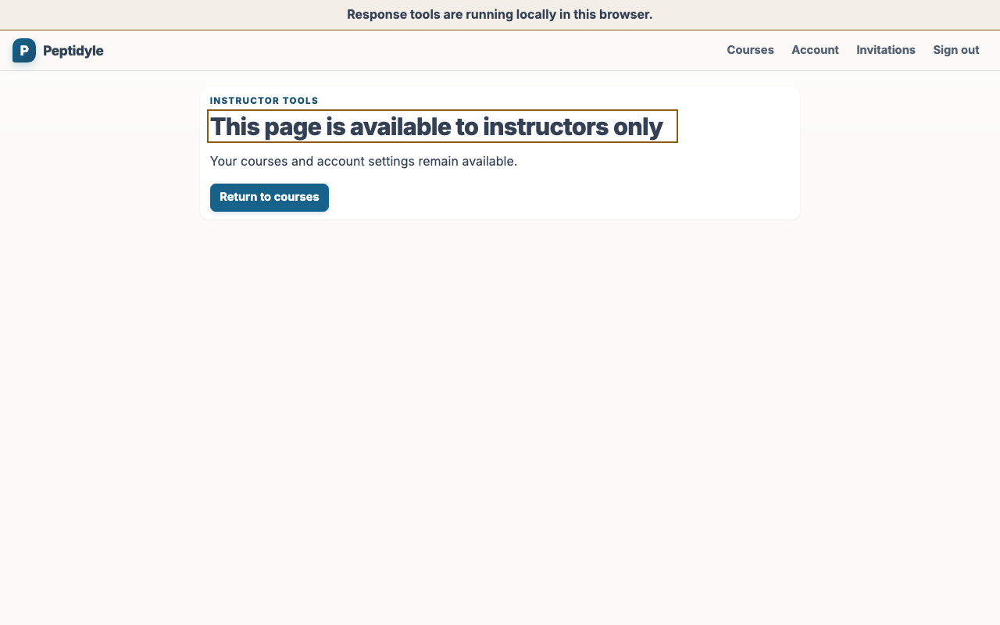
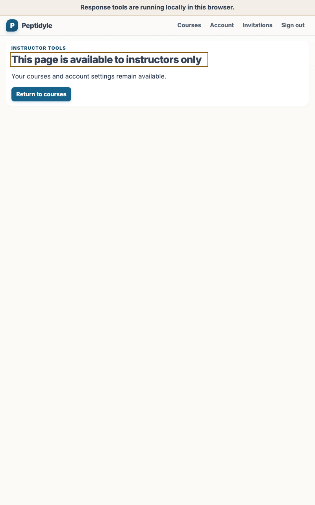
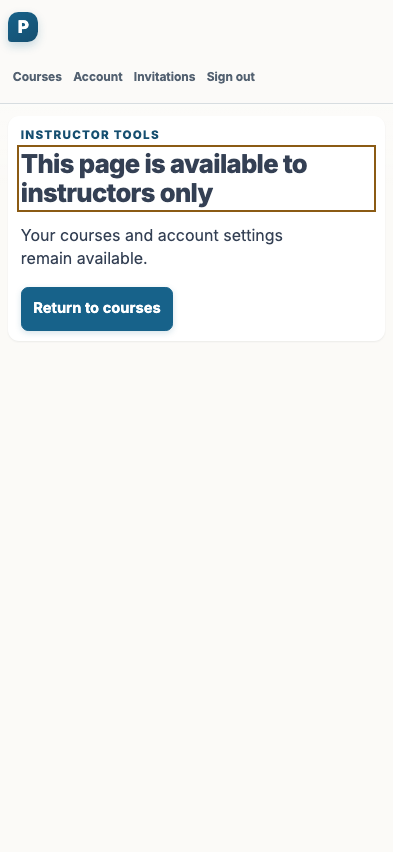
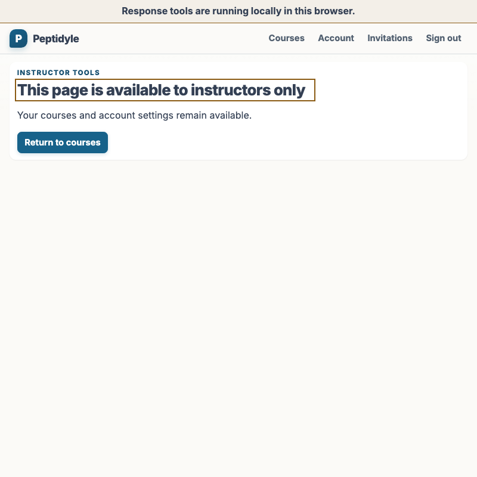

# Student page visuals

This document defines the permanent student and access-evidence contract and embeds the current
deterministic built-app demo environment. It uses fictional students and sample course data that
people can evaluate without implying a real deployment. Browser behavior and no-transport
assertions remain the authority for access control; screenshots show the student-visible composition.

## Evidence contract

Student captures use these exact CSS-pixel viewports. The percentages are planning weights, not test
quotas or telemetry targets.

| Viewport | Aspect | Planning weight |
| --- | --- | --- |
| 1280 by 800 | 16:10 laptop | 40% |
| 800 by 1280 | 10:16 portrait tablet | 30% |
| 393 by 852 | iPhone Pro aspect | 20% |
| 800 by 800 | square | 10% |

The student corpus must include an allowed student surface and an access-denial state for
instructor-only routes. Pixels show composition and the visible denial; they cannot prove
authorization. Each access capture therefore ships with no-transport assertions that the denied
route mounted no instructor payload, plus direct route probes for the same session.

The denial boundary is one centrally derived, fail-closed route decision. It runs before instructor
components or transport requests mount. It covers every instructor-only route, including roster and
gradebook, and does not depend on a component hiding itself after a request. A direct navigation to
an instructor-only route must receive the same denial and no instructor transport as an in-app link.

## Current visual evidence

The first four images show the allowed assignment overview with plain-text instructions and
server-resolved course-zone delivery details. The next four show the same student session denied
access to the representative instructor gradebook route. Each set follows the table's laptop,
portrait tablet, iPhone Pro, and square order.

<!-- screenshots:begin (managed by screenshot-docs) -->








<!-- screenshots:end -->

## Refreshing evidence

From the repository root, publish fresh visual evidence whenever a student UI,
corpus, or viewport change requires it:

```bash
./capture_screenshots.sh
```

The gate uses the fixed real-stack browser owner, stages the dynamic
manifest-owned corpus, verifies origin and provenance, and atomically publishes
the resulting `docs/screenshots/` artifacts. `./all_test.sh` exercises the
same stack's behavior and contract gates without rewriting documentation
assets.

## Planned surfaces

| Surface | Role | Evidence purpose | Corpus area |
| --- | --- | --- | --- |
| Student assignment list | Student | Allowed course work | `docs/screenshots/student/` |
| Student assignment or run | Student | Allowed learner task | `docs/screenshots/student/` |
| Student access denial | Student/access | Fail-closed instructor-route denial | `docs/screenshots/student/access/` |
| Roster denial probe | Student/access | No instructor transport | `docs/screenshots/student/access/` |
| Gradebook denial probe | Student/access | No instructor transport | `docs/screenshots/student/access/` |

`tests/e2e/browser_screenshot_corpus.json` is the sole screenshot ownership
authority. `tests/playwright/ui_corpus_manifest.ts` and
`tests/e2e/e2e_browser_screenshot_contract.py` strictly consume it; capture
pipelines derive artifact names, role, route, viewport, and evidence purpose
from it. This page does not create a second executable ownership list.

## Evidence boundaries

Live evidence uses local-development credentials or invitations because email is unavailable. It may
describe a local credential or invitation, but must not claim email delivery. Keep student and access
artifacts under `docs/screenshots/student/` and `docs/screenshots/student/access/`; keep public
evidence free of answer keys, grading implementations, private source, real email, real identifying
records, UUIDs, and FERPA records. Deterministic fictional fixture addresses in the reserved
`example.invalid` domain are permitted and are not real identifying records.

Screenshots become acceptance evidence only after a fresh capture at the required viewport, visual
inspection of the captured files, and passing behavior and no-transport assertions. Retained images
alone do not establish current acceptance.

## Validation handoff

The retained T1 evidence adds resolved instructions and delivery details to the already accepted S4
student/access matrix. Behavior-named browser tests cover the allowed learner projection,
fail-closed direct-route denial, and no instructor transport; the visual capture and native
inspection gate follows those tests. See [TEST_EVIDENCE_MODEL.md](TEST_EVIDENCE_MODEL.md) for the
repository-wide Validation test suite and [HUMAN_GUIDANCE.md](HUMAN_GUIDANCE.md) for the durable
viewport decision.
