# Student phone screenshots

Generated from the current screenshot manifest. Images link to their full-size files.

[Complete screenshot atlas](../SCREENSHOT_ATLAS.md)

[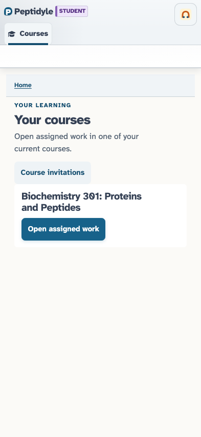](../screenshots/student/phone/course_list.png)

**Student courses on a phone.** course list - phone.

[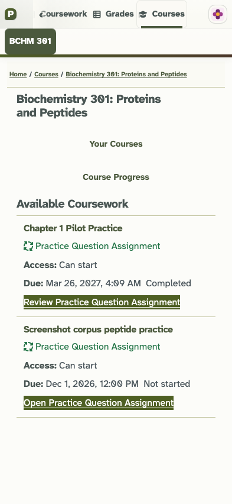](../screenshots/student/phone/course_landing.png)

**Course-specific overview on a phone.** Course-specific context - phone.

[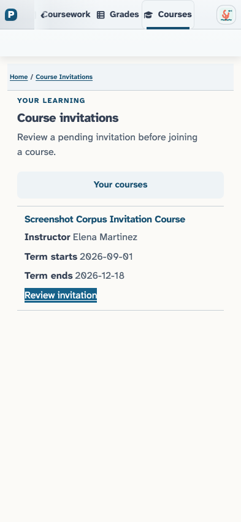](../screenshots/student/phone/invitation_index.png)

**Pending Course Invitations on a phone.** pending index - phone.

[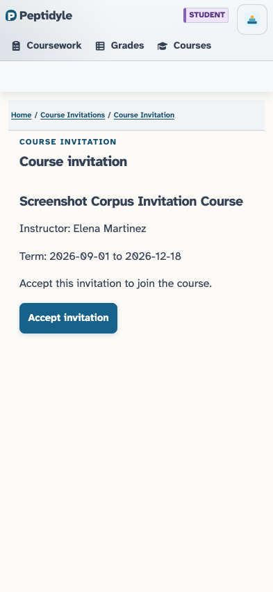](../screenshots/student/phone/invitation_detail.png)

**Course Invitation review on a phone.** review - phone.

[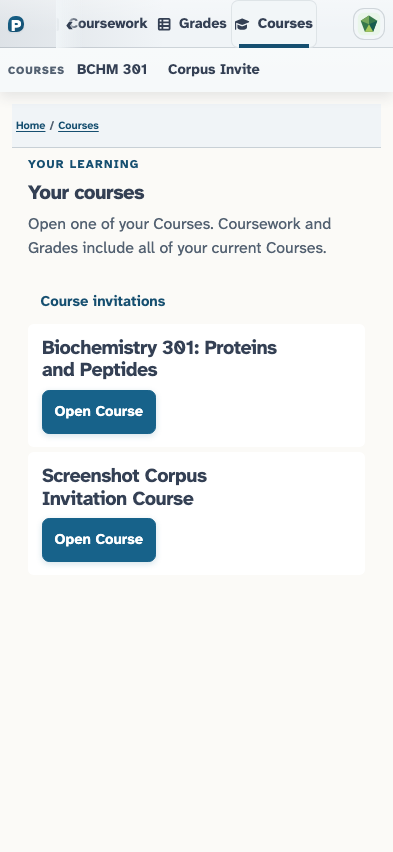](../screenshots/student/phone/two_course_list.png)

**Student with two active Courses on a phone.** two active Courses - phone.

[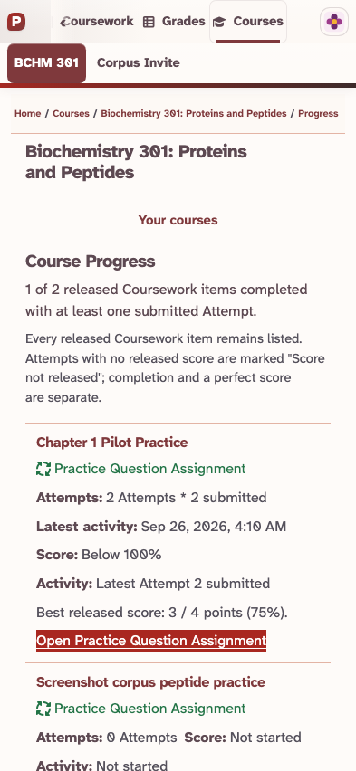](../screenshots/student/phone/course_progress.png)

**Student Course Progress on a phone.** completed Attempts and score status - phone.

[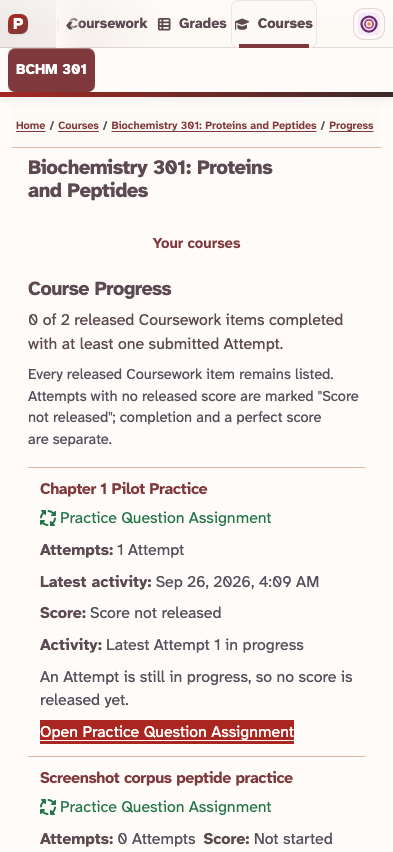](../screenshots/student/phone/course_progress_unreleased.png)

**Student Progress when an Attempt has no released score on a phone.** Attempts with no released score - phone.

[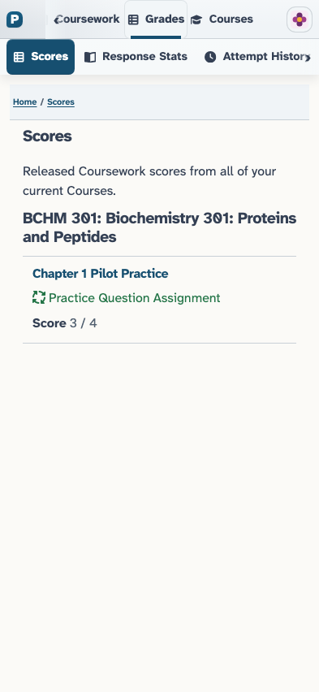](../screenshots/student/phone/grades-scores-scores.png)

**Student Scores on a phone.** self-only grades - phone.

[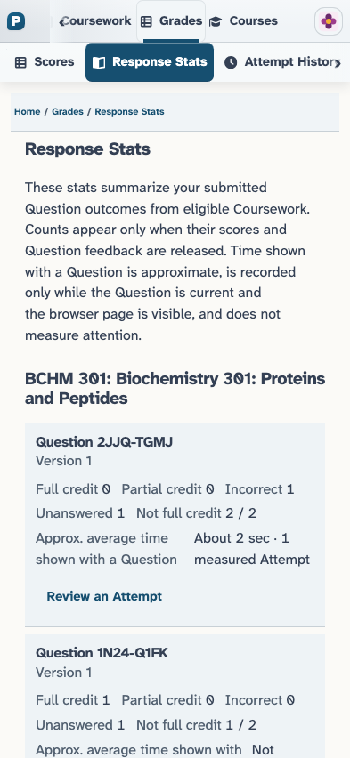](../screenshots/student/phone/grades-stats-response_stats.png)

**Student Response Stats on a phone.** released Question outcomes and measured duration - phone.

[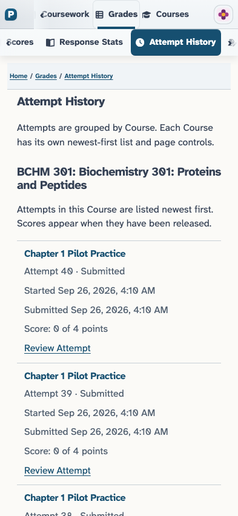](../screenshots/student/phone/grades-history-course_attempt_history.png)

**Student Attempt History with Latest Feedback available on a phone.** at least 40 submitted Attempts and released feedback shortcut enabled - phone.

[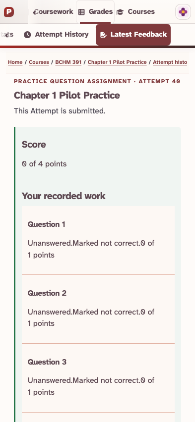](../screenshots/student/phone/grades-feedback-latest_feedback.png)

**Attempt review opened from Latest Feedback on a phone.** released feedback review opened from Grades - phone.

[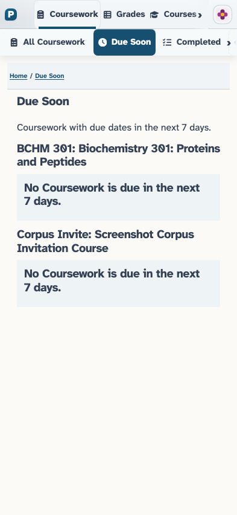](../screenshots/student/phone/coursework-due-course_due_soon.png)

**Student Coursework Due Soon on a phone.** server-bounded next seven days - phone.

[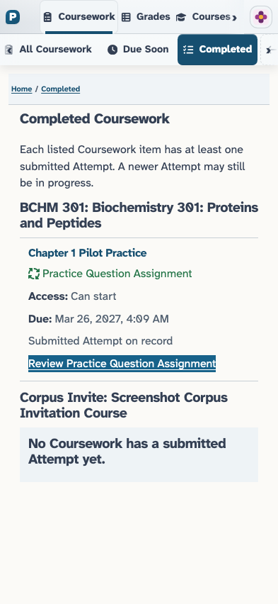](../screenshots/student/phone/coursework-completed-course_completed.png)

**Student Completed Coursework on a phone.** submitted Attempts - phone.

[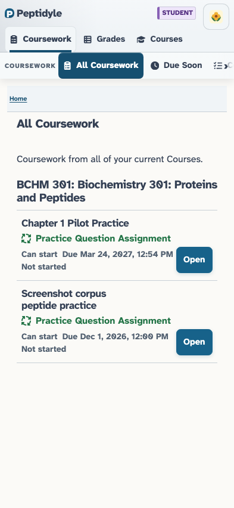](../screenshots/student/phone/not_started.png)

**Not-started Course landing on a phone.** no running Attempt clock; Active Attempt disabled - phone.

[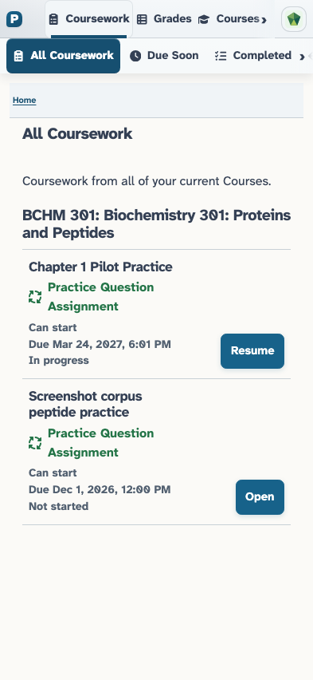](../screenshots/student/phone/in_progress.png)

**In-progress Course landing on a phone.** timed Attempt clock running; Active Attempt enabled - phone.

[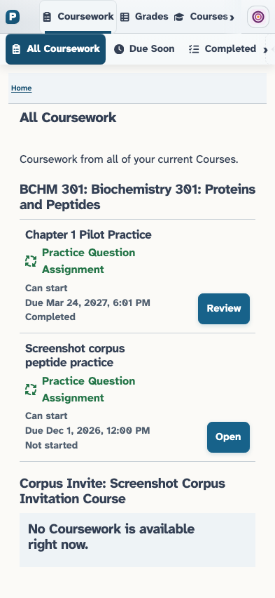](../screenshots/student/phone/completed.png)

**Completed Course landing on a phone.** completed - phone.

[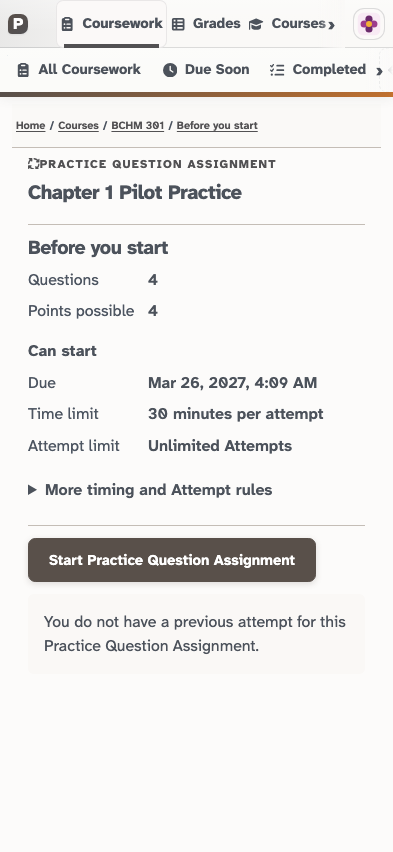](../screenshots/student/phone/coursework-overview-unanswered.png)

**Unanswered Assignment overview on a phone.** unanswered - phone.

[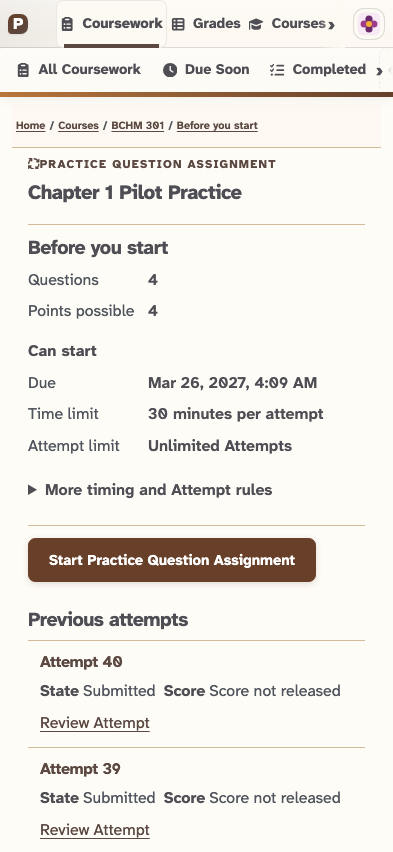](../screenshots/student/phone/coursework-overview-overview_history.png)

**Assignment overview with previous attempts on a phone.** previous attempts - phone.

[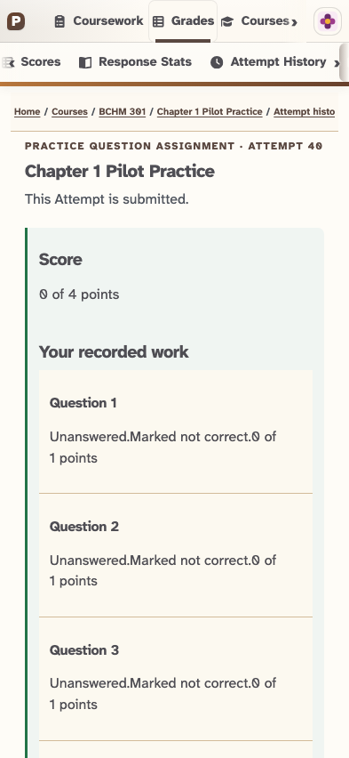](../screenshots/student/phone/coursework-overview-selected_history.png)

**Latest Attempt review from Assignment history on a phone.** selected latest Attempt review - phone.

[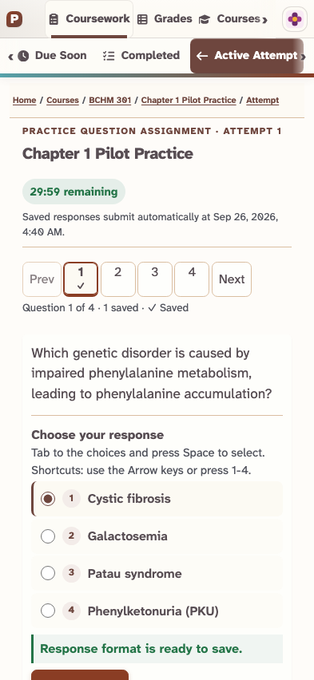](../screenshots/student/phone/coursework-active-response_selected.png)

**Saved Student Assignment response on a phone.** saved response - phone.

[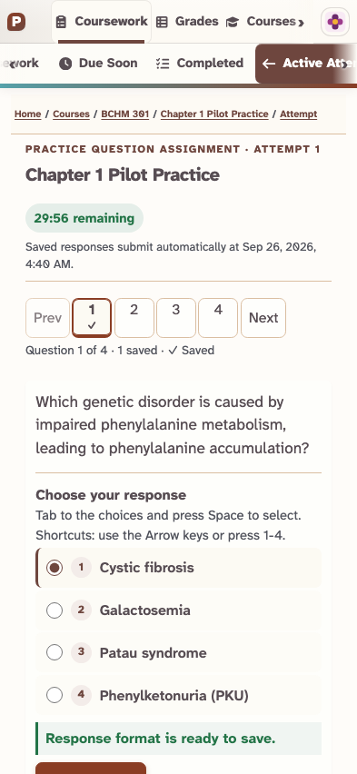](../screenshots/student/phone/coursework-active-resume_selected.png)

**Reloaded Student Assignment response on a phone.** reloaded saved response - phone.

[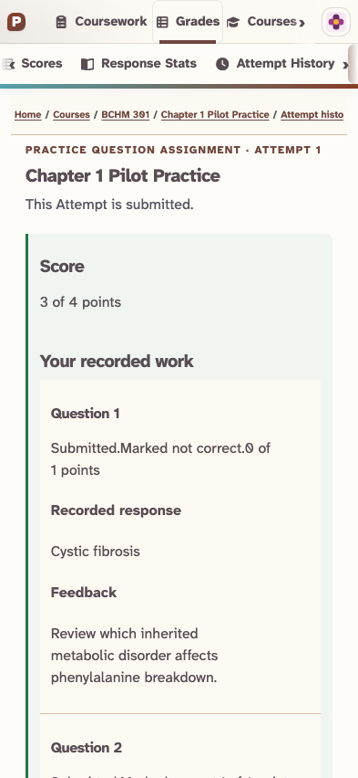](../screenshots/student/phone/coursework-active-submitted.png)

**Submitted Student Assignment on a phone.** submitted - phone.

[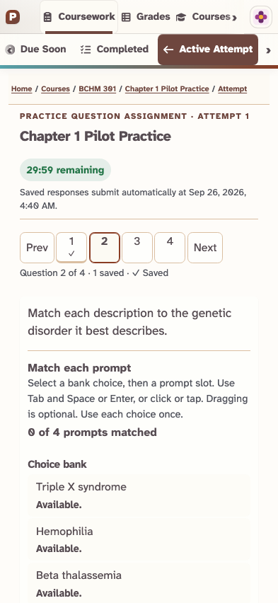](../screenshots/student/phone/coursework-active-assessment_navigation.png)

**Student Question navigation, saved progress, and countdown timer on a phone.** Question 2 current with one saved response - phone.

[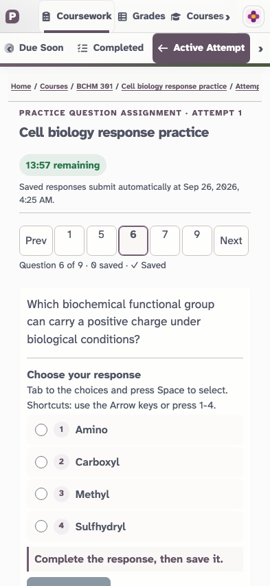](../screenshots/student/phone/coursework-active-q_unanswered_mc.png)

**Student MC response controls on a phone.** unanswered MC question - phone.

[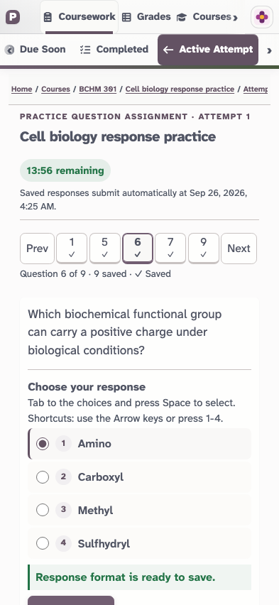](../screenshots/student/phone/coursework-active-q_answered_mc.png)

**Student MC response controls after saving a response on a phone.** answered MC question - phone.

[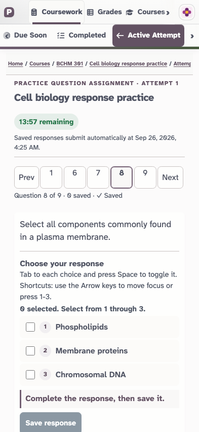](../screenshots/student/phone/coursework-active-q_unanswered_ma.png)

**Student MA response controls on a phone.** unanswered MA question - phone.

[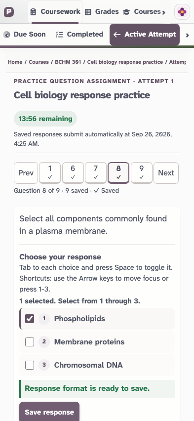](../screenshots/student/phone/coursework-active-q_answered_ma.png)

**Student MA response controls after saving a response on a phone.** answered MA question - phone.

[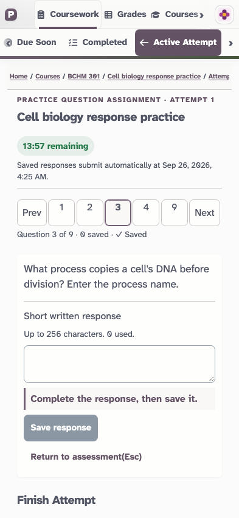](../screenshots/student/phone/coursework-active-q_unanswered_fib.png)

**Student FIB response controls on a phone.** unanswered FIB question - phone.

[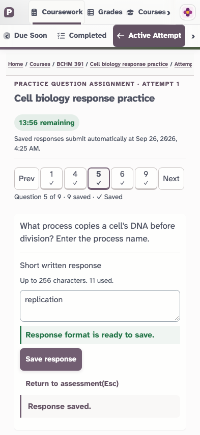](../screenshots/student/phone/coursework-active-q_answered_fib.png)

**Student FIB response controls after saving a response on a phone.** answered FIB question - phone.

[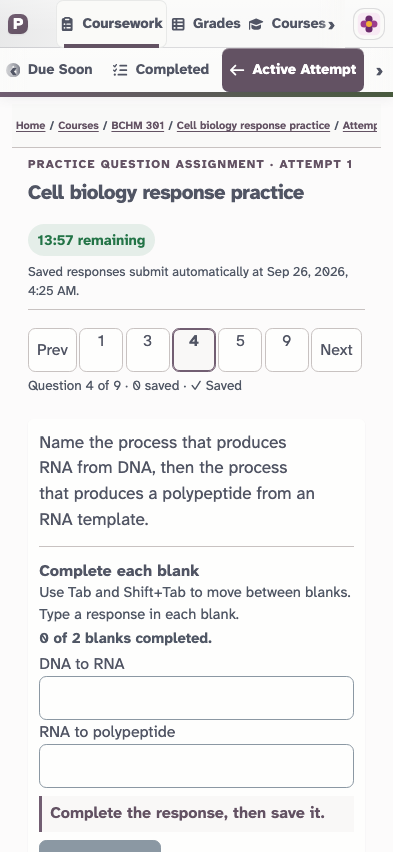](../screenshots/student/phone/coursework-active-q_unanswered_multi_fib.png)

**Student MULTI-FIB response controls on a phone.** unanswered MULTI-FIB question - phone.

[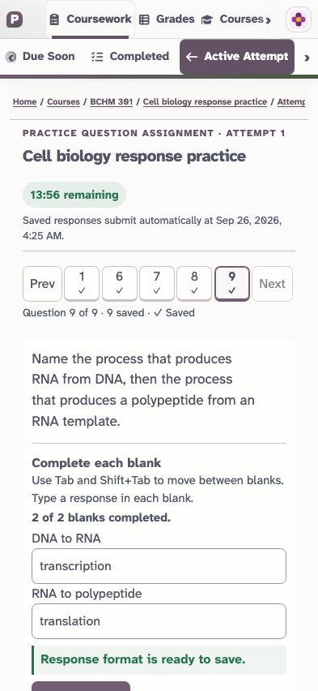](../screenshots/student/phone/coursework-active-q_answered_multi_fib.png)

**Student MULTI-FIB response controls after saving a response on a phone.** answered MULTI_FIB question - phone.

[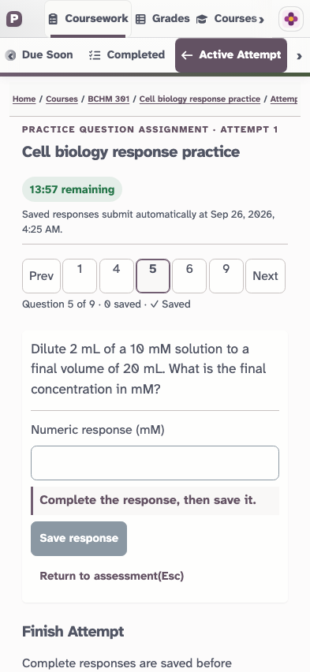](../screenshots/student/phone/coursework-active-q_unanswered_num.png)

**Student NUM response controls on a phone.** unanswered NUM question - phone.

[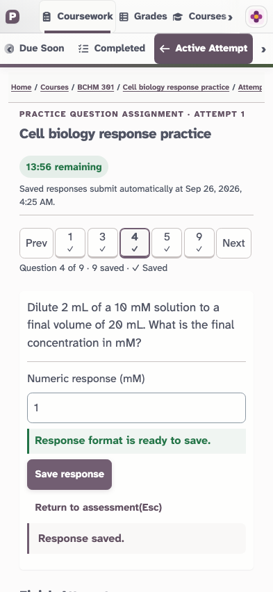](../screenshots/student/phone/coursework-active-q_answered_num.png)

**Student NUM response controls after saving a response on a phone.** answered NUM question - phone.

[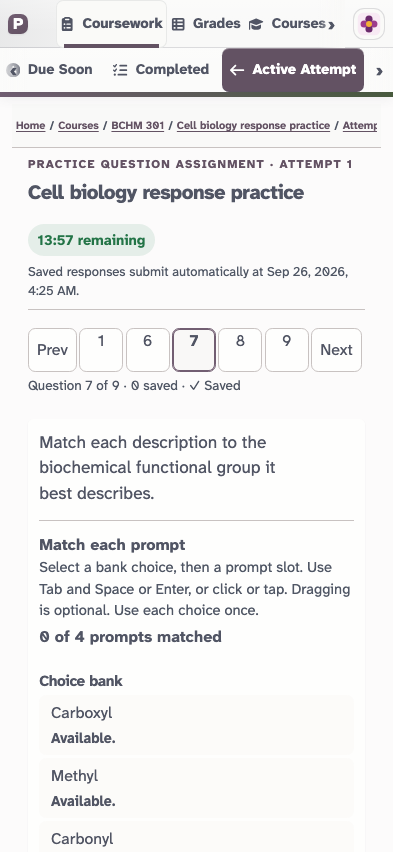](../screenshots/student/phone/coursework-active-q_unanswered_match.png)

**Student MATCH response controls on a phone.** unanswered MATCH question - phone.

[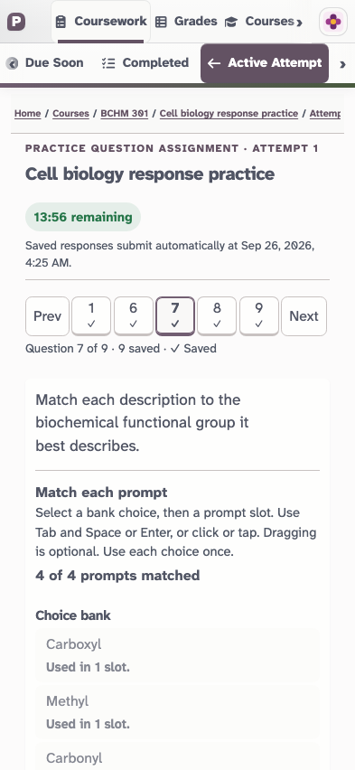](../screenshots/student/phone/coursework-active-q_answered_match.png)

**Student MATCH response controls after saving a response on a phone.** answered MATCH question - phone.

[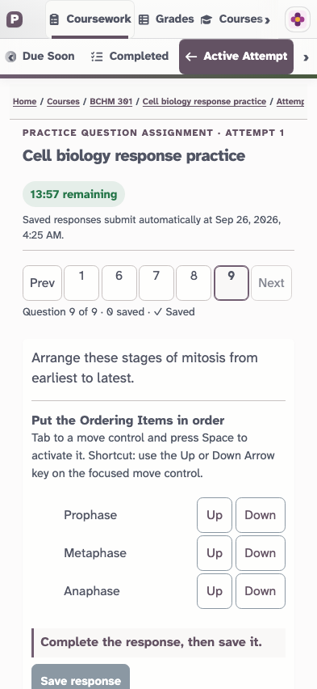](../screenshots/student/phone/coursework-active-q_unanswered_order.png)

**Student ORDER response controls on a phone.** unanswered ORDER question - phone.

[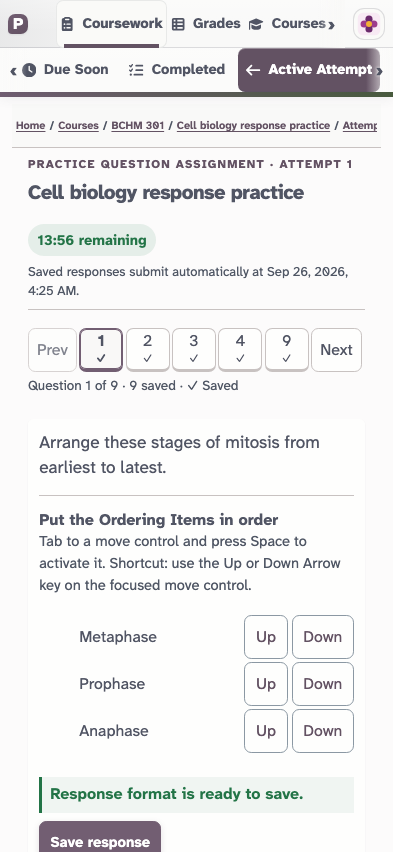](../screenshots/student/phone/coursework-active-q_answered_order.png)

**Student ORDER response controls after saving a response on a phone.** answered ORDER question - phone.

[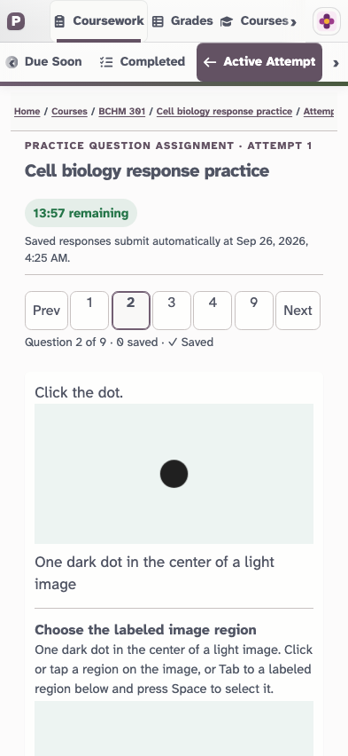](../screenshots/student/phone/coursework-active-q_unanswered_hotspot.png)

**Student HOTSPOT uploaded-image response controls on a phone.** unanswered HOTSPOT question - phone.

[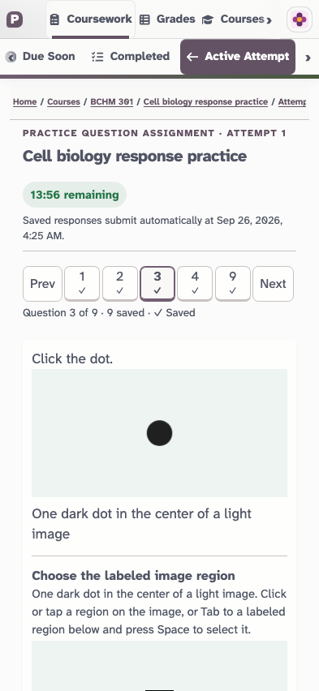](../screenshots/student/phone/coursework-active-q_answered_hotspot.png)

**Student HOTSPOT uploaded-image response controls after saving a response on a phone.** answered HOTSPOT question - phone.

[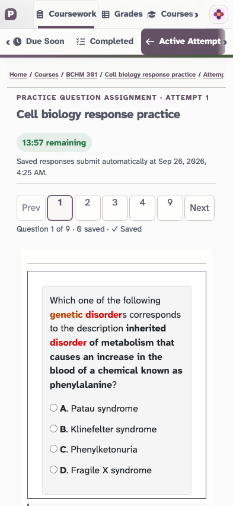](../screenshots/student/phone/coursework-active-q_unanswered_webwork.png)

**Student WeBWorK response controls on a phone.** unanswered WeBWorK question - phone.

[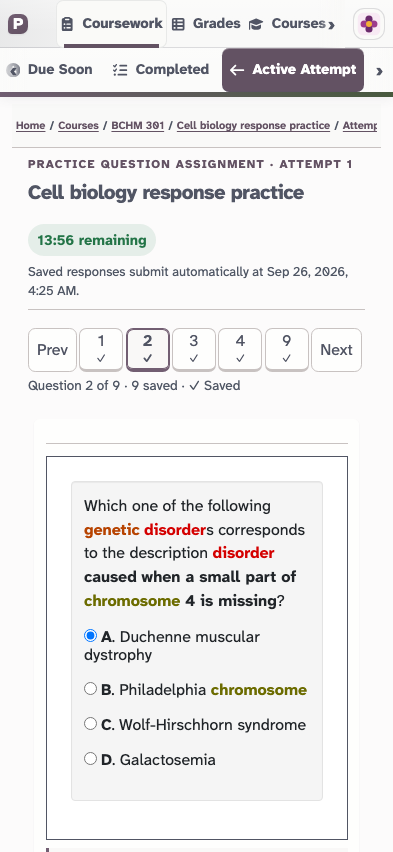](../screenshots/student/phone/coursework-active-q_answered_webwork.png)

**Student WeBWorK response controls after saving a response on a phone.** answered WEBWORK question - phone.

[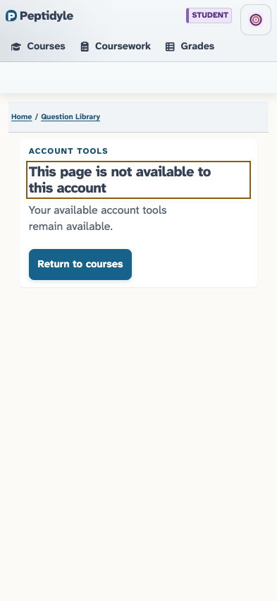](../screenshots/student/phone/denial.png)

**Student authorization denial on a phone.** denied - phone.

[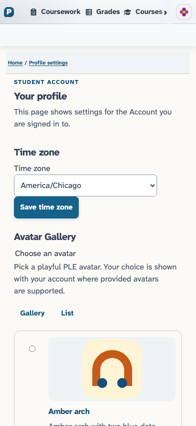](../screenshots/student/phone/profile.png)

**Student Profile on a phone.** default profile - phone.

