# Student tablet screenshots

Generated from the current screenshot manifest. Images link to their full-size files.

[Complete screenshot atlas](../SCREENSHOT_ATLAS.md)

[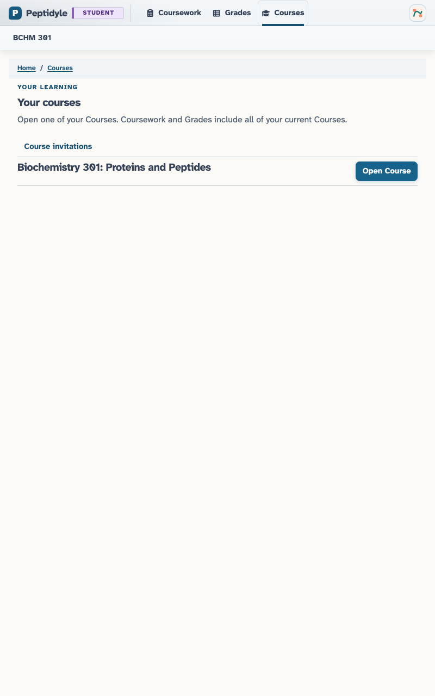](../screenshots/student/tablet/course_list.png)

**Student courses on a tablet.** course list - tablet.

[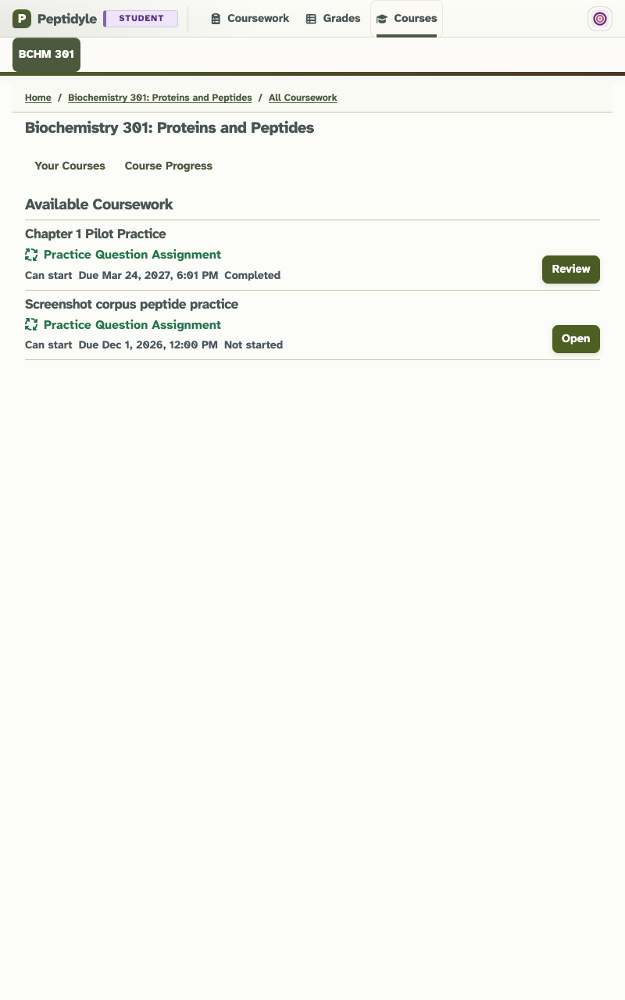](../screenshots/student/tablet/course_landing.png)

**Course-specific overview on a tablet.** Course-specific context - tablet.

[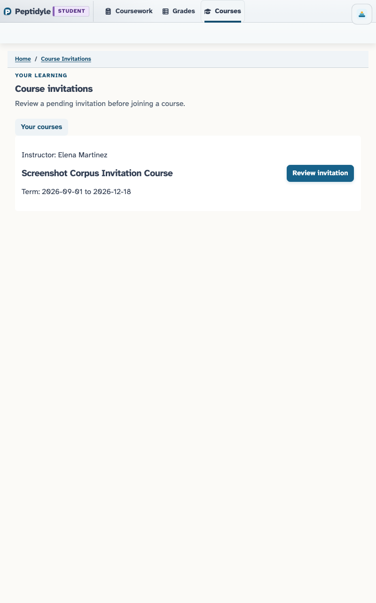](../screenshots/student/tablet/invitation_index.png)

**Pending Course Invitations on a tablet.** pending index - tablet.

[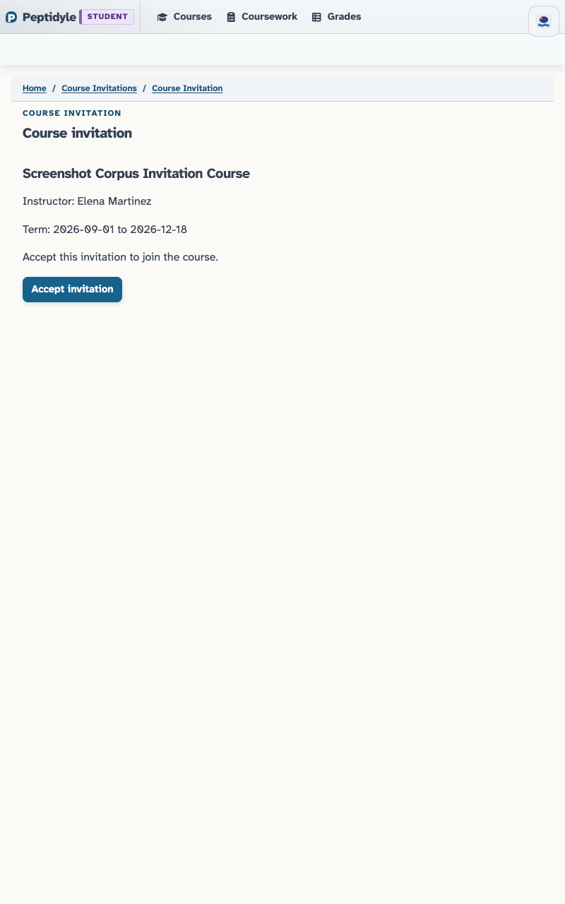](../screenshots/student/tablet/invitation_detail.png)

**Course Invitation review on a tablet.** review - tablet.

[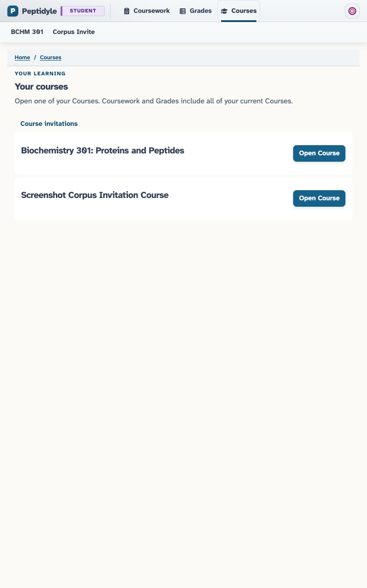](../screenshots/student/tablet/two_course_list.png)

**Student with two active Courses on a tablet.** two active Courses - tablet.

[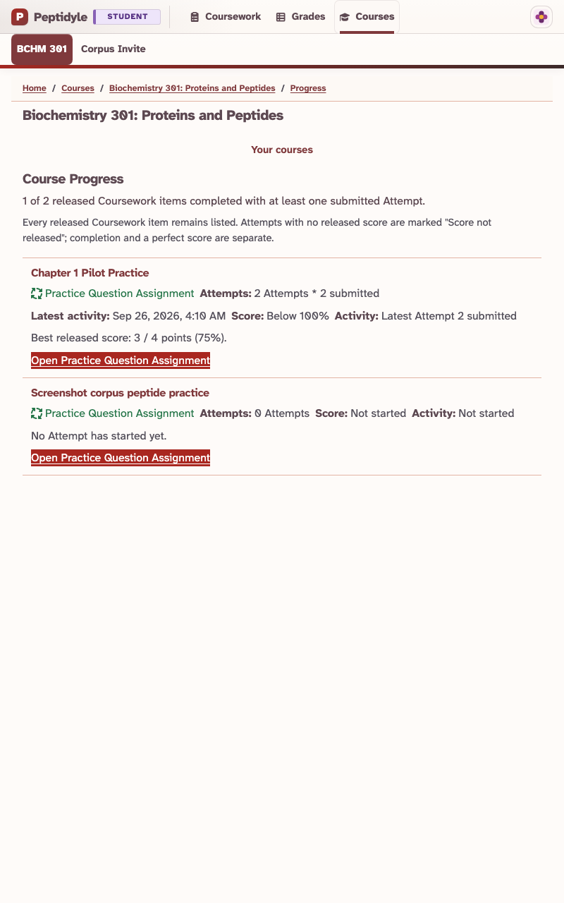](../screenshots/student/tablet/course_progress.png)

**Student Course Progress on a tablet.** completed Attempts and score status - tablet.

[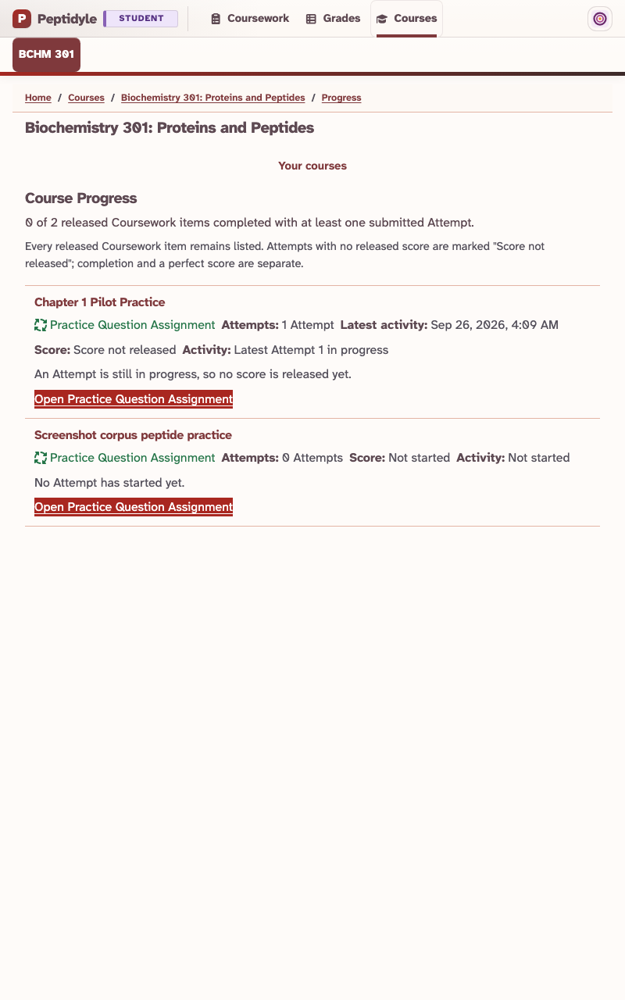](../screenshots/student/tablet/course_progress_unreleased.png)

**Student Progress when an Attempt has no released score on a tablet.** Attempts with no released score - tablet.

**Student Scores on a tablet.** self-only grades - tablet.

**Student Response Stats on a tablet.** released Question outcomes and measured duration - tablet.

**Student Attempt History with Latest Feedback available on a tablet.** at least 40 submitted Attempts and released feedback shortcut enabled - tablet.

**Attempt review opened from Latest Feedback on a tablet.** released feedback review opened from Grades - tablet.

**Student Coursework Due Soon on a tablet.** server-bounded next seven days - tablet.

**Student Completed Coursework on a tablet.** submitted Attempts - tablet.

[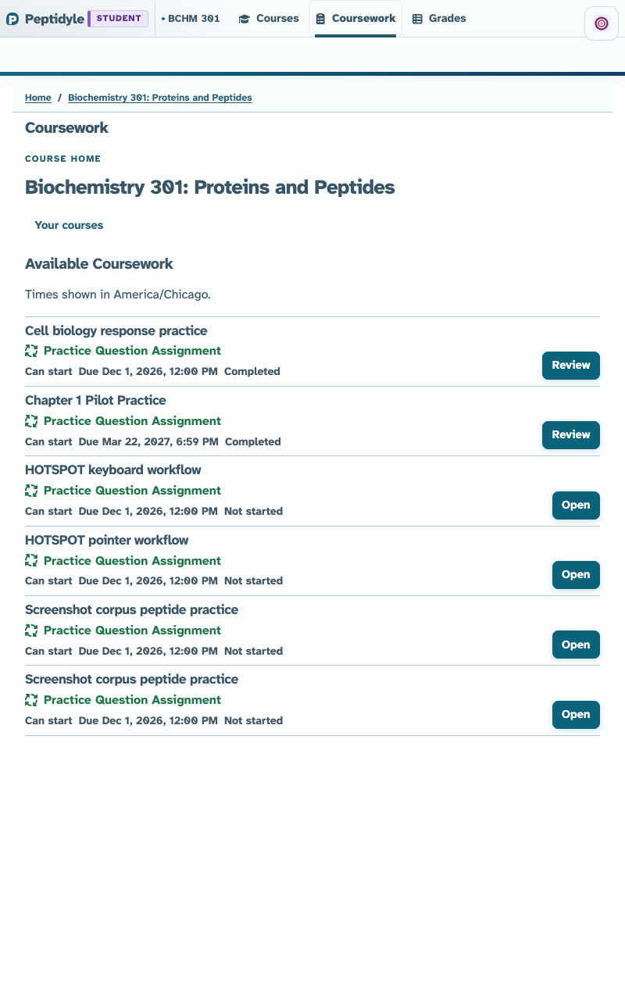](../screenshots/student/tablet/not_started.png)

**Not-started Course landing on a tablet.** no running Attempt clock; Active Attempt disabled - tablet.

[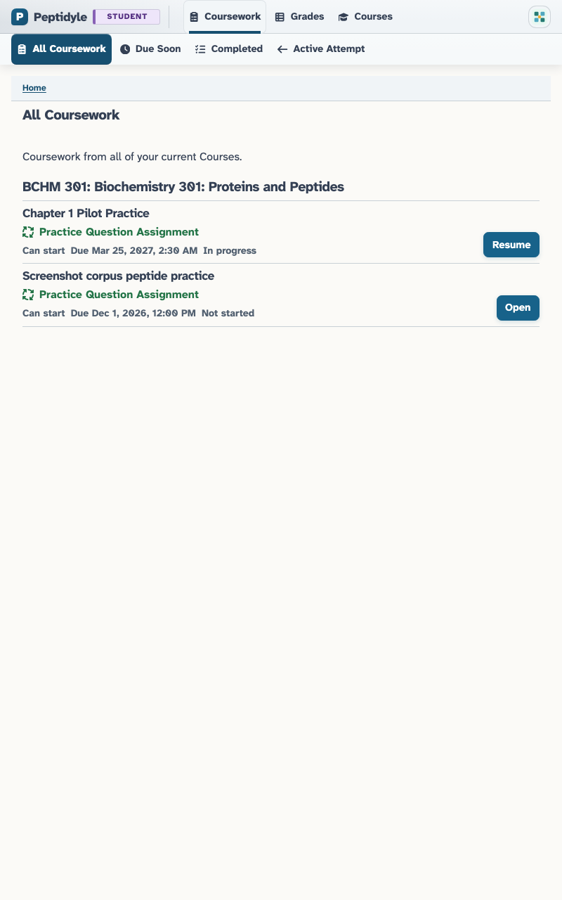](../screenshots/student/tablet/in_progress.png)

**In-progress Course landing on a tablet.** timed Attempt clock running; Active Attempt enabled - tablet.

[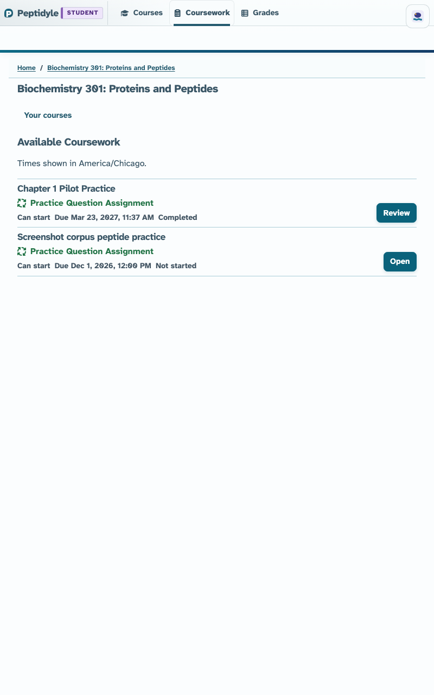](../screenshots/student/tablet/completed.png)

**Completed Course landing on a tablet.** completed - tablet.

**Unanswered Assignment overview on a tablet.** unanswered - tablet.

**Assignment overview with previous attempts on a tablet.** previous attempts - tablet.

**Latest Attempt review from Assignment history on a tablet.** selected latest Attempt review - tablet.

**Saved Student Assignment response on a tablet.** saved response - tablet.

**Reloaded Student Assignment response on a tablet.** reloaded saved response - tablet.

**Submitted Student Assignment on a tablet.** submitted - tablet.

**Student Question navigation, saved progress, and countdown timer on a tablet.** Question 2 current with one saved response - tablet.

**Student MC response controls on a tablet.** unanswered MC question - tablet.

**Student MC response controls after saving a response on a tablet.** answered MC question - tablet.

**Student MA response controls on a tablet.** unanswered MA question - tablet.

**Student MA response controls after saving a response on a tablet.** answered MA question - tablet.

**Student FIB response controls on a tablet.** unanswered FIB question - tablet.

**Student FIB response controls after saving a response on a tablet.** answered FIB question - tablet.

**Student MULTI-FIB response controls on a tablet.** unanswered MULTI-FIB question - tablet.

**Student MULTI-FIB response controls after saving a response on a tablet.** answered MULTI_FIB question - tablet.

**Student NUM response controls on a tablet.** unanswered NUM question - tablet.

**Student NUM response controls after saving a response on a tablet.** answered NUM question - tablet.

**Student MATCH response controls on a tablet.** unanswered MATCH question - tablet.

**Student MATCH response controls after saving a response on a tablet.** answered MATCH question - tablet.

**Student ORDER response controls on a tablet.** unanswered ORDER question - tablet.

**Student ORDER response controls after saving a response on a tablet.** answered ORDER question - tablet.

**Student HOTSPOT uploaded-image response controls on a tablet.** unanswered HOTSPOT question - tablet.

**Student HOTSPOT uploaded-image response controls after saving a response on a tablet.** answered HOTSPOT question - tablet.

**Student WeBWorK response controls on a tablet.** unanswered WeBWorK question - tablet.

**Student WeBWorK response controls after saving a response on a tablet.** answered WEBWORK question - tablet.

[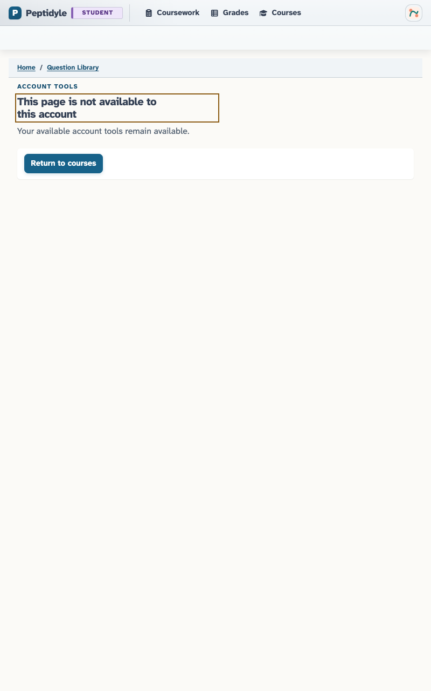](../screenshots/student/tablet/denial.png)

**Student authorization denial on a tablet.** denied - tablet.

[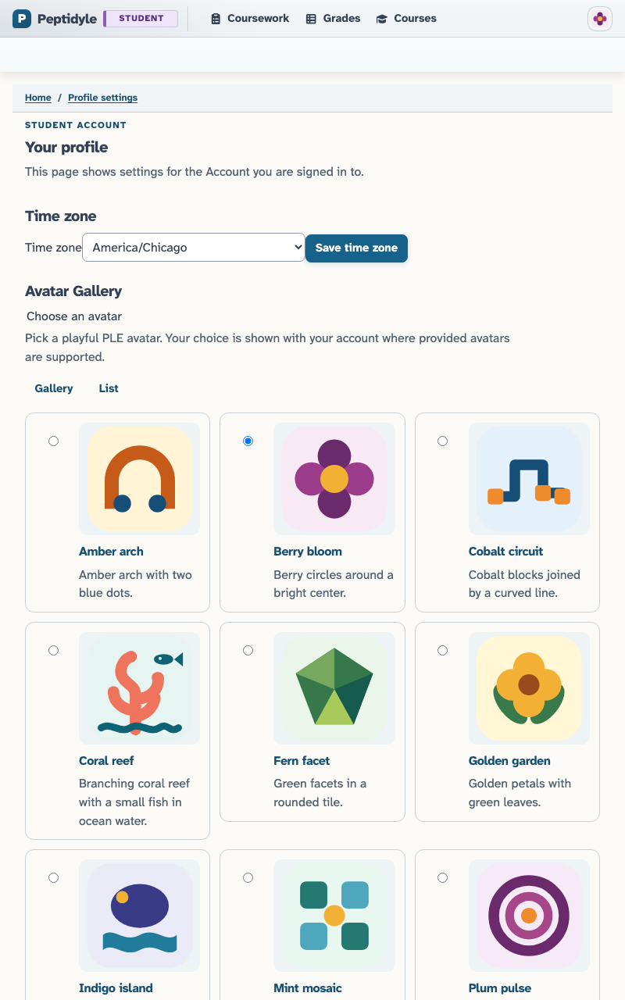](../screenshots/student/tablet/profile.png)

**Student Profile on a tablet.** default profile - tablet.

