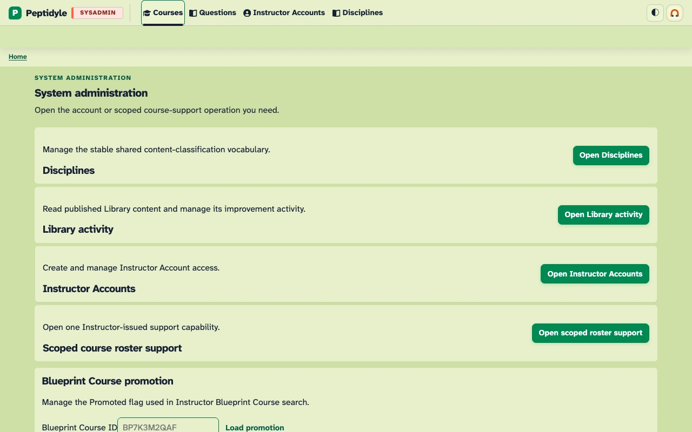
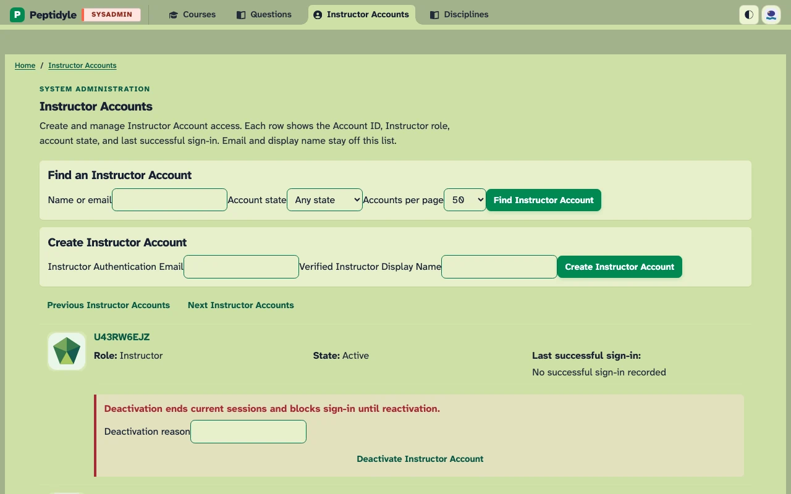
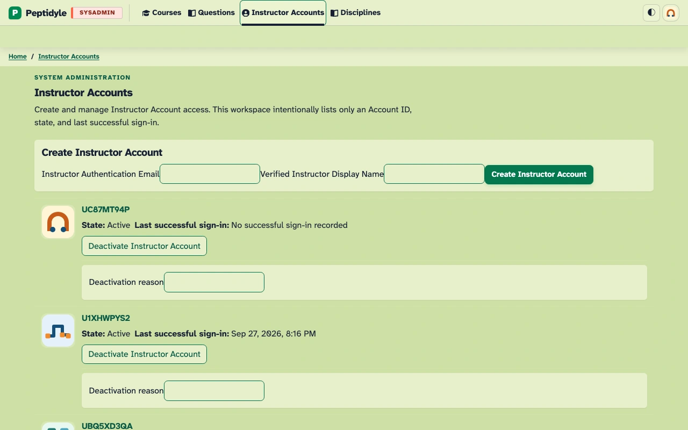
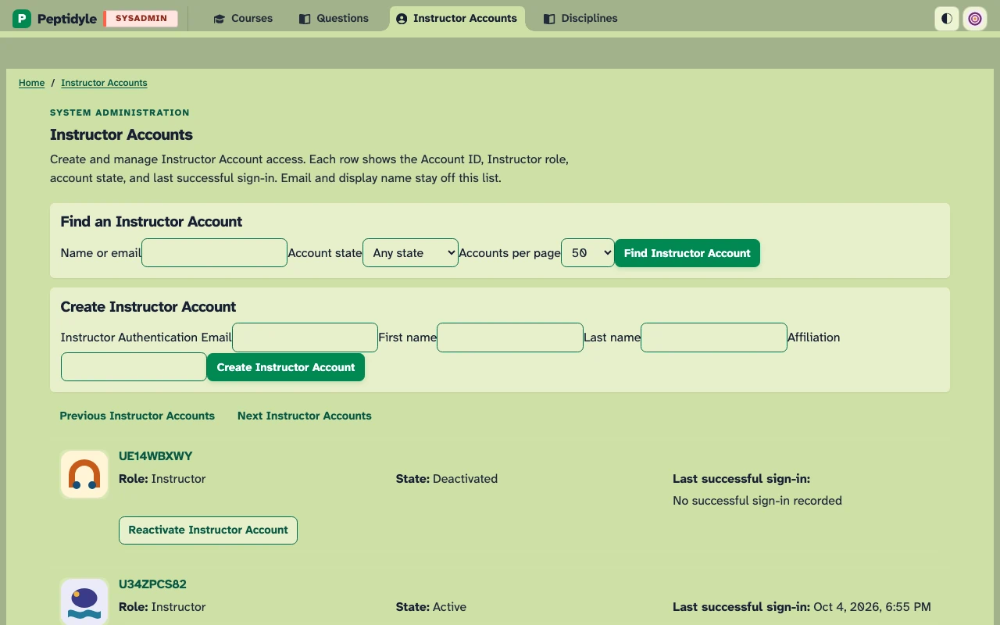
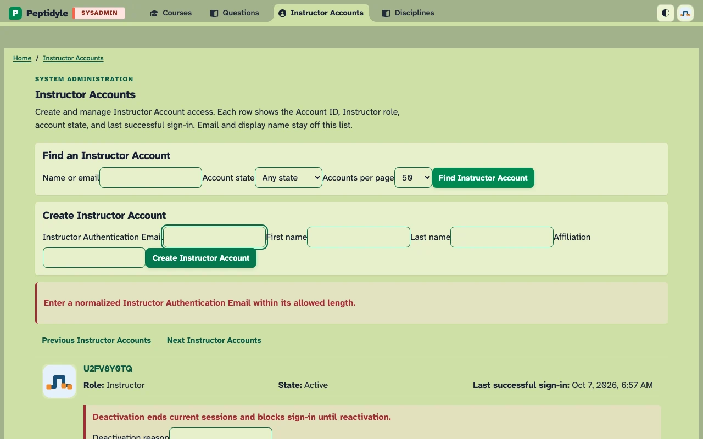

# Sysadmin screenshots

Generated from the current screenshot manifest. Images link to their full-size files.

[Complete screenshot atlas](../SCREENSHOT_ATLAS.md)

**System administration home.** system administration home - laptop.

**Instructor Accounts.** initial - laptop.

**Created Instructor Account.** created - laptop.

**Deactivated Instructor Account.** deactivated - laptop.

**Instructor Account creation validation.** creation validation - laptop.

